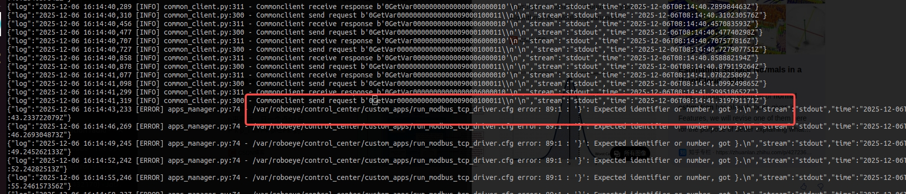
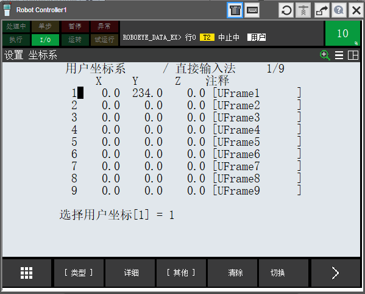
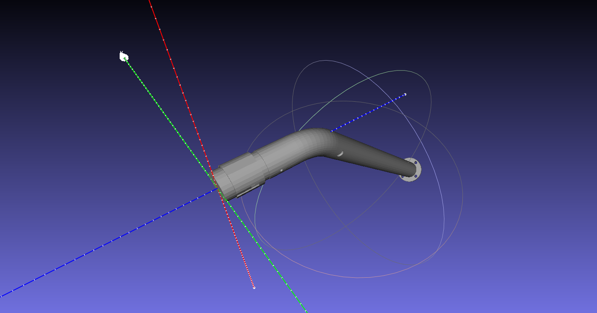
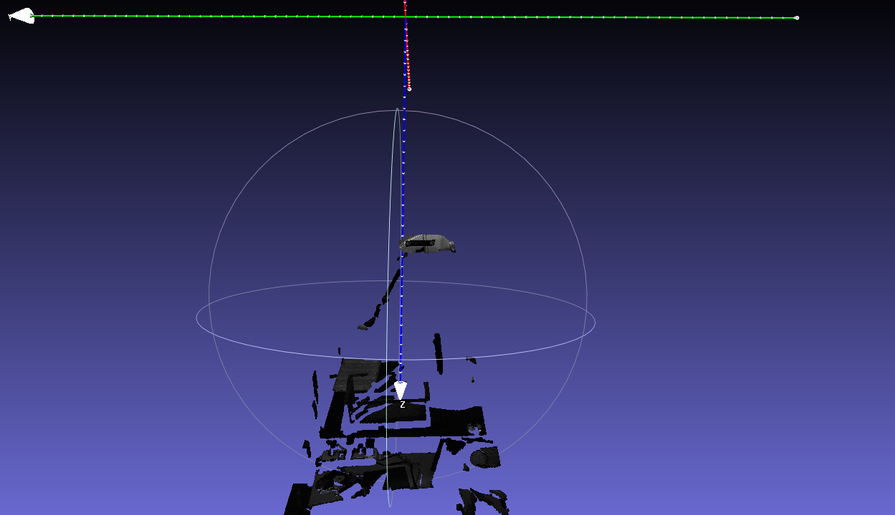
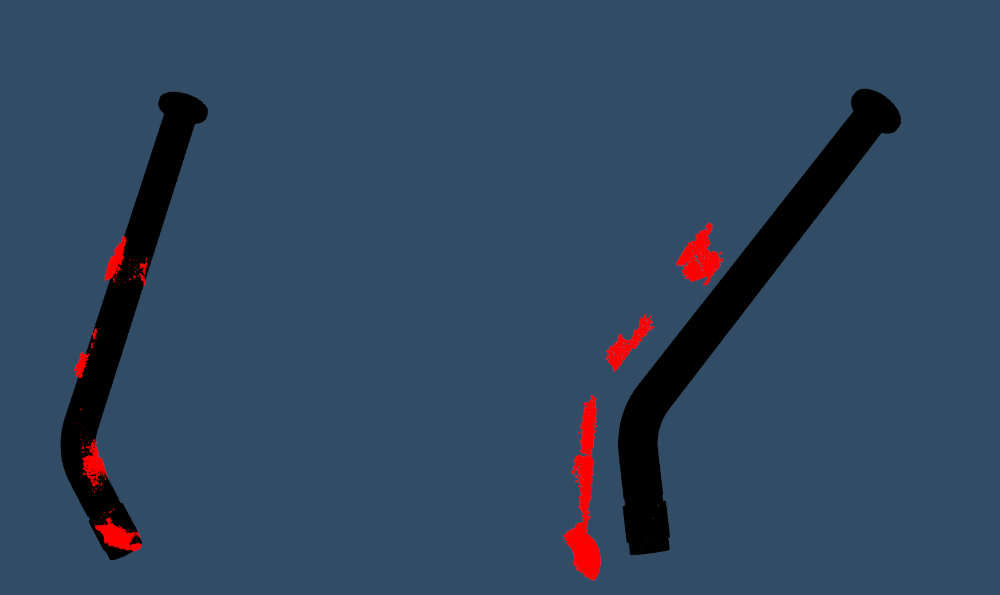
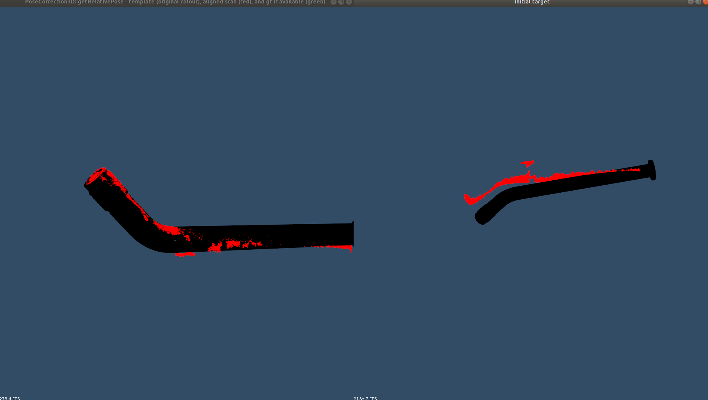
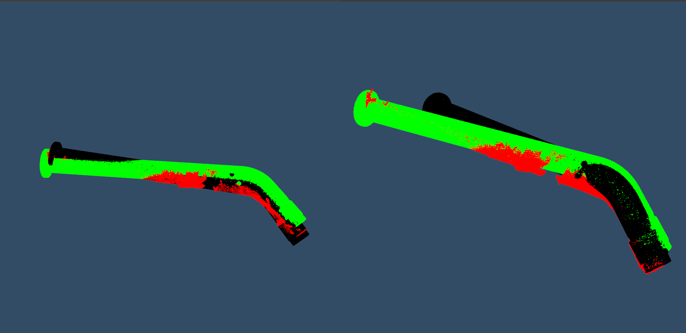
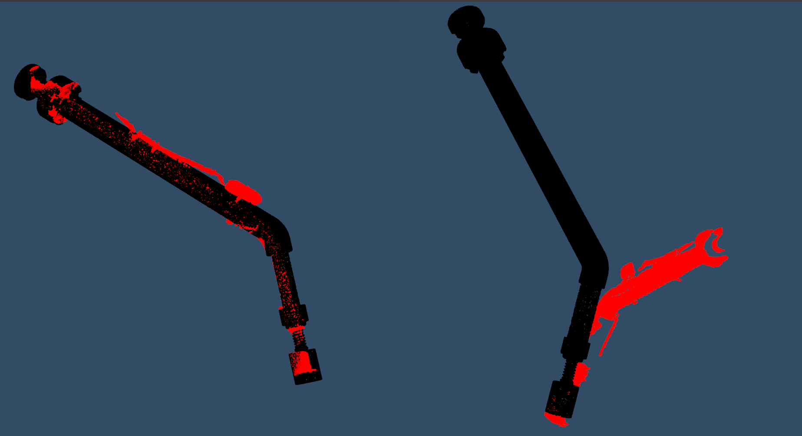
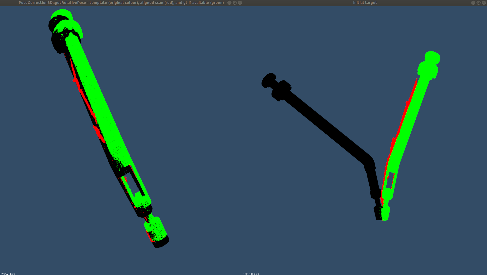
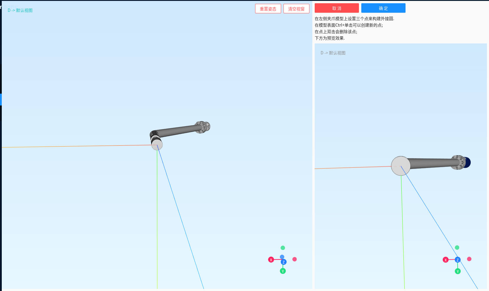

# Q4

## 根据场景输出默认配置 :heavy_check_mark:

### 应用场景

#### 逃逸

```bash 
t017 
remove_obj_pc_threshold: 8
fail_gripper_object_collisions: false
```


#### 工件点云移除不到位


```bash
2509：HST-YZ/2509/2509-LINE1-1/2025-10-28-09-32-50
2507：HST-CZ/2507/2507-Hou-OP20/2025-11-07-16-19-27
eva6: roboeye/EVA6/eva6_sta1/2025-12-02-20-04-16
```

#### 点云缺失


### 统一配置

merge 部分配置 (collision_param)，轮流完成回归测试

#### 使用一份配置 :heavy_check_mark:

只需要传入路径即可

#### 使用多份配置 :heavy_check_mark:

如何处理失败的测试数据集:question:

不同配置针对不同使用场景，即其他配置**只需要再检测没有通过的数据集**

1. ~~根据 sample_id 检测是否通过并剔除该 sample_id 的结果~~
2. 根据 workflow_dataset_id 检测，若没通过则使用其他配置

==注：==每个数据集需要指定参数路径


## 协作机器人奇异点逆解 :heavy_check_mark:

### 当前局限

#### 肩部奇异

$\theta_1$ 无法求解

#### 肘部奇异

$\theta_2$ 求解与 $\theta_3$ 相关

#### 腕部奇异

$\theta_6$ 无法求解
$$
\theta_5 = 0
$$

$$
\textcolor{red}{\theta_6 = Atan2(m,n) - Atan2(sin\theta_5, 0)}
$$

$$
\textcolor{red}{\theta_6 = Atan2(m, n)-Atan2(0, \pm 1)}
$$

```python 
[-91.71, -98.96, -126.22, -46.29, 0, -1.78]
[ -91.78, -115.74, -119.69,   48.89,    6.95,  -93.62]
```

==注：==求解出 $\theta_5 \neq 0$

### 分离-重连

$$
T_L \& T_R
$$

$$
T = \begin{bmatrix}
n_x&o_x&a_x&p_x\\
n_y&o_y&a_y&p_y\\
n_z&o_z&a_z&p_z\\
0&0&0&1
\end{bmatrix}
$$

$d_1...d_6$ 表示关节长度

```python 
TL =[ cos(q2 + q3 + q4), -sin(q2 + q3 + q4), 0, a3*cos(q2 + q3) + a2*cos(q2)
      sin(q2 + q3 + q4),  cos(q2 + q3 + q4), 0, a3*sin(q2 + q3) + a2*sin(q2)
                      0,                  0, 1,                           d4
                      0,                  0, 0,                            1]
   
TR =[ - cos(q1)*(ax*sin(q5) - nx*cos(q5)*cos(q6) + ox*cos(q5)*sin(q6)) - sin(q1)*(ay*sin(q5) - ny*cos(q5)*cos(q6) + oy*cos(q5)*sin(q6)),  cos(q1)*(ax*cos(q5) + nx*cos(q6)*sin(q5) - ox*sin(q5)*sin(q6)) + sin(q1)*(ay*cos(q5) + ny*cos(q6)*sin(q5) - oy*sin(q5)*sin(q6)), - ox*cos(q1)*cos(q6) - nx*cos(q1)*sin(q6) - oy*cos(q6)*sin(q1) - ny*sin(q1)*sin(q6), cos(q1)*(px - ax*d6 + d5*ox*cos(q6) + d5*nx*sin(q6)) + sin(q1)*(py - ay*d6 + d5*oy*cos(q6) + d5*ny*sin(q6))
                                                                                   nz*cos(q5)*cos(q6) - az*sin(q5) - oz*cos(q5)*sin(q6),                                                                            az*cos(q5) + nz*cos(q6)*sin(q5) - oz*sin(q5)*sin(q6),                                                           - oz*cos(q6) - nz*sin(q6),                                                             pz - d1 - az*d6 + d5*oz*cos(q6) + d5*nz*sin(q6)
        cos(q1)*(ay*sin(q5) - ny*cos(q5)*cos(q6) + oy*cos(q5)*sin(q6)) - sin(q1)*(ax*sin(q5) - nx*cos(q5)*cos(q6) + ox*cos(q5)*sin(q6)), sin(q1)*(ax*cos(q5) + nx*cos(q6)*sin(q5) - ox*sin(q5)*sin(q6)) - cos(q1)*(ay*cos(q5) + ny*cos(q6)*sin(q5) - oy*sin(q5)*sin(q6)),   oy*cos(q1)*cos(q6) + ny*cos(q1)*sin(q6) - ox*cos(q6)*sin(q1) - nx*sin(q1)*sin(q6), sin(q1)*(px - ax*d6 + d5*ox*cos(q6) + d5*nx*sin(q6)) - cos(q1)*(py - ay*d6 + d5*oy*cos(q6) + d5*ny*sin(q6))
                                                                                                                                      0,                                                                                                                               0,                                                                                   0,                                                                                                           1];

```

$$
T_L =\left[\begin{matrix}\cos{\left(q_{2} + q_{3} + q_{4} \right)} & - 1.0 \sin{\left(q_{2} + q_{3} + q_{4} \right)} & 0 & a_{2} \cos{\left(q_{2} \right)} + a_{3} \cos{\left(q_{2} + q_{3} \right)}\\\sin{\left(q_{2} + q_{3} + q_{4} \right)} & 1.0 \cos{\left(q_{2} + q_{3} + q_{4} \right)} & 0 & a_{2} \sin{\left(q_{2} \right)} + a_{3} \sin{\left(q_{2} + q_{3} \right)}\\0 & 0 & 1.0 & d_{4}\\0 & 0 & 0 & 1\end{matrix}\right]
$$


$$
T_R = 
\left[\begin{matrix}- \left(ax \cos{\left(q_{1} \right)} + ay \sin{\left(q_{1} \right)}\right) \sin{\left(q_{5} \right)} + \left(\left(nx \cos{\left(q_{1} \right)} + ny \sin{\left(q_{1} \right)}\right) \cos{\left(q_{6} \right)} - \left(ox \cos{\left(q_{1} \right)} + oy \sin{\left(q_{1} \right)}\right) \sin{\left(q_{6} \right)}\right) \cos{\left(q_{5} \right)} & \left(ax \cos{\left(q_{1} \right)} + ay \sin{\left(q_{1} \right)}\right) \cos{\left(q_{5} \right)} + \left(\left(nx \cos{\left(q_{1} \right)} + ny \sin{\left(q_{1} \right)}\right) \cos{\left(q_{6} \right)} - \left(ox \cos{\left(q_{1} \right)} + oy \sin{\left(q_{1} \right)}\right) \sin{\left(q_{6} \right)}\right) \sin{\left(q_{5} \right)} & - \left(nx \cos{\left(q_{1} \right)} + ny \sin{\left(q_{1} \right)}\right) \sin{\left(q_{6} \right)} - \left(ox \cos{\left(q_{1} \right)} + oy \sin{\left(q_{1} \right)}\right) \cos{\left(q_{6} \right)} & d_{5} \left(\left(nx \cos{\left(q_{1} \right)} + ny \sin{\left(q_{1} \right)}\right) \sin{\left(q_{6} \right)} + \left(ox \cos{\left(q_{1} \right)} + oy \sin{\left(q_{1} \right)}\right) \cos{\left(q_{6} \right)}\right) - d_{6} \left(ax \cos{\left(q_{1} \right)} + ay \sin{\left(q_{1} \right)}\right) + px \cos{\left(q_{1} \right)} + py \sin{\left(q_{1} \right)}\\- az \sin{\left(q_{5} \right)} + \left(nz \cos{\left(q_{6} \right)} - oz \sin{\left(q_{6} \right)}\right) \cos{\left(q_{5} \right)} & az \cos{\left(q_{5} \right)} + \left(nz \cos{\left(q_{6} \right)} - oz \sin{\left(q_{6} \right)}\right) \sin{\left(q_{5} \right)} & - nz \sin{\left(q_{6} \right)} - oz \cos{\left(q_{6} \right)} & - az d_{6} - d_{1} + d_{5} \left(nz \sin{\left(q_{6} \right)} + oz \cos{\left(q_{6} \right)}\right) + pz\\- \left(ax \sin{\left(q_{1} \right)} - ay \cos{\left(q_{1} \right)}\right) \sin{\left(q_{5} \right)} + \left(\left(nx \sin{\left(q_{1} \right)} - ny \cos{\left(q_{1} \right)}\right) \cos{\left(q_{6} \right)} - \left(ox \sin{\left(q_{1} \right)} - oy \cos{\left(q_{1} \right)}\right) \sin{\left(q_{6} \right)}\right) \cos{\left(q_{5} \right)} & \left(ax \sin{\left(q_{1} \right)} - ay \cos{\left(q_{1} \right)}\right) \cos{\left(q_{5} \right)} + \left(\left(nx \sin{\left(q_{1} \right)} - ny \cos{\left(q_{1} \right)}\right) \cos{\left(q_{6} \right)} - \left(ox \sin{\left(q_{1} \right)} - oy \cos{\left(q_{1} \right)}\right) \sin{\left(q_{6} \right)}\right) \sin{\left(q_{5} \right)} & - \left(nx \sin{\left(q_{1} \right)} - ny \cos{\left(q_{1} \right)}\right) \sin{\left(q_{6} \right)} - \left(ox \sin{\left(q_{1} \right)} - oy \cos{\left(q_{1} \right)}\right) \cos{\left(q_{6} \right)} & d_{5} \left(\left(nx \sin{\left(q_{1} \right)} - ny \cos{\left(q_{1} \right)}\right) \sin{\left(q_{6} \right)} + \left(ox \sin{\left(q_{1} \right)} - oy \cos{\left(q_{1} \right)}\right) \cos{\left(q_{6} \right)}\right) - d_{6} \left(ax \sin{\left(q_{1} \right)} - ay \cos{\left(q_{1} \right)}\right) + px \sin{\left(q_{1} \right)} - py \cos{\left(q_{1} \right)}\\0 & 0 & 0 & 1\end{matrix}\right]
$$


$$
A1 = px - ax * d6
\\B1 = py - ay * d6
\\\textcolor{red}{q1 = np.arctan2(d4, k1 * \sqrt{(A1^2 + B1^2 - d4^2)} + np.arctan2(B1, A1)}
$$
若 $A1^2 + B1^2 - d4^2 < 0$，有

$(px - ax * d6)^2 + (py - ay * d6)^2 < d_4^2$

$q_1$ 求解与奇异点无关，若在工作空间内，则有解
$$
A6 = ny * np.cos(q1) - nx * np.sin(q1)
\\B6 = oy * np.cos(q1) - ox * np.sin(q1)
\\\textcolor{red}{q6 = np.arctan2(0, k2) - np.arctan2(B6, A6)}
$$
$q_1$ 有解，则 $q_6$ 有解
$$
\begin{equation}
\begin{aligned}
p1 =& (np.cos(q1) * (px - ax * d6 + d5 * ox * np.cos(q6) + d5 * nx * np.sin(q6)) \\
&+np.sin(q1) * (py - ay * d6 + d5 * oy * np.cos(q6) + d5 * ny * np.sin(q6)))
\\p2 =& pz - d1 - az * d6 + d5 * oz * np.cos(q6) + d5 * nz * np.sin(q6)
\\c3 =& (p1^2 + p2^2 - a2^2 - a3^2) / (2 * a2 * a3)
\\s3 =& k3 * \sqrt{(1 - c3^2)}
\\\textcolor{red}{q3 =}& \textcolor{red}{np.arctan2(s3, c3)}
\end{aligned}
\end{equation}
$$
$q_3$ 是否有解与 $1 - c3^2$ 有关，若 $1 - c3^2 < 0$，有 
$$
(p1^2 + p2^2 - a2^2 - a3^2) > (2 * a2 * a3)\\
\textcolor{red}{p1^2 + p2^2 > (a_2 + a_3)^2}
$$

$$
A23 = 2 * a3 * p1
\\B23 = 2 * a3 * p2
\\C23 = a3^2 + p1^2 + p2^2 - a2^2
\\q23 = (np.arctan2(k3 * \sqrt{(A23^2 + B23^2 - C23^2)}, C23) + np.arctan2(B23, A23))
\\\textcolor{red}{q2 = q23 - q3}
$$

$q_3$ 奇异不影响 $q_2$
$$
\begin{aligned}
A5 =& (-ny * np.cos(q1) * np.cos(q6) + nx * np.cos(q6) * np.sin(q1) 
\\&+ oy * np.cos(q1) * np.sin(q6) - ox * np.sin(q1) * np.sin(q6))
\\B5 =& ax * np.sin(q1) - ay * np.cos(q1)
\\\textcolor{red}{q5 =}& \textcolor{red}{np.arctan2(0, 1) + np.arctan2(A5, B5)}
\end{aligned}
$$

$$
\begin{aligned}
 A4 =& (nz * np.cos(q5) * np.cos(q6) - az * np.sin(q5) - 
                oz * np.cos(q5) * np.sin(q6))
\\B4 =& (-np.cos(q1) * (ax * np.sin(q5) - nx * np.cos(q5) * np.cos(q6)+ ox * np.cos(q5) * np.sin(q6)) 
\\&-np.sin(q1) * (ay * np.sin(q5) - ny * np.cos(q5) * np.cos(q6) + 
oy * np.cos(q5) * np.sin(q6)))
\\q234 =& np.arctan2(A4, B4)
\\\textcolor{red}{q4 =}& \textcolor{red}{q234 - q23}
\end{aligned}
$$

$q_5$ 奇异不影响 $q_4$


## ~~G025 库卡通讯问题~~

[receive data flag](https://www.robot-forum.com/robotforum/thread/43960-ethernetkrl-sometimes-message-is-not-received-correctly/?postID=201033&highlight=Ethernetkrl%2Bflag#post201033)

1. 存在 cc 发送指令，一直等回包的情况

   

   cc 等回包，机器人等待数据，期间 cc 与 机器人保持连接

   1. cc 成功发送， 机器人没有正常收到
      * $FLAG[2] 异常
   2. 机器人成功回复，cc 没有正常收到
      * SWRITE_OFFSET 

   * 检查 $FLAG[1], \$FLAG[2]
   * SWRITE_OFFSET 回包数据长度


## 机器附加轴/导轨问题

### kuka

需要设置 $BASE 基坐标系至机器人基座

### fanuc

```python
$UFRAME=$MNUFRAME[1,1]
```




## 回归测试找不到夹爪

本地新下载的工作流数据，先检查了夹爪路径，再生成 workflow.data 文件

* 初始化算子前生成 workflow.data

## fanuc 示教器版本兼容 :heavy_check_mark:

目前 pc 程序是在  v9.10 的环境下编译的，无法导入 v8.x 等低版本示教器

### controller

[fanuc controller](https://www.robots.com/series/fanuc-robot-controllers)

### teach pendant

```python 
ROUTINE socket__read_from_string_buffer(this: T_SOCKET; fl : FILE; buffer : STRING)
VAR
  n_bytes,
  status: INTEGER
BEGIN
  REPEAT
    BYTES_AHEAD(fl, n_bytes, status)
    if (status <> 0) THEN
      this.status = status
      WRITE( 'Error,status', this.status, CR)
      RETURN
    ENDIF
    if (n_bytes >=1) THEN
      WRITE( 'Bytes ahead: ' , n_bytes, CR)
      READ fl(buffer::n_bytes)
      status = IO_STATUS(fl)
      RETURN
    ENDIF
  UNTIL(status <> 0)
END socket__read_from_string_buffer
```


1. 寄存器设定为10的倍数

2. 获取当前坐标
   [fanuc joint2 & joint3](https://www.robot-forum.com/robotforum/thread/22888-fanuc-j2-j3-relationship/)

   ```python
   apose[3] = apose[2] + apose[3]
   ```


## middleware 自动计算mode


## tcp  标定 

### 快速标定

[基于模型匹配的直接标定](https://yuanbao.tencent.com/chat/naQivTmsDa/07b0c171-782c-4f6f-9408-3bf48cb2f085)

如何利用视觉相机做 tcp 标定（需要依赖手眼标定 $T^{camera}_{base}$)，已知条件 

1. 夹爪 mesh / ply
   * ~~手动指定法兰中心 & tcp 中心，能否由夹爪mesh得到模型的 tcp 标定矩阵 :question:~~
2. 3d 相机 -> 夹爪点云 （==眼在手外==）

步骤：

1. 确定夹爪模型初始坐标系 (需要手动设置 tcp 中心位置，)
   
   ==注：==~~能否指定法兰坐标系 :question:~~

2. 随机移动机器人 $T_{base}^{flange_i}$，确保夹爪在相机视野下（复用眼在手外自动标定点位计算）

3. ~~能否手动给定 icp 需要的初始值 :question:~~

   * 通过 crop box 分割夹爪以及确定夹爪初始 tcp 位姿

4. 触发相机拍照，并截取夹爪特征（类似3d特征模板匹配）

   * 去除环境干扰，得到需要匹配的大致点云
   * 这一步可以获取 crop_box 的位姿（暂定使用这个作为 icp 的初始矩阵）

   
   ==注：==这里可能需要前端支持

   * 模型匹配：找到一组 tf 矩阵，使得理想的夹爪 mesh 变换后与实际观测到的一致 $T_{camera}^{gripper_i}$

5. 经过上述步骤，可以获取

   * $T_{base}^{flange_i}$ $T_{camera}^{gripper_i}$

6. 利用 tcp 中心与机器人基坐标系的关系，迭代优化求解
   $$
   T_{base}^{gripper_i} = T_{base}^{flange_i} \cdot T_{flange}^{gripper}
   $$

   $$
   T_{base}^{gripper_i} = T_{base}^{camera} \cdot T_{camera}^{gripper_i}
   $$

7. 若手眼标定矩阵已知
   $$
   T_{flange}^{gripper} = (T_{base}^{flange_i})^{-1} \cdot T_{base}^{camera} \cdot T_{camera}^{gripper_i}
   $$
   


#### 手眼标定矩阵已知 

使用手眼标定数据集计算 tcp，可以反向验证手眼标定是否准确
$$
T_{base}^{flange_i} \cdot T_{flange}^{gripper} =T_{base}^{camera} \cdot T_{camera}^{gripper_i}
$$
使用手眼标定数据集，可能匹配效果不好，没有足够的点云/特征

让相机拍到更多特征

eva5




```python 
cal_tcp: 
[  72.05342176,   4.29070228, 370.44095443,-170.36330281, -46.09082569,
   -6.47491881]
actual_tcp: 
[  53.        ,   3.20000005, 364.57998657,-171.56000026, -41.23780085,
   -5.256252  ]
tcp_euclidian_distance: 19.964677428476826
```

eva4





```python
cal_tcp: 
[ -22.6425613 ,-104.94668725, 436.15415438,  77.58900234, -46.43288603,
    2.49675841]
actual_tcp: 
[ -23.45000076,-107.68000031, 435.55999756,  86.9100057 , -45.98293595,
   -4.80161083]
tcp_euclidian_distance: 2.9157486228549767
rotation 
cal_tcp: 
[ -21.6737247 ,-111.50266214, 441.97933834,  90.96299779, -46.08290224,
   -4.8528257 ]
```


#### ~~手眼标定结果未知~~

~~类似手动 tcp 标定求解，用最小二乘求解 $T_{flange}^{gripper}$~~

##### 手动 tcp 标定

$$
T_{base}^{gripper} = T_{base}^{flange} \cdot T_{flange}^{gripper}
$$

类似上式，有：
$$
T_{base}^{camera}   =T_{base}^{flange_i} \cdot T_{flange}^{gripper} \cdot (T_{camera}^{gripper_i})^{-1}
$$

$$
T_{base}^{camera}   =T_{base}^{flange_1} \cdot T_{flange}^{gripper} \cdot (T_{camera}^{gripper_1})^{-1}
$$

$$
T_{base}^{camera}   =T_{base}^{flange_2} \cdot T_{flange}^{gripper} \cdot (T_{camera}^{gripper_2})^{-1}
$$

$$
T_{base}^{flange_1} \cdot T_{flange}^{gripper} \cdot (T_{camera}^{gripper_1})^{-1} =T_{base}^{flange_2} \cdot T_{flange}^{gripper} \cdot (T_{camera}^{gripper_2})^{-1}
$$

$$
(T_{base}^{flange_2})^{-1} \cdot T_{base}^{flange_1} \cdot T_{flange}^{gripper}  = T_{flange}^{gripper} \cdot (T_{camera}^{gripper_2})^{-1}\cdot T_{camera}^{gripper_1}
$$

求解 $AX=XB$ 问题 （需要多组数据）

==注：==需要用==tcp 标定（大致 tcp 标定，通过界面获取）&手眼标定结果求出夹爪大致的初始位姿==，再用 icp 输出比较精确的位姿

### 误差分析

1. 理想夹爪模型与实际夹爪模型误差 -> $T_{camera}^{gripper_i}$
   * 模型 tcp 与 实际 tcp 匹配，模型其他点云可以有误差
     使用大致的 tcp 再截取夹爪特征做匹配
     * 先用==完整==夹爪点云完成姿态标定
     * 再截取夹爪 tcp ==部分特征==完成位移标定
2. icp 输出结果误差 -> $T_{camera}^{gripper_i}$
3. 机器人移动误差 -> $T_{base}^{flange_i} $ (基本忽略)

### 验证标定结果

[如何定义 tcp](https://encycam.com/articles/how-to-define-the-tool-center-point-tcp-on-a-robot/)

已知 tcp 标定结果如何快速验证（标定矩阵&夹爪坐标系定位在tcp中心）

* 以实际的tcp中心作为初始值，若 icp 输出的 transform 小于某个阈值（旋转精度 $10^{-6}$ -> $0.08{\degree}$, 位移精度 $1$ mm)，则认为标定结果可信。
* ~~绕点~~（不一定能找到 标定的工具中心）
* 实际抓取验证
  * ~~若模型有误差会引入什么~~
  * ~~用 pose_deriving 算子，获取实际 tcp 应该在的位置，再反算 $T_{base}^{flange}$， 再对比计算的和实际的法兰位姿判断误差（旋转精度 $10^{-6}$ -> $0.08{\degree}$, 位移精度 $1$ mm)~~


### 快速标定界面

1. 夹爪模型准备

   * 夹爪点云文件
   * 确定 tcp 中心
     

2. 移动夹爪至相机工作范围 -> $T_{base}^{flange_i}$

   * 生成完整场景点云
   * 设置夹爪初始位姿
     * ~~截取 tcp 特征，并指定 z 方向与 tcp 方向一致，夹爪初始位姿用 crop_box 位姿~~
     * ~~**若 crop_box 无法匹配，需要用界面做 tcp 标定，算出 tcp 在相机坐标系下位姿，给出夹爪初始位**
       **姿**~~
     * ~~根据夹爪模型输出理想 tcp~~
     * 使用标注工具确定初始位姿

3. 特征匹配输出 tcp 中心在相机坐标系下的 tf 矩阵 -> $T_{camera}^{gripper_i}$

   * 提取夹爪特征
     * 截取包含 tcp 平面的特征完成 tcp 位移标定
     * 截取能确定法兰与tcp旋转姿态（如包含法兰和 tcp 平面）的特征完成 tcp 姿态标定

   ==注：==目前特征匹配为模板匹配理想的夹爪模型

4. tcp 标定结果输出

   * 手眼标定已知 （一组数据即可求出 tcp 矩阵） -> $T_{base}^{camera}$
     经过上述步骤，可以求出 tcp 
     $$
     T_{flange}^{gripper} = (T_{base}^{flange_i})^{-1} \cdot T_{base}^{camera} \cdot T_{camera}^{gripper_i}
     $$
     
   * 手眼标定未知 ==（未实现）==
     需要移动两次机器人并触发拍照
   
5. 标定验证（不需要现场验证）

   * 移动夹爪至其他位置，用输出的 tcp 结果给定夹爪的初始位姿，若 icp 输出矩阵小于某个阈值（旋转精度 $10^{-6}$ -> $0.08{\degree}$, 位移精度 $1～2$mm)，则认为该次tcp标定有效；或者再算一次 tcp 对比两次的值。

     ```python 
     first_tcp: 
     [ -22.6425613 ,-104.94668725, 436.15415438,  77.58900234, -46.43288603,
         2.49675841]
     second_tcp: 
     [ -22.32368279,-105.68178558, 436.42886353,  90.90999576, -46.3899993 ,
        -4.7399972 ]
     tcp_euclidian_distance: 0.878784016570075
     ```
   
   * 用 pose_deriving 算子 -> 输出变化量，计算实际 tcp 应该在的位置，~~再反算 $T_{base}^{flange}$， 再对比计算的和实际的法兰位姿判断误差（旋转精度 $10^{-6}$ -> $0.08{\degree}$, 位移精度 $1$ mm)~~，机器人切换到该 tcp 坐标，再移动，对比抓取位置/姿态是否有差异。
   
     * 上传模板位姿 （可以计算理论 tcp 位姿）
     * 移动工件，输出法兰位姿&变化量，根据变化量计算实际 tcp 应该在的位置，进而计算法兰位姿

     
     $$
     T_B^T = T_B^F \cdot T_F^T\\
     T_B^F = T_B^T \cdot (T_F^T)^{-1}
     $$
     pose deriving
     $$
     T_{B}^{T_2} \cdot (T_{B_1}^{T})^{-1} \cdot T_B^{F_1}
     $$
   
     $$
     T_B^{T_2} = \Delta T \cdot T_B^{T_1}\\
     \Delta T = T_B^{T_2} \cdot (T_{B_1}^{T})^{-1}
     $$

     TCP<->EEF
     $$
     T_B^{T1} = T_B^{F_1} \cdot T_{F_1}^{T_1}
     $$
     
     $$
     T_B^{F_2} = T_B^{T2} \cdot (T_F^T)^{-1} = \Delta T \cdot T_B^{T1}
     $$
     
     
     
   * ~~示教抓取位姿，机器人切换坐标系，机器人运动至 tcp (难以保证抓取姿态的丰富度)~~
   
     * eva5
   
       ```python
       test_cpose: 643.22,175.54,399.51,171.85,39.27,-172.67
       current_use_tcp: 53, 3.2, 364.58, -171.56, -41.24, -5.26
       fast_tcp: 65.80425799,   3.80857997, 367.0765508, -170.36330281, -46.09082569,-6.47491881
       ```
   
       
   
   * 抓取 + 放置测试
   
     * eva4 
       left right 手眼标定结果误差不一致 -> tcp 结果有异
     * eva5 无法完成抓取& 放置实验


