#  Q1

## planner 相关体验优化

### 机器人配置更新重新加载 :heavy_check_mark:

目前：初始化 planner 算子加载 config，若没有 planner 算子需要重启 planner 修改才能生效

读配置路径并是否有更改

1. 类似 middleware reload 实现

   * 机器人配置、夹爪
     * ~~夹爪 mesh cache~~
     * 新夹爪不会加载
       若找不到夹爪尝试重新检查当前路径

   * ~~重载影响当前 planner server 响应~~
     重载过程中缓存客户端请求，重载完按顺序执行
   * ~~判断当前状态是否为加载状态，若为加载状态，等待加载完成再执行响应~~
   * 配置了机器人路径&夹爪路径
2. ~~配置改变，重启服务器~~
3. 回归测试等路径更新:star:
   


### 回放工具显示碰撞点云等 :heavy_check_mark:

```python
Toyota/T029/T029_sta1/2026-01-11-15-16-02
FF04
HST-YZ/2509/2509-LINE1-1/2025-10-28-09-32-50
TBd1
```

1. 碰撞点云用不同颜色显示并保存至文件
   回放轨迹类似

   ```python
   grasp_trajectory_samples
   ```

   ```python
   // Gripper to scan
   optional double collision_score_scan = 25 [default = 0.0];
   // Target object occlusion score
   optional double collision_score_object_occlusion = 26 [default = 0.0];
   // Target object missing pixels score
   optional double collision_score_object_missing_pixels = 30 [default = 0.0];
   // Target object implausible pixels score
   optional double collision_score_object_implausible_pixels = 34 [default = 0.0];
   // Gripper -> other objects collision score during attack
   optional double collision_score_objects_attack = 28 [default = 0.0];
   // Gripper -> other objects collision score during retreat
   optional double collision_score_objects_retreat = 29 [default = 0.0];
   // Target object -> Detected objects depth map occlusion check
   optional double collision_score_object_object_occlusion = 36 [default = 0.0];
   ```

2. 遮挡显示 

1. 直接用 collision_mat 等掩码生成点云

   * 数据量大 （100 m + )，耗时久 0.063 s -> 63 ms
     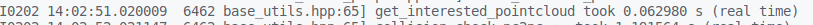

2. 提取有效点云重新分配 0.094 s -> 94 ms

   * 只生成点云0.007 s  -> 7 ms

   

   * extractInterestPointCloud +depthMapToPointCloud + toproto -> 94  ms
     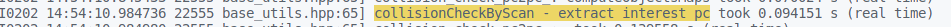


回放碰撞点云显示位置与实际碰撞位置不符合 :star:

```bash
roboeye/EVA4/EVA4/2026-04-07-14-34-53
```

有框场景显示问题

### 不可达等提示

需要看日志等提示才能辨明


### waypoint 检查轨迹插补 :heavy_check_mark:

已知起始点 （apose）& 终点 （cpose），夹爪 tcp 未知，==眼在手上相机可能和本体&障碍物碰撞（障碍物冗余）==

1. 手眼标定等应用 (用路径规划接口)

   * 检查完整轨迹
     * cpose
     * apose
   * 使用当前关节坐标（有连接机器人可以获取）检测作为起始点检测
   * 其他障碍物
     * 夹爪
       能否要求做手眼标定前不安装夹爪
     * 相机盒
       附着于机器人，可以以 flange 为原点

2. 放置点可达性检查 （这里有可能需要用路径规划）

   * 路径规划

     * start_joints -> final_pose/final_joint
       输出 apose list （类似 grasp_trajectory)

     * gripper_id 
       middleware 获取

       * correction 3d / correction 2d

         ```bash
         robot.response()
         ```

       * 拿不到 gripper id 则只检查轨迹

   * 关节空间移动

     * 关节空间插补

       * 五次多项式
         $$
         q(t) = a_0 + a_1t + a_2t^2 + a_3t^3 + a_4t^4+a_5t^5\\
         v(t) = a_1 + 2a_2t+3a_3t^2 + 4a_4t^3 + 5a_5t^4\\
         a(t) = a_2 + 6a_3t + 12a_4t^2 + 20a_5t^3
         $$
         约束条件
         $$
         q(0) = \text{pre\_pose}\\
         q(T) = \text{final\_pose}\\ v(0) = 0, v(T) = 0\\
         a(0) = 0, a(T) = 0
         $$

         $$
         a_0 = q_1\\
         a_1 = 0\\
         a_2 = 0\\
         $$

         $$
         q_f = q_1 + a_3T^3 + a_4T^4 + a_5T^5\\
         0 = 3a_3T^2 + 4a_4T^3 + 5a_5T^4\\
         0 = 6a_3T + 12 a_4 T^2 + 20 a_5 T^3
         $$

         

       * 线性插值
         $$
         q(t) = q_0 + (q_f - q_0) \frac{t}{T}\\
         v(t) = \frac{q_f - q_0}{T}\\
         a(t) = 0
         $$
         

   * 笛卡尔空间移动

   * 其他移动方式

3. 回放轨迹 :question:

4. 兼容性问题

   * ~~目前用到单点检查的情况都是 movel 的情况~~
   * 实际路径有可能不是从原点开始

5. control center 轨迹检查不经过 middleware 

   * robot_id 怎么获取 
     1. ~~middleware -> setting robot_id~~
     2. ~~根据 middleware_port 获取~~
     3. driver robot_status 

   

   

### ~~根据布局文件导入障碍物~~

~~slam 构建地图(动态构建，目前 bin picking 场景相机成像无法覆盖全局）~~

1. 确定文件格式

   * cad -> dwg
   * step

2. 确定文件参考原点 （理想的是机器人基座）

   * 机器人
   * 相机
   * 其他

   已知参考原点与机器人基座的关系 -> 变换布局图原点至基座原点/手动指定原点（若布局图给出机器人）
   
3. 文件存放路径

   * 类似 gripper 路径

4. 安装误差在厘米级别


### ~~middleware 回归测试使用 planner~~

回归测试开启 planner server subporgress


## 为新的项目/软件应用场景提供机器人相关支持

### 长广溪协作 :heavy_check_mark:

#### 设置 ip

[设置 ip](https://academy.cgxi.com/course/detail?cid=447880755171397)


#### 混动

[CGXI G9](https://www.cgxi.com/product/detail?pid=470860645683269)

1. 用**任务**与主程序并行
2. 机器人支持作为客户端/服务端
3. 任务里是否可以移动 :heavy_check_mark:
   * 有阻塞
4. 处理附加轴
5. 选用带工具的坐标系，当前位姿是否一致 :heavy_check_mark:


#### 测试数据

```lua
recv_data_table = {}
    recv_data_table[1] = "0SetVar*********0000008300050001100701+00000.000+00000.000+00090.000+00000.000-00090.000+00000.000000000000"
    recv_data_table[2] = "0GetVar*********00000009000100011"
    recv_data_table[3] = "0SetVar*********0000008300040001200700-00492.000-00114.000+00400.000+00127.280-00127.230+00000.000001000000"
    recv_data_table[4] = "0Move***********000000811+00000.000+00000.000+00000.000+00000.000+00000.000+00000.000000000000+00050.0001"
    recv_data_table[5] = "0GetCurPose*****00000000"
    recv_data_table[6] = "0GetVar*********00000009000500011"
    recv_data_table[7] = "0Move***********000000811+00000.000+00000.000+00090.000+00000.000-00090.000+00000.000000000000+00050.0001"
    recv_data_table[8] = "0Move***********000000810-00492.000-00114.000+00400.000+00127.280-00127.230+00000.000001000000+00050.0000"
    recv_data_table[9] = "0GetCurPose*****00000000"
    response_data_table = {}
    response_data_table[1] = "0"
    response_data_table[2] = "000010"
    response_data_table[3] = "0"
    response_data_table[4] = "0"
    response_data_table[5] = "00+00000.000+00000.000+00000.000+00000.000+00000.000+00000.0000000000001+00000.000+00000.000+00000.000+00000.000+00000.000+00000.000000000000"
    response_data_table[6] = "00+00000.000+00000.000+00000.000+00000.000+00000.000+00000.0000000000001+00000.000+00000.000+00000.000+00000.000+00000.000+00000.000000000000"
    response_data_table[7] = "0"
    response_data_table[8] = "0"
    response_data_table[9] = "00+00000.000+00000.000+00000.000+00000.000+00000.000+00000.0000000000001+00000.000+00000.000+00000.000+00000.000+00000.000+00000.000000000000"
    response_data_temp = ""
    recv_data_talbe_len = length(recv_data_table)
```


return to cc

request

```lua 
0GetVar*********00000006000010
```

```lua
0SetVar*********0000002310018unknow var type :6
```


```lua
0SetVar*********000000010
```

```lua
0SetVar*********000000010
```

```lua
0Move***********000000010
```

get_cur_pose response 

```lua
0GetCurPose*****0000014100+00000.000+00000.000+00000.000+00000.000+00000.000+00000.0000000000001+00000.000+00000.000+00000.000+00000.000+00000.000+00000.000000000000
```

home

```lua
0GetVar*********00000075000701+00000.000+00000.000+00090.000+00000.000-00090.000+00000.000000000000
```

```lua
0Move***********000000010
```

```lua
0GetCurPose*****0000014100+00000.000+00000.000+00000.000+00000.000+00000.000+00000.0000000000001+00000.000+00000.000+00000.000+00000.000+00000.000+00000.000000000000
```

```lua
0GetVar*********00000075000700-00492.000-00114.000+00400.000+00127.280-00127.230+00000.000001000000
```

```lua
0GetCurPose*****0000014100+00000.000+00000.000+00000.000+00000.000+00000.000+00000.0000000000001+00000.000+00000.000+00000.000+00000.000+00000.000+00000.000000000000
```

```lua
0Move***********000000010
```

```lua
0GetCurPose*****0000014100+00000.000+00000.000+00000.000+00000.000+00000.000+00000.0000000000001+00000.000+00000.000+00000.000+00000.000+00000.000+00000.000000000000
```


#### 通讯模板

针对机器人程序基于 lua 的模板自动生成

* 替换部分机器人自定义函数 :star:

  * socket 相关

  * get/set var

    * pose 相关处理 （需要明确单位）

      ```lua
      -- cpose & apose 长度处理
      function format_pose(pose, pose_type)
      
      end 
      
      function set_pose(pose_data, pose_type)
      
      end 
      ```

      

  * 移动 (若子线程无法移动，写法基本一致)

    ```lua
    function roboeye_move(recv_data)
        
    end
    
    -- 部分涉及单位转化
    function set_pose(pose_data, pose_type)
    
    end
    
    -- comm thread can not move
    function robot_recieve_request()
    
    end
    ```

    

  * 获取当前位姿

    * 机器人内置函数获取
    * 位姿长度

    ```lua
    function get_cur_pose()
    
    end
    ```

    

  * 设置/读取 io 

    ```lua
    function set_io(recv_data)
    
    end
    
    function get_io(recv_data)
    
    end
    ```

  * 字符串截取 ->lua string.sub（从 1 开始）

    ```lua
    function str_substr(str, start, len)
        start = start + 1
        return string.sub(str, start, start + len - 1)
    end 
    ```

  * 字符串 <-> 数字 相互转化 
    lua 

    ```
    tonumber()
    tostring()
    ```

  * 初始化虚拟寄存器

  

* 接口抽象层设计
  需要用 metatable 实现多态
  [metatable](https://www.runoob.com/lua/lua-metatables.html)
  
  * 需要导入多个文件


#### cc 通用通讯测试 + ik 

1. 所有变量类型测试
   * 设置再获取 
2. 移动测试
3. 获取位姿测试
4. io （可选）
5. ik 测试
   * cc 向 planner 发起请求，不经过 middleware

#### windows 通讯测试

```po
$listener = [System.Net.Sockets.TcpListener]::new(8080)
$listener.Start()
Write-Host "Listening on port 8080..."

$client = $listener.AcceptTcpClient()
$stream = $client.GetStream()
$bytes = New-Object byte[] 256
$stream.Read($bytes, 0, $bytes.Length) | Out-Null
$data = [System.Text.Encoding]::ASCII.GetString($bytes)
Write-Host "Received: $data"

$listener.Stop()
```

```po

# 创建 TCP 监听器对象
$listener = [System.Net.Sockets.TcpListener]::new(1000)

# 启动监听
$listener.Start()
Write-Host "Listening on port 6000..."


   # 接受客户端连接
   $client = $listener.AcceptTcpClient()
   Write-Host "Client connected: $($client.Client.RemoteEndPoint)"

# 处理客户端数据
$stream = $client.GetStream()
$reader = New-Object System.IO.StreamReader($stream)
$writer = New-Object System.IO.StreamWriter($stream)

# 发送响应
$response = "0SetVar*********0000008300050001100701+00000.000+00000.000+00090.000+00000.000-00090.000+00000.000000000000"
$writer.WriteLine($response)
$writer.Flush()

# 读取客户端发送的数据
$data = $reader.ReadLine()
Write-Host "Received: $data"


# 关闭连接
$client.Close()
Write-Host "Client disconnected"
$listener.Stop()

```


```python 
--机器人做客户端
j=1
wait(1500)
socket_connect("tcp", "192.168.6.110" , j,1000)--作为客户端连接服务器
				
while(true)
do
	   connect_status = get_socket_connect_status(j)
    
		if(connect_status == 0) 
		then
			 print("connect ok")
		     break
		elseif(connect_status == 1) 
		then
			 print("连接失败")
		     popup_message( "连接失败","popup example",false, false, true)
			 wait(1000)
			 socket_connect("tcp", "192.168.6.110" , j,1000)
		elseif(connect_status == 2) 
		then
			 print("status = 2")
			 socket_disconnect(j)
			 j = j + 1	
			 wait(1000)
			 socket_connect("tcp", "192.168.6.110" , j,1000)
		     if (j >= 16) then 
				print("ID全部失败")
				popup_message( "ID全部失败，请停止程序，重新运行","popup example",false, false, true)
                 j=0
			end
		elseif(connect_status == 3) 
		then
			 print("connect invalid")
		     popup_message( "非法连接，请停止程序检查连接","popup example",false, false, true)
		end
	wait(500)
end
```


#### ~~手眼标定&位姿显示适配~~ 

旋转模式角度/弧度表示
换成 Euler pose

#### 需要优化

1. connect popup_message :heavy_check_mark:
2. recieve_data 数据判断，根据连接状态 :heavy_check_mark:
2. 寄存器初始化单独在程序开始前触发


### fanuc 协作 :heavy_check_mark:

[UR Series vs. Fanuc CRX: Cobot Showdown](https://qviro.com/blog/universal-robots-ur-fanuc-crx/)

#### 机器人模型适配

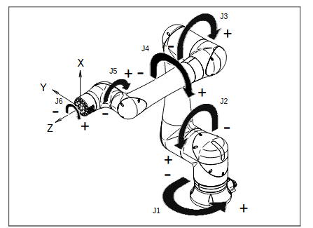
[fanuc cr inverse kinematics robot forum](https://www.robot-forum.com/robotforum/thread/42265-inverse-kinematics-of-fanuc-crx-10ia-and-other-robots-with-non-spherical-wrist/)
[fanuc cr10ia-l ik mdpi](https://www.mdpi.com/2218-6581/13/6/91)

[fanuc fk&ik sdk](https://underautomation.com/fanuc/documentation/kinematics)

##### algebraic numerical

standard D-H model

```python
Inverse Kinematics of a Class of 6R Collaborative Robots with Non-Spherical Wrist
```

conert Cayley transform into rotation transform, 提供了一种从反对称矩阵到正交矩阵的直接映射，通过该转化可以避免求解三角函数
$$
c = \begin{bmatrix}
0&-c_3&c_2\\
c_3&0&-c_1\\
-c_2&c_1&0
\end{bmatrix}
$$
称向量 $w = [c_1,\ c_2,\ c_3]^T$ 为 Cayley 参数
$$
w = vee((I-R)(I+R)^{-1})
$$

$$
^0R_4 = (I + C)(I-C)^{-1}
$$


##### disconnection and re-connection

```python
An effective and unified method to derive the inverse
kinematics formulas of general six-DOF manipulator with
simple geometry
```

$$
T_L =\left[\begin{matrix}\cos{\left(q_{2} + q_{3} + q_{4} \right)} & - 1.0 \sin{\left(q_{2} + q_{3} + q_{4} \right)} & 0 & a_{2} \cos{\left(q_{2} \right)} + a_{3} \cos{\left(q_{2} + q_{3} \right)}\\\sin{\left(q_{2} + q_{3} + q_{4} \right)} & 1.0 \cos{\left(q_{2} + q_{3} + q_{4} \right)} & 0 & a_{2} \sin{\left(q_{2} \right)} + a_{3} \sin{\left(q_{2} + q_{3} \right)}\\0 & 0 & 1.0 & d_{4}\\0 & 0 & 0 & 1\end{matrix}\right]
$$

$$
T_R = 
\left[\begin{matrix}- \left(ax \cos{\left(q_{1} \right)} + ay \sin{\left(q_{1} \right)}\right) \sin{\left(q_{5} \right)} + \left(\left(nx \cos{\left(q_{1} \right)} + ny \sin{\left(q_{1} \right)}\right) \cos{\left(q_{6} \right)} - \left(ox \cos{\left(q_{1} \right)} + oy \sin{\left(q_{1} \right)}\right) \sin{\left(q_{6} \right)}\right) \cos{\left(q_{5} \right)} & \left(ax \cos{\left(q_{1} \right)} + ay \sin{\left(q_{1} \right)}\right) \cos{\left(q_{5} \right)} + \left(\left(nx \cos{\left(q_{1} \right)} + ny \sin{\left(q_{1} \right)}\right) \cos{\left(q_{6} \right)} - \left(ox \cos{\left(q_{1} \right)} + oy \sin{\left(q_{1} \right)}\right) \sin{\left(q_{6} \right)}\right) \sin{\left(q_{5} \right)} & - \left(nx \cos{\left(q_{1} \right)} + ny \sin{\left(q_{1} \right)}\right) \sin{\left(q_{6} \right)} - \left(ox \cos{\left(q_{1} \right)} + oy \sin{\left(q_{1} \right)}\right) \cos{\left(q_{6} \right)} & d_{5} \left(\left(nx \cos{\left(q_{1} \right)} + ny \sin{\left(q_{1} \right)}\right) \sin{\left(q_{6} \right)} + \left(ox \cos{\left(q_{1} \right)} + oy \sin{\left(q_{1} \right)}\right) \cos{\left(q_{6} \right)}\right) - d_{6} \left(ax \cos{\left(q_{1} \right)} + ay \sin{\left(q_{1} \right)}\right) + px \cos{\left(q_{1} \right)} + py \sin{\left(q_{1} \right)}\\- az \sin{\left(q_{5} \right)} + \left(nz \cos{\left(q_{6} \right)} - oz \sin{\left(q_{6} \right)}\right) \cos{\left(q_{5} \right)} & az \cos{\left(q_{5} \right)} + \left(nz \cos{\left(q_{6} \right)} - oz \sin{\left(q_{6} \right)}\right) \sin{\left(q_{5} \right)} & - nz \sin{\left(q_{6} \right)} - oz \cos{\left(q_{6} \right)} & - az d_{6} - d_{1} + d_{5} \left(nz \sin{\left(q_{6} \right)} + oz \cos{\left(q_{6} \right)}\right) + pz\\- \left(ax \sin{\left(q_{1} \right)} - ay \cos{\left(q_{1} \right)}\right) \sin{\left(q_{5} \right)} + \left(\left(nx \sin{\left(q_{1} \right)} - ny \cos{\left(q_{1} \right)}\right) \cos{\left(q_{6} \right)} - \left(ox \sin{\left(q_{1} \right)} - oy \cos{\left(q_{1} \right)}\right) \sin{\left(q_{6} \right)}\right) \cos{\left(q_{5} \right)} & \left(ax \sin{\left(q_{1} \right)} - ay \cos{\left(q_{1} \right)}\right) \cos{\left(q_{5} \right)} + \left(\left(nx \sin{\left(q_{1} \right)} - ny \cos{\left(q_{1} \right)}\right) \cos{\left(q_{6} \right)} - \left(ox \sin{\left(q_{1} \right)} - oy \cos{\left(q_{1} \right)}\right) \sin{\left(q_{6} \right)}\right) \sin{\left(q_{5} \right)} & - \left(nx \sin{\left(q_{1} \right)} - ny \cos{\left(q_{1} \right)}\right) \sin{\left(q_{6} \right)} - \left(ox \sin{\left(q_{1} \right)} - oy \cos{\left(q_{1} \right)}\right) \cos{\left(q_{6} \right)} & d_{5} \left(\left(nx \sin{\left(q_{1} \right)} - ny \cos{\left(q_{1} \right)}\right) \sin{\left(q_{6} \right)} + \left(ox \sin{\left(q_{1} \right)} - oy \cos{\left(q_{1} \right)}\right) \cos{\left(q_{6} \right)}\right) - d_{6} \left(ax \sin{\left(q_{1} \right)} - ay \cos{\left(q_{1} \right)}\right) + px \sin{\left(q_{1} \right)} - py \cos{\left(q_{1} \right)}\\0 & 0 & 0 & 1\end{matrix}\right]
$$

==注：==$\theta_6$ 也需要寻根


##### geometry approach 

[geometry_approach_code](https://github.com/mattj23/crx-kinematics)

```python 
Geometric Approach for Inverse Kinematics of the FANUC CRX Collaborative Robot
```

fk: D-H modified
$$
T_i = Trans_x(a_i) \cdot Rot_x(\alpha_i) \cdot Trans_z(d_i) \cdot Rot_z(\theta_i)
$$


==the coupling between $J_2$ and $J_3$ must be considered.==

求解 $O_4$  的实际位置

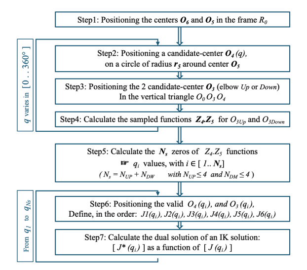

prelimenary knowledge
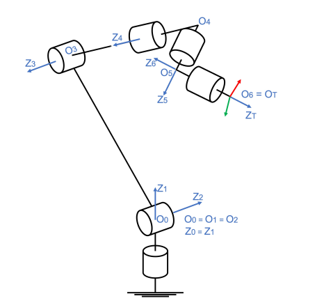
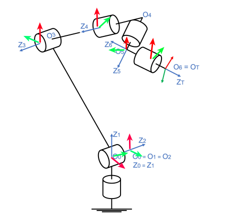

| i              | 1     | 2          | 3           | 4     | 5     | 6     |
| -------------- | ----- | ---------- | ----------- | ----- | ----- | ----- |
| $a_{i-1}$      | 0     | 0          | 540         | 0     | 0     | 0     |
| $\alpha_{i_1}$ | 0     | -90        | 180         | -90   | 90    | -90   |
| $\theta_i$     | $J_1$ | $J_2 - 90$ | $J_2 + J_3$ | $J_4$ | $J_5$ | $J_6$ |
| $r_i$          | 0     | 0          | 0           | -540  | 150   | -160  |


$$
^0R_{tool} = R_z(R) \cdot R_Y(P) \cdot R_X（W\\
^0O_6 = [X, Y, Z, 1]^T	\\
^0T_{tool} = ^0R_{tool} \oplus ^0O_6\\
^{tool}O_5 = [0, 0, r_6, 1]^T\\
\textcolor{red}{^0O_5 = ^0T_{tool} \cdot ^{tool}O_5}
$$
注： 这里 $\oplus$ 表示矩阵拼接

令 $q \in [0, 2\pi]$ 为向量$O_5O_4$ 与 轴 $O_5O_6$ 的特征角（采样），有
$$
^{tool}O_4 = [r_5\cos(q), r_5\sin(q), r_6, 1]^T\\
^0O_4(q) = ^0T_{tool} \cdot ^{tool}O_4(q)
$$
==满足约束条件，求解确切的 $^0O_4$ 位置==

1. 以 $O_1,\ O_3,\ O_4$ 为三角形，有
   $d_04 \leq a_2 + (-r_5)$
2. $Z_4 \cdot Z_5 = 0$
   * $\overrightarrow{O_3O_4}$ $\overrightarrow{O_4O_5}$

solve  $O_3$
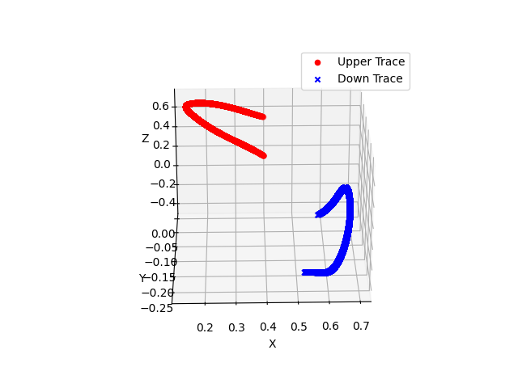
$$
\overrightarrow{O_3^{\prime}} = a_2 \cdot cos(\theta) \cdot \overrightarrow{O_4}\\
\overrightarrow{O_3} = \overrightarrow{O_3^{\prime}} + a\cdot \sin(\theta)\cdot \overrightarrow{O_3^{\prime}O_3}
$$


solve $J_1$
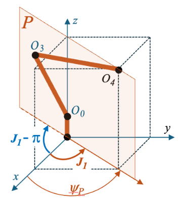
$$
^{tool}O_4(q_i) = [r_5\cos(q_i), r_5\sin(q_i), r_6, 1]^T\\
^0O_4(q_i) = ^0T_{tool} \cdot^{tool}O_4(q_i)=[X_{Q_4}, Y_{Q_4}, Z_{Q_4}, 1]^T\\
\textcolor{red}{\Phi_p = \atan2(Y_{Q_4}, X_{Q_4})}\\
J_1 = \Phi_p\\
J_1^* = \Phi_p - \pi
$$
solve $J_2, J_3$

down

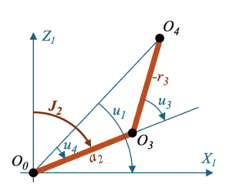
$$
u_1 = \atan2(Z_{Q_4}, \sqrt{X_{Q_4}^2 + Y_{Q_4}^2})\\
u_2 = -((X_{Q_4}^2 + Y_{Q_4}^2 + Z_{Q_4}^2)-(a_2^2+r_4^2)) / (2 \cdot a_2 \cdot r_4)\\
u_3 = \delta \cdot \arccos(u_2)\\
u_4 = \atan2(-r_4 \cdot \sin(u_3), a_2 - r_4 \cdot \cos(u_3))\\
J_2 = \frac{\pi}{2}  - u_1 + u_4 \\
J_3 = u_1 + u_3 - u_4
$$
==注：== $u_2$ 为余弦定理

up


solve $J_4$

令 $J_4^* = J_5^* = 0$, 得 $^3T_4^*, ^4T_5^*$
$$
^0T_4^* = ^0T_1 \cdot ^1T_2 \cdot ^2T_3 \cdot ^3T_4^*  \\
^0T_5^* = ^0T_4^* \cdot ^4T_5^*\\
Z_4 = ^0T_4^* \cdot [0, 0, 1, 0]^T\\
^0O_5^* = ^0T_5^* \cdot [0, 0, 0, 1]^T\\
V_0 = O_5^* - O_4\\
V_1 = O_5 - O_4\\
scal1 = V_0 \cdot V_1\\
scal4 = (V_0 \land V_1) \cdot Z_4\\
s_4 = sign(scal4)\\
J_4 = s_4 \cdot \arccos(scal_1)
$$

==注：== $\land$ 表示叉乘

solve $J_5$

similar to $J_4$
$$
^0T_4^* = ^0T_1 \cdot ^1T_2 \cdot ^2T_3 \cdot ^3T_4  \\
^0T_6^* = ^0T_4 \cdot ^4T_5^* \cdot ^5T_6^*\\
Z_5 = ^0T_5^* \cdot [0, 0, 1, 0]^T\\
^0O_6^* = ^0T_6^* \cdot [0, 0, 0, 1]^T\\
W_0 = O_6^* - O_5\\
W_1 = O_6 - O_5\\
scal1 = W_0 \cdot W_1\\
scal4 = (W_0 \land W_1) \cdot Z_5\\
s_5 = sign(scal5)\\
J_5 = s_5 \cdot \arccos(scal_3)
$$
solve $J_6$
$$
^0T_6^* = ^0T_4 \cdot ^4T_5 \cdot ^5T_6^*\\
R = (^0R_6^*)^{-1} \cdot ^0R_6 \\
J_6 = \atan2(-R(1,2), R(1,1))
$$
其中， $R$ 为 $6^*$ 与 $6 $ 的变换矩阵

dual property
$$
[J] = [J_1, J_2, J_3, J_4, J_5, J_6]^T\\
[J^*] = [J_1 - 180, -J_2, 180-J_3, J_4-180, J_5, J_6]^T
$$


对比工业机器人，ur类型的协作机器人，以及 fanuc 协作类型的 ik 单次求解

1. ir

   ```bash
   ik_ct = 0.00018095970153808594 s
   ```

   0.2 ms

2. cr

   ```bashe
   ik_ct = 0.0003917217254638672 s
   ```

   0.4 ms

3. ir_with_skew_offset

   ```bash
   ik_ct = 0.6108040809631348 s
   ```

   600 ms

   向量化后 + 采样 （1度，若连杆长度为 1m 则间隔 2 cm 取一个采样点）

   ```bash
   k_ct = 0.005276918411254883 s
   ```

   5 ms
   使用 cpython 优化

   ```bash
   ERROR:root:ik_ct = 0.0007674694061279297 s
   ERROR:root:ik_ct = 0.0005478858947753906 s
   ```


##### singularity

A cuspidal manipulator is one which can change posture ==without meeting a singularity.==

[ur singularity](https://www.universal-robots.com/articles/ur/application-installation/what-is-a-singularity/)

joint angle  & link length

1. shoulder singularity
2. elbow singularity
   $[0, \frac{\pi}{2}],\ [-\frac{\pi}{2}, 0], [-2\pi, -\frac{3}{2}\pi], [\frac{3}{2} \pi, 2 \pi]$
3. wrist singularity

```python
  # def test_compute_ik_analytical(self):
    #     home_joints = []
    #     home_joints.append(np.array([0,0,0,0,-90,0]))
    #     # home_joints.append(np.array([0, 55.021, 133.904, 0, -90, 0]))
    #     # home_joints.append(np.array([0, 116.747, 194.747, -160.704, 0, 0]))
    #     target_pose = []
    #     target_pose.append(np.array([540.0, -150, 550, -180, 0, 0]))
    #     # target_pose.append(np.array([842.86, -150, 906.046, 180, -78.883, 0]))
    #     # target_pose.append(np.array([828.054, 141.574, 354.861, -4.018, 11.317, -19.694]))
    #     for j in range(len(home_joints)):
    #         target_pose_as_matrix = self.crx_robot.compute_fk(home_joints[j] / 180 * np.pi)[-1]
    #         results = self.crx_robot.compute_ik_analytical(target_pose_as_matrix)
    #         success = True
    #         for i, result in enumerate(results):
    #             ik_matrix = self.crx_robot.compute_fk(result)[-1]
    #             target_pose[j][:3] *= self.settings.translations_scale
    #             target_matrix = matrix_utils.from_euler_to_matrix(target_pose[j], self.settings.rotation_mode, self.settings.rotation_as_degree)
    #             import logging
    #             np.set_printoptions(suppress=True)
    #             logging.error(f"result {i}: {np.array2string(result * 180 / np.pi, precision=3)}")
    #             if not np.allclose(ik_matrix, target_matrix, atol=1e-3):
    #                 success = False

    #         self.assertTrue(success)
```


#### 通讯适配

1. 控制柜类型
   * R-30+B Mini Plus controller
2. 示教器系统版本
   * v9.40


### ~~逃逸碰撞检测~~

1. 确定当前夹爪冗余 （mm)
2. 最大抓取角度 100 deg
3. 与框壁碰撞检测 0.5 mm


## 降低现有产品功能研发支持次数

### cc 切换工序失败

* 现场遇到过cc发送切换工序，middleware 还未完成 cc 就收到了切换失败的回复


### 获取工件数量需要更新抓取轨迹 :heavy_check_mark:

* 有序等场景解耦
* pose_deriving 无法获取 :question:

#### 前提条件

1. **capture 3d**
2. ~~cur_grasp_traj 是否一定需要？~~


### 获取放置点有误

* 用错 tcp(capture/placement)
* 上报带工具的 tcp
* *出现不可达等原因有🈚更好的提示方式* 


### 上方点回放与实际不符合 :heavy_check_mark:

* 无框根据抓取点生成上方点
* 调试工具轨迹不一致
  * 单次调试根据一个工件生成

```bash
# 抓取点报与环境障碍物碰撞，与回放不一致，首个样本
# 夹爪模型问题
HST-CZ/2507/2507-Qian-OP50/2026-03-14-19-32-36
```

```bash
#末尾样本
HST-CZ/2507/2507-S09/2026-01-08-17-31-07

grasps_pos_info_for_group {
  key: 0
  value {
    grasps_length: 4
    min_pos {
      x: 0.75858860380917947
      y: -2.207437944379528
      z: 0.3376702730279651
    }
    max_pos {
      x: 1.1565648763934406
      y: -1.9333507269217156
      z: 0.34333966413265582
    }
    avg_pos {
      x: 0.92654934856784732
      y: -2.099497853091735
      z: 0.33931416796240821
    }
  }
}

#末尾样本
HST-CZ/2507/2507-S02/2026-03-17-17-05-39

grasps_pos_info_for_group {
  key: 0
  value {
    grasps_length: 2
    min_pos {
      x: 1.6098682954619017
      y: 0.82962020400132908
      z: 0.312222827336534
    }
    max_pos {
      x: 1.7146933259572243
      y: 1.6323073370946724
      z: 0.56000890949092674
    }
    avg_pos {
      x: 1.662280810709563
      y: 1.2309637705480008
      z: 0.4361158684137304
    }
  }
}

# 夹爪模型问题
HST-CZ/2507/2507-Qian-OP50/2026-03-19-14-11-42
```

1. ~~无框~~根据单个抓取点生成上方点 （与回放逻辑一样）
   * 保存抓取点信息
     grasp_group grasp_planner_runtime_context
     list grasp_planner_runtime_context
2. 有框若根据抓取点生成
3. 回放适配
4. 新增允许不启用上方点配置


### 不启用上方点 :heavy_check_mark:

1. 目前上方点 0 & 1 为相同位置
2. 使用进攻&撤退点代替


### 工具坐标系切换上报位姿问题

* 目前切换工具坐标系上报位姿还是用的 null tool 的 （fanuc、kuka……）


### 机器人执行 cc 指令失败不明显

* 前端界面没打印


### 夹爪与工件碰撞检测问题 

* 夹爪与工件点云 -> 深度图在相机视野下的转换，投影方向不竖直，导致不同高度的点云在相机视野下x、y 是一致的，但在机器人坐标系下 x、y 不一致

#### 相机成像模型

[3d 物体投影](https://www.phoenix-eye.com/courses/camera_model.html)

3d 世界与 2d 图片转换（类似点云与深度图）
$$
P = K[R|T]X
$$
其中，$P(x,y,z)$ 为现实世界的一个点，$X(x,y)$ 为2d图像点


### ~~返回cpose对应mode~~

目前使用 rrt 返回 apose

cc 向 planner 发起请求


### fanuc 卡屏 :heavy_check_mark:

1. 连续跑一段时间有概率出现通讯问题，表现为 cc 发送指令，机器人没回复，同时机器人 ping cc 超时
   * 目前视觉请求完成后，强制 abort_task，再次发起视觉请求后主动关闭上一次的连接
     * 尝试过只连接和 abort_task， 没有导致通讯异常
     * abort_task 不会进行资源回收
   
2. 示教器卡屏
   * 用户界面优先级 90，用户程序优先级 50 （fanuc 优先执行靠前的）
     fanuc 优先级靠前的可以中断靠后的，同级别的时间间隔 256 ms 会检查是否有就绪的任务要执行，优先级靠后的无法抢占资源。适当的延时可以让出 cpu 执行其他低级别的任务。
     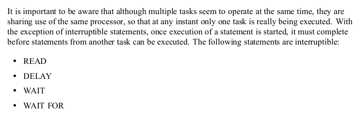
     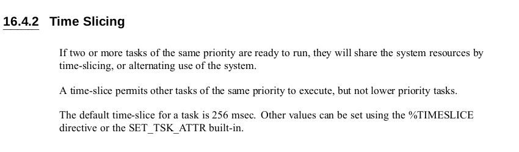
   
   执行完一次视觉请求后，正常退出（关 socket，关 文件），下次启动通讯程序前确保上一次的安全退出后再启动


### 客户端 & 服务端可配置

fanuc 目前仅支持使用 c1 / s3 

karel varialbes (.vr)


### 调试工具 middleware 上报数据 

1. 调试工具需要切换工作文件夹获取机器人配置
   * 导致 middleware & planner grasp_planner 不一致
2. middleware 有独自的线程上报机器人位姿至 planner & roboeye
   * 由于工作文件夹被切换导致 middleware 机器人配置文件与当前的有可能不一致


1. ~~若机器人与 middleware 断连接~~
   不依赖连接状态，且不能解决当前问题
2. planner reload -> middleware reload
   * planner reload 保留部分配置，只修改有改动的
     不更新路径，大概率需要更新
3. pose 值一致不上传
   * planner 重启后不更新位姿
     强制上传一次
4. planner & middleware 维护统一的配置文件


### 降采样破坏 mesh 拓扑结构 :star:

使用 core 降采样方法

夹爪拓扑结构被破坏严重，碰撞检测误检（与回放界面显示不一致）

```bash
HST-CQ/G026_OP20_L/unknow_station/2026-03-18-17-25-01
```

未知碰撞问题

```bash
HST-CZ/2507/2507-Qian-OP10/2026-03-27-20-15-46
```


1. 构建碰撞环境（update_scene）会对夹爪进行降采样处理（设置最大的 polygons） ，轨迹检查又会降采样
   RB13_2_decimated_50000或者加 padding
   
1. gui 初始化夹爪会降采样，并指定 max_polygons 为 50000 (max_mesh_polygons)
   
2. 夹爪统一使用 core 的降采样方式 :star:
   输入 mesh_file_path，并保存降采样后的文件，再用 o3d read
   
   * 限定最大三角形数量
     但机器人 link 一般没有 5万个三角形
     
   * 目前 pcl 降采样耗时  $\approx 4.36 $ s
   
     ```bash 
     Decimating gripper mesh from 1386908 to 49999 polygons took took 4.358062 s (real time)
     ```
   
     
   
   * o3d 降采样耗时 $\approx 0.24$ s
   
     ```bash 
     decimated_gripper from 1386908 to 15640 triangles in 0.23666882514953613 seconds
     ```
   
   * pybind11 
   
     通过 numpy 数据发回 vertices & triangles
     
   * 夹爪 id 与 max_polygons 绑定而不是和 grippers 绑定
   
     * 目前，如果不同算子使用的 max_polygons 参数不同，会导致获取夹爪就加载一次夹爪（全路径下的都会被更改），但是我只想根据当前的 gripper_id 和 设置的 max_polygons 来决定是否重新加载单个夹爪。我~~现在有些地方只用 gripper id 来获取夹爪信息还不够（其他地方可以就按照 gripper id 拿，因为如果 max_polygons 改了，对应 gripper_id  的mesh也会改）。~~
   
4. 使用 decimated 文件做碰撞检测 :white_check_mark:

   ```python
   removeExtension(file_path) + "_decimated_" + std::to_string(max_gripper_mesh_polygons_) +
              '.' + Gripper::MESH_PLY;
   ```

   

4. 回放界面使用降采样后的显示
   * ~~夹爪~~
   
     第一次加载使用原始的？运行过程中会生成降采样文件，加载的时候动态更新
     目前前端显示夹爪路径: 
   
     localPathToUrl -> 使用 workflow.data 路径下的夹爪
   
     目前我遇到的问题是调试界面显示的夹爪和实际作检测的不一致。实际检测的夹爪会经过降采样。目前调试界面首次加载夹爪用的 url，为什么要用 url。点击运行工作流后，我想用降采样的夹爪显示，在运行工作流的时候会把夹爪降采样，但是路径好像变了。你是推荐我在 url 目录下新生成一个降采样的夹爪还是直接用其他位置的已经降采样过的夹爪。
     ==目前导入夹爪会先降采样==
   
   * 机器人(不设置 max_polygons)
     ~~sync to remote 对所有 mesh 文件都进行降采样，通过降采样覆盖保存的 link~~
     前端显示机器人模型会缓存
     根据文件是否改变动态加载机器人模型
     
   
   
   
   
   
   


### g601 kuka 连接超时 :heavy_check_mark:

1. KLI (KUKA LINE INTERFACE) :heavy_check_mark:

   * 已经连接至XF5（KRC 5)
   * KLI （KRC 4）
2. 后台程序正常运行 :white_check_mark:
3. 通过交换机连接，ip 唯一 :white_check_mark:
4. ~~是否有其他依赖软件？~~
5. 机器人正常监听端口并能接受到数据

windows powershell  telnet

```bash 
Enable-WindowsOptionalFeature -Online -FeatureName TelnetClient
```

**工控机用了广播地址**


