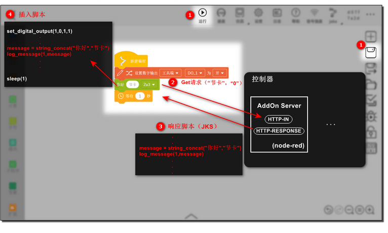
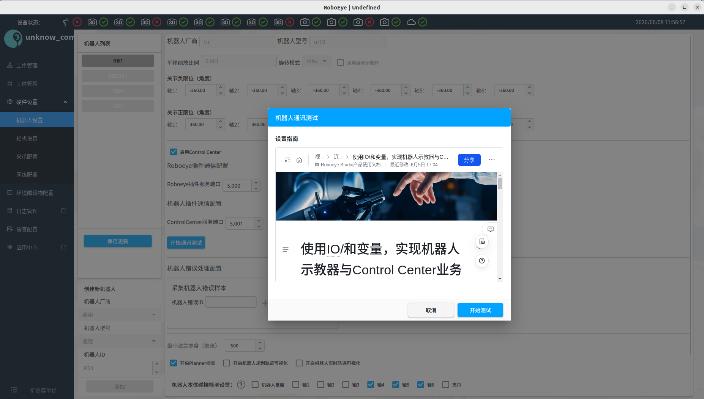
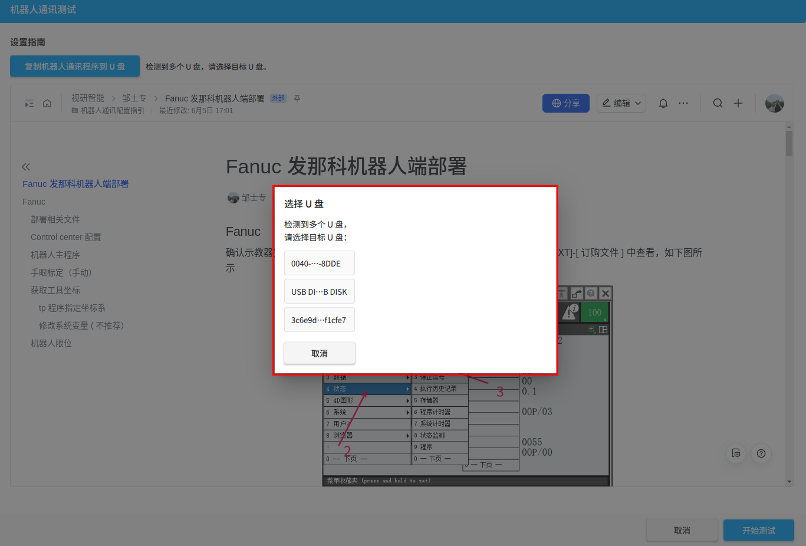
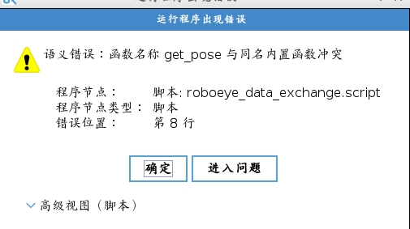
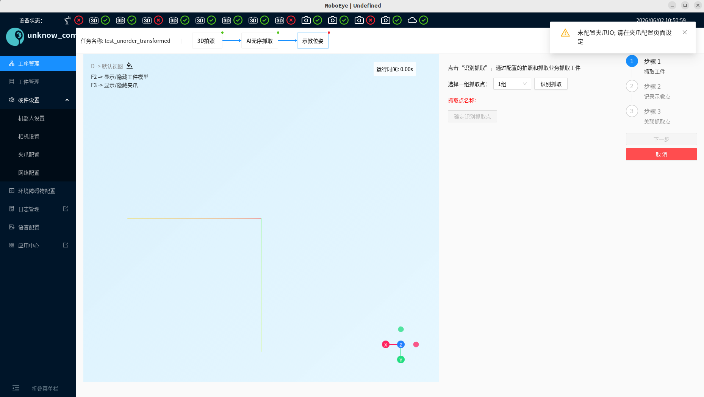

# Q2

## 开发新的产品功能可以满足客户的生产需求

### jaka 等新机器人接入

#### 接入流程

1. cc 指令解析
2. 混动接入
3. 是否可以通过切换工具坐标系完成对应 tcp 坐标上报
4. tcp 位姿是否基于机器人基座
5. 地轨等接入影响

#### 增加已有品牌新型号

```yaml
kuka 
kr90-r2300
kr90-r2700

Yaskawa
motoman-gp180

Ur
ur8long
```

ur8 远程控制与脚本控制

待增加

```bash 
Nachi
sra350

jaka
zu12
```


#### 混动通信

##### jaka 机器人 :white_check_mark:

```bash 
jakazuadmin
```

[jaka_script](https://www.jaka.com/docs/guide/1.7.2/jks.html#%E5%A4%9A%E7%BA%BF%E7%A8%8B%E6%8C%87%E4%BB%A4)

1. 只支持机器人充当服务器 -> socket_open

2. 支持多线程，子线程不允许执行运动相关指令

   * 需要保存至 /user/etc/jkzuc/scripts/program/ :question:
   * 需要初始化数据(子线程 join())

3. ~~只有 100 个系统变量，没有寄存器~~

4. rotation mode -> 依次绕固定坐标系的轴x-y-z旋转

   * xyz
   * mm
   * degree

   ==注：==使用 SDK  单位是 mm 和 $\degree$

5. 不支持字符串数组与数组的嵌套 :question:

   * 用一维数组模拟，行优先映射

6. 格式化字符串不支持宽度和填充修饰符 :x:

   * 仅支持 %d, %f, %s

7. 脚本语言无法创建函数 :x:

   * jaka add on
     但是子程序无法调用
   * add on 运行 python 脚本

8. 字符串无法按索引获取 :x:

   * 不支持按索引 & 获取指定长度字符串

9. ~~使用 add on 服务耗时~~

[jaka addon](https://www.jaka.com/docs/guide/1.7.2/addOn/1.1-AboutAddOn.html)

* 通过 Add On 自定义服务完成通讯
  当自定义指令块被插入到程序中，点击保存或运行时，App 向 AddOn 服务发起请求，与此同时将指令块上的参数一并发送。AddOn 服务接收请求，将参数拼接到自定义指令的脚本中，返回给 App。最后 App 将收到的脚本插入。

  

  * add on 完成客户端通讯 :white_check_mark:
    * 需要进入开发者页面更改 ip 和 端口，无法通过参数传递
      * 打开浏览器，在地址栏中输入机器人 IP + 端口号（`IP:Portal`）进入开发者界面
        端口号示教器自动生成
    * cc 与 add on 自定义服务直接通讯，该自定义服务为后台通讯程序
  * 获取/设置机器人 
    * add on 查询机器人信息并通过 tcp request 发送
      **若机器人报错有可能 get_cur_pose 等指令会失败，并阻塞**
  * 设置 result  + 变量至系统变量 （混动）
    * ~~通过传入变量获取 global register 内容~~
    * ~~写入程序变量~~
    * 无法通过自定义指令完成 request & cc_state 的更新
      ==由于自定义指令是预先编译再插入 jks 至机器人主程序==
      * 通过 socket 向cc tcp client 读写虚拟寄存器 
        自定义指令返回类型需要区分 -> num_register & pose_register
      * 是否需要动态设置虚拟寄存器
  * ~~保存/运行都会触发一次请求，但 App 没有收到 Http 请求或响应超时会导致服务器内部错误~~
  * 无法动态获取机器人信息，比如io、系统变量等
    * 不支持 cc 控制 io
  * 减少服务端口占用
    * get_register 统一占用一个
    * set_register 统一占用一个
      pose_register 无法设置
  
* ~~控制器仅提供输入，复杂逻辑通过自定义服务处理~~

  使用 addon 自定义服务 (node red) ➕自定义指令
  

  ==不支持获取变量内容，只能获取变量 id==

  * 自定义指令运行时，app 向 AddOn 服务器发起请求，经过处理后返回给 app

    * 配置文件
      [配置文件说明](https://www.jaka.com/docs/guide/1.7.2/addOn/7.1-IniConfig.html)

      
  
* ~~使用 nodered 运行 python 脚本~~

* ~~modbus + ~~sdk~~

  * ~~cc 自定义程序采用 sdk 完成 ，上报坐标，自动标定等~~

    jaka .so 
    [jaka python sdk](https://www.jaka.com/docs/guide/1.7.2/SDK/Python.html)

    * ```python
      get_actual_joint_position() 
      ```

    * ```python 
      get_actual_tcp_position()
      ```

    * ```python 
      joint_move(joint_pos, move_mode, is_block, speed)
      ```

    * ```python
      linear_move(end_pos, move_mode, is_block, speed)
      ```

      

  * ~~混动使用 modbus~~

    * 支持 cur_pose、move 等指令

      * 约定某个寄存器为接收指令寄存器，如 `anolog_register[1] = 1,2,3`
        注：机器人寄存器数量有限

    * 有关坐标的处理需要使用多个寄存器，需要根据多个寄存器拼接对应 pose

      * set (x,y,z,a,b,c) -> cpose_register cc

        注：机器人也需要支持组合成 cpose

    * modbus 设备接入混动 :white_check_mark:
      仅使用变量，不和机器人对接，目前已支持

    * 由于寄存器是全局的，可能会干扰其他设备的使用

    * Modbus 是**请求-响应**模型，通信延迟（Latency）高且不确定（Jitter 大）。

  


### 机器人通讯程序发版不依赖 infra

部分机器人需要依赖通讯包，比如库卡 `EthernetKRL.kop` 


## 减少对接机器人相关的部署调试工单

### 解决抓取点调试界面回放效果与检查结果不一致的问题 

#### 夹爪显示与前端不一致 :white_check_mark:

抓取调试页面夹爪降采样与检测不一致

* 第一次获取夹爪降采样文件还未生成，selected_path 是 raw_path，但是后面都用的 decimated_path 了


#### 部分夹爪碰撞检测在相机坐标系下有误

大型夹爪在相机坐标系下有可能有畸变


### 减少机器人通讯相关工单 

#### ~~禁止选用特殊 ip 地址~~

g601 如网关、广播地址


#### ~~不同品牌自动构建 cfg 文件~~

新版 cc 已经支持

g601 没有根据文档配置


#### ~~未支持模型能否让现场生成~~

生成 urdf & meshes

1. 需要填入机器人品牌
   * 协作 manufacture 填 `cr`
2. 需要填入 dh 参数（link 长度）
3. 需要导出机器人 link 对应的 mesh 模型
   * freecad, 但是有可能 base_frame 和要求的不一致，需要转换（freecad 支持）
4. 复制到  `~/Desktop/working_dir_all/robot_model`
5. 通过机器人接入测试上传至 s3 


#### 新机器人接入测试 :star:

或者是进场时都需要的一次通讯测试

接入测试

机器人配置页面触发 -> 一键唤起通讯与机器人模型测试

在机器人界面新增按钮一键启动机器人通讯& ik 测试

*  点击按钮启动测试
* 弹出文档界面 -> 示教器设置，启动通讯程序
* 用户确认机器人通讯配置已经完成
* 启动应用测试
* 弹出界面提示测试是否完成


1. 通讯测试一键复制机器人通讯插件至 u 盘 :white_check_mark:
   机器人通讯程序在 Desktop/working_dir_all/robot_programs/，具体路径生成是在 repos/infrastructure 生成的

   * 如果有多个怎么选
   * 一个u 盘 默认复制并提示

   

2. 修改端口后提示 :white_check_mark:

   * 编辑端口之后不保存，数据没有更新还是之前的需要怎么适配，并且显示文字超出提示框
   * 如果修改了端口没有运行通讯测试需要给出提示

   

3. 变量名适配机器人，estun 非数字 :white_check_mark:

4. ~~对于不支持的指令给出提示，但是不影响测试结果~~

   * set/get string register 
   * set/get io

5. 不同机器人根据不同飞书链接弹出 :white_check_mark:

   ```python 
   CGXI：https://e34j74nspv.feishu.cn/docx/KaXbdgzXdoSlyDx67uJcEMpwn3v?from=from_copylink
   Dobot: https://e34j74nspv.feishu.cn/docx/Gq35d6Ql2osmekx2MdeclZGnnHg?from=from_copylink
   Duco: https://e34j74nspv.feishu.cn/docx/WVl9dX8WWoEnlyxxDkbcxj7qn1e?from=from_copylink
   Estun: https://e34j74nspv.feishu.cn/docx/ZAKfd1M7xoUvYrx30OlcqohIn3b?from=from_copylink
   Fanuc: https://e34j74nspv.feishu.cn/docx/R0NLd1UcSoMDhJxtf1icSkn8n42?from=from_copylink
   Jaka: https://e34j74nspv.feishu.cn/docx/C1F1dObDqoWaktxgbYaclzNansb?from=from_copylink
   Kawasaki: https://e34j74nspv.feishu.cn/docx/Qvl7dRvfvoQXs7xbCw0cX3Rzn6g?from=from_copylink
   Kuka: https://e34j74nspv.feishu.cn/docx/M3IHdkCLko6RacxVw5zcxaxYnKb?from=from_copylink
   Nachi/OTC: https://e34j74nspv.feishu.cn/docx/KIy6di54Uogki9xwCY5cAutMnYg?from=from_copylink
   Ur: https://e34j74nspv.feishu.cn/docx/XVGRdyKZEohoXTxyI2gctt8tn5b?from=from_copylink
   Yaskawa: https://e34j74nspv.feishu.cn/docx/BV74dPLENoBOytx22vkcbSvBnrc?from=from_copylink
   ```

6. ~~测试机器人与工控机是否正确连接~~

   * 工控机作 client -> ping 
   * 工控机作 server -> 超时提示

7. cc/middleware 还没启动的提示 

8. u 盘选择后按钮高亮，并在右边的空白页面提示正在复制文件 :white_check_mark:
   

9. 机器人设置界面 “开启 ik 测试”去掉 :white_check_mark:

   * 变量设置也去掉

7. 开始测试的延时和阅读整个文档才允许 “开始测试” 去掉 :white_check_mark:


#### 通讯配置文档详细更新 :star:

* 硬件接线 mech mind
* 示教器常用操作，如运行程序等
* 异常恢复


#### 现场反馈待优化问题

1. 根据所选择的工具坐标系上传当前位姿，目前某些机器人默认上传 null frame 坐标（kuka 、fanuc）
1. 机器人断电重启 cc 无法重新连接，需要重启 cc :question:
1. kuka 上报位姿太麻烦，需要额外启动应用


##### ur 函数名冲突 :white_check_mark:



统一使用机器人程序完成 cc 应用，不再使用远程控制（新版控制器需要手动开启）

```bash 
robot_name: Ur
robot_type: CR
rotation_mode: rotvec
rotation_as_degree: false
joint_as_degree: true
translation_scale: 0.001
is_robot_status_tcp_server: true
manipulability_threshold: 0.048
common_robot:
  rotationMode: "rotvec"
  commandPadding: " "
  enableMoveTrajectory: false

```

```bash 
robot_name: Dobot
robot_type: CR
rotation_mode: xyz
rotation_as_degree: true
translation_scale: 0.001
is_robot_status_tcp_server: true
common_robot:
  rotationMode: "xyz"
  enableMoveTrajectory: false

```


### 用户可以独立完成CC与PLC的通信


### ~~禁用上方点配置~~

1. 有序场景默认禁用上方点
2. 显式开放


### 机器人外部轴

现场如果存在外部轴（接入地轨），很有可能会耦合在某个方向上，导致上报的机器人笛卡尔坐标是基于地轨原点的而不是机器人基座的
如 kuka、fanuc（都是基于 base_frame 而不是 robot_frame）等

需要处理这种情况让机器人上报的坐标、移动是基于基座的

* 动态设置用户坐标系


### 默认机器人配置没有碰撞对象 :white_check_mark:

读了 config.yml 的碰撞对象


### 删除所有机器人配置 middleware 无法启动 :white_check_mark:

1. 读取config文件，但是机器人找不到对应 urdf 文件 (er99-9999)


### 工具/base 坐标系混用

目前需要用 null tool 的坐标现场有可能用带工具的，比如手眼标定、上报位姿（get_place_pose 有可能需要用带工具的）等


### roboeye 强制绑定 io :white_check_mark:

目前配置夹爪需要强制绑定 io，配置放置点触发一次识别抓取 (grasp_once) 会设置 io，且 io 类型无法配置



* 不是所有机器人品牌都支持动态设置 io （jaka）
* 某些机器人仿真支持配置可能与实机不一致 （CGXI）
* ur io 配置没写


1. 目前夹爪配置 io 存在用户不确定绑定了那个 io 口的情况
2. 允许不配置 io 触发抓取任务 -> 显性提示
3. ~~common_client 增加不支持 io 设置配置~~机器人 response 提示


## 回归测试数据集修复 :white_check_mark:

部分回归测试 s3 数据集已损坏

```bash
HaoSiTe/Hst/EVA2/2025-06-11-11-23-51
roboeye/GT027/GT027_stastion2/2025-05-14-11-46-03
roboeye/GT027/GT027_stastion2/2025-05-10-13-45-24
roboeye/GT027/GT027_stastion2/2025-05-21-17-21-34
DeZhengDa/G019/G019_Station1/2025-06-03-16-10-05
HaoSiTe/Hst/EVA2/2025-06-06-14-30-30
HaoSiTe/Hst/EVA2/2025-06-05-17-58-33
roboeye/P020/station001/2025-01-14-12-09-20
roboeye/P020/station001/2025-02-12-05-05-20

```

```bash 
s3://roboeye-data-dev/company_specific/HaoSiTe/project_specific/Hst/station_specific/EVA2/
s3://roboeye-data-dev/company_specific/HaoSiTe/project_specific/Hst/station_specific/EVA2/
```

```bash 
s3://roboeye-data-dev/company_specific/DeZhengDa/project_specific/G019/station_specific/G019_Station1/2025-06-03-16-10-05.7z
```


## 拍照失败返回空箱 :white_check_mark:

目前若拍照失败会返回空箱信号


## 2d 矫正防碰撞范围设置 :white_check_mark:

需要根据配置点设定矩形区域 + 姿态限制 （工具/法兰坐标系为旋转轴，选取最大旋转角与设置值比较）

### 前端数据

1. 设置起始位置 (cpose)
   place_position

2. 开关

3. 矩形范围 $x\in[x_n,x_p]$ $y\in[y_n, y_p]$ $z\in[z_n, z_p]$ , 姿态约束 -> (Rx, Ry, Rz)三个方向旋转角度最大值

   * 限制负向只能小于 0 ？

   ```proto
   message range {
     double min = 1;
     double max = 2;
   }
   
   message safe_region {
     range safe_region_x = 1;
     range safe_region_y = 2;
     range safe_region_z = 3;
   
     // 姿态约束：统一最大值
     double max_rotate_angle = 4;
   
     // 或者分别指定
     // double max_rx = 5;
     // double max_ry = 6;
     // double max_rz = 7;
   }
   ```


### 2d 矫正检查是否在安全区域内

2d 矫正、3d 矫正 (已经使用类似 safe_region 的检查了 max_correction_translation, max_correction_rotation)、get_place_pose、get_named_pose

根据起始位置和范围可以确定安全区域

1. 从文件读取 xyz 限制与姿态限制 ->  构造安全区域 
2. 检查当前矫正 pose 位置是否在安全区域
3. 检查绕 tcp 坐标系的轴角范围
4. 前端界面文字修改
   * 位姿防碰撞安全范围设置（相对于当前位姿）-> 位姿防碰撞安全范围设置（新位姿）
   * 六轴 -> 去掉
5. 是否没加全 -> check_waypoint_in_cspace 


测试修改

1. 有序禁止选用 tcp，强制选择 eef（目前可选）
2. 负向范围不管填入正数还是负数，都按负数写入设置（正负校验）


## 眼在手外自动手眼标定

前 5 个点自动生成


