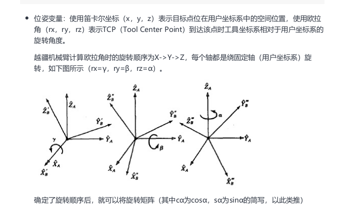
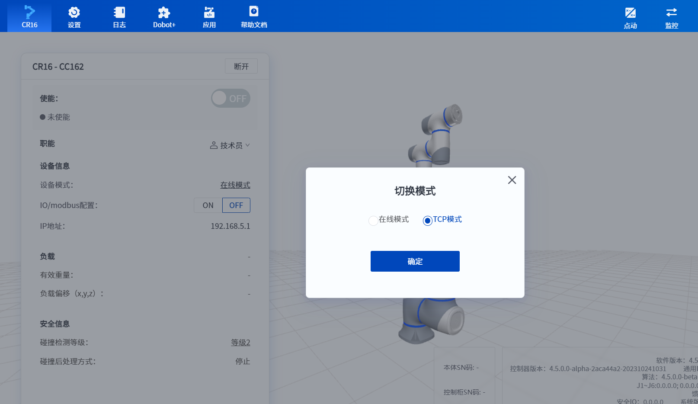
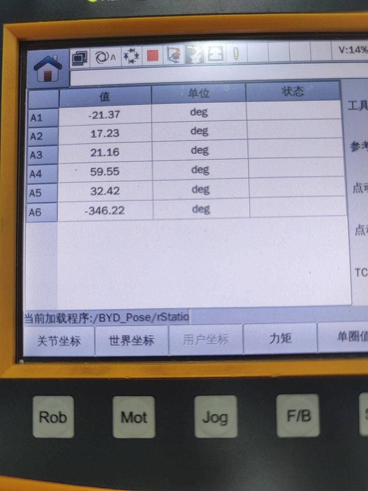
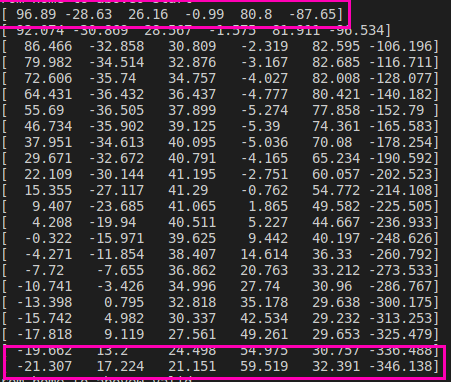
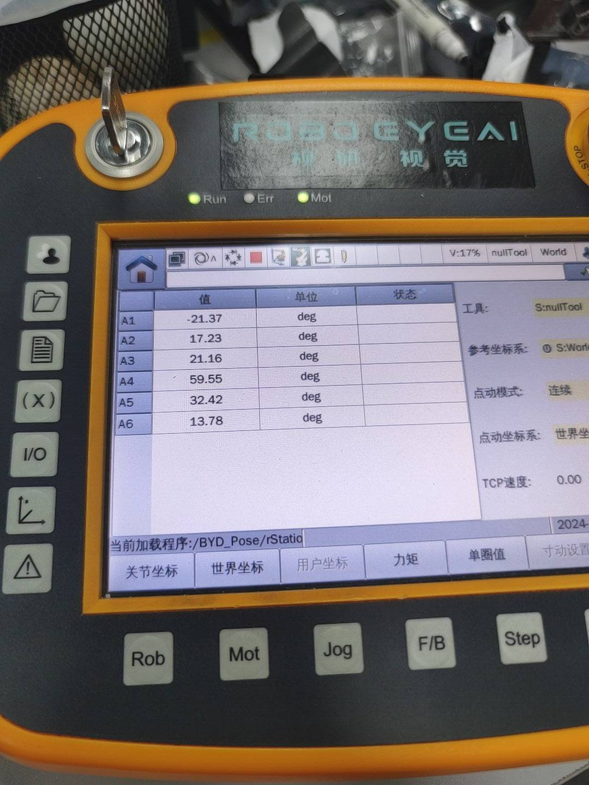
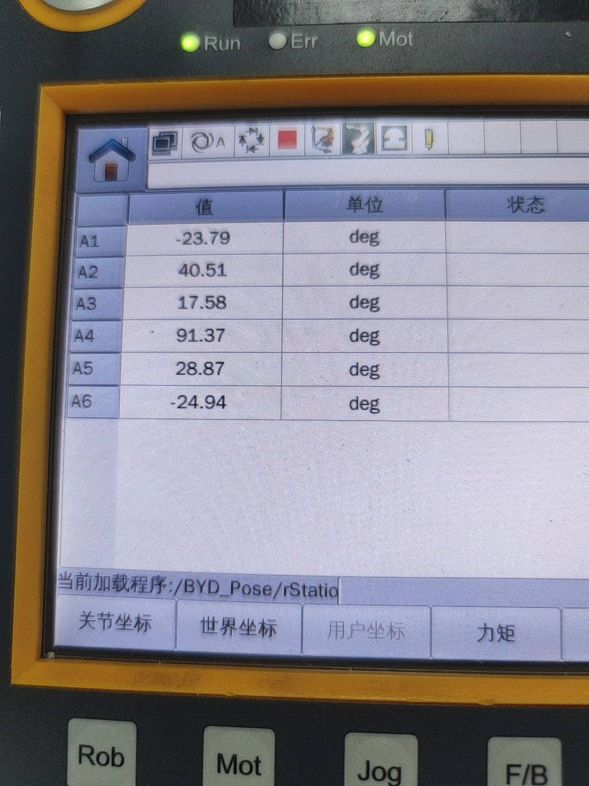
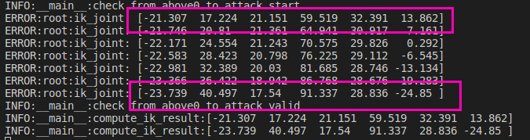
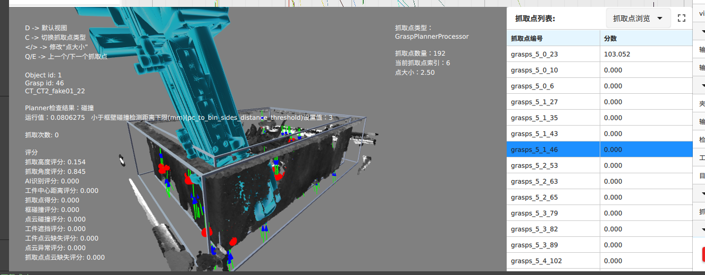
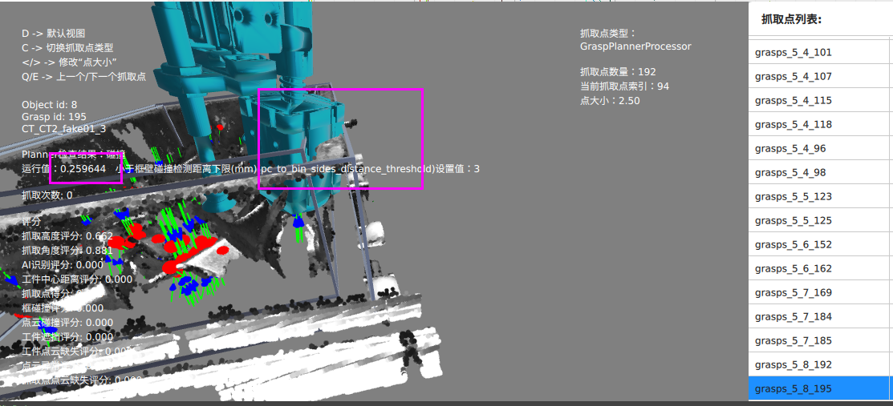

# DOBOT

## 官方仿真环境

```
random_code | 4353
```


~~CR10(==S==)~~

CR10AS

[download center cn](https://www.dobot.cn/)

[download center](https://www.dobot-robots.com/service/download-center)

非官方仿真环境

coppeliasim

## rotation mode



==euler type : xyz==

## ROS2

fishros

```BASH
wget http://fishros.com/install -O fishros && . fishros

```


## COMM :star:

[pydobot](https://pypi.org/project/pydobot/)

~~for dobot magician~~

```bash
pip install pydobot
```

### protocol

==using socket, similar to estun==

[dobot repository](https://github.com/Dobot-Arm)

[tcp-ip-python-v3](https://github.com/Dobot-Arm/TCP-IP-Python-V3)

[tcp-ip-python-v4](https://github.com/Dobot-Arm/TCP-IP-Python-V4)

1. getcurpose
   * GetAngle
   
     ```python
     ErrorID,{J1,J2,J3,J4,J5,J6},GetAngle();
     ```
   
     
   
   * GetPose
   
     ```python
     ErrorID,{X,Y,Z,Rx,Ry,Rz},GetPose(User,Tool);
     ```
   
     
   
2. set io
   * DO
     digital
     
     ```python
     ErrorID,{ResultID},DO(index,status,time);
     ```
     
     ==ResultID为算法队列ID,可用于判断指令执行顺序。==
     
   * ToolDOExecute
     末端数字输出端口
     
   * AOExecute
     analogy
   
3. get io
   * DI
     获取 DI 端口状态
   * ToolDI
   * AI
   * ToolAI
   
4. get_var 

   ~~modebus 相关~~

   * ~~GetInRegs~~
   * GetInputBool
   * GetInputInt

5. move

   * MovJ

     ==速度设置：关节速度设置比例$\text{speed} \in [0, 100]$==

   * MovL

     单位 $\text{mm/s}$
     maximum linear speed: $2000\  \text{mm/s}$

   ==注：==move 指令发送之后，机器人会在移动完成前返回信息，并且机器人会检查一遍发送的点位是否可达/非奇异，有问题的点位机器人不会执行并报警

6. move_trajectory :x:

   使用 move 指令设置平滑过渡参数

==注：==需要设置机器人为 TCP 模式



```python
roboeye_main: v1.9.627
control_center: test_dobot_client
middleware: v1.0.297
```

### test :star:

```python
control_center: v1.0.80    
middleware: latest
roboeye: latest
```

#### 没切换tcp模式没提示

在线模式下 socket 正常连接，发送信息无返回


#### move 指令优化

==注：队列指令为立即返回指令，接口返回成功仅代表发送成功，不代表执行完毕。若判断执行完毕，则需要结合CommandID和RobotMode来综合判断==

```python
# 判断机械臂是否使能且空闲
def RobotMode(self):
        """
        获取机器⼈当前状态。
        1 ROBOT_MODE_INIT 初始化状态
        2 ROBOT_MODE_BRAKE_OPEN 有任意关节的抱闸松开
        3 ROBOT_MODE_POWEROFF 机械臂下电状态
        4 ROBOT_MODE_DISABLED 未使能（⽆抱闸松开）
        5 ROBOT_MODE_ENABLE 使能且空闲
        6 ROBOT_MODE_BACKDRIVE 拖拽模式
        7 ROBOT_MODE_RUNNING 运⾏状态(⼯程，TCP队列运动等)
        8 ROBOT_MODE_SINGLE_MOVE 单次运动状态（点动、RunTo等）
        9 ROBOT_MODE_ERROR
             有未清除的报警。此状态优先级最⾼，⽆论机械臂
             处于什么状态，有报警时都返回9
        10 ROBOT_MODE_PAUSE ⼯程状态
        11 ROBOT_MODE_COLLISION 碰撞检测触发状态
        """
```


需要机器人到达后再返回信息

### 使用版本

```python
control_center: dobot_move
middleware: v1.0.297
roboeye: dobot_joint_base
```


### 机器人程序触发指令

#### UpdateTrajectoryTextX

1. 回复协议格式

#### demo

```lua
-- 定义一个 split 函数, 解析 pose
function split(input, delimiter)
    if not delimiter or delimiter == "" then
        return input
    end

    local result = {}
    for match in (input .. delimiter):gmatch("(.-)" .. delimiter) do
        table.insert(result, match)
    end
    return result
end

-- 无需额外处理返回值的指令，如 cCaptureOnlyRawX, workflowRaw 等指令
function common_cmd(cmd,create_socket)
  print("send "..cmd.." to middleware")
  TCPWrite(create_socket,cmd)
  while(true)
  do
    err, buf = TCPRead(create_socket, 4,"string")
    if buf ~= nil
    then
      print("receive data from middleware: "..buf.buf)
    else	
      Sleep(500)
      break
    end
  end
end

-- 工控机 ip 与端口, 根据现场修改
local ip="192.168.0.28"
local port=8000
local err=0
local socket=0
	::create_server::
  print("roboeye start")
	err, socket = TCPCreate(false, ip, port)
	if err ~= 0 then
		print("无法创建socket，正在重新连接")
		Sleep(1000)
		goto create_server
	end
	err = TCPStart(socket, 0)
	if err ~= 0 then
		print("无法连接服务器，正在重新连接")
		TCPDestroy(socket)
		Sleep(1000)
		goto create_server
	end
    
  local capture_only = "CaptureOnlyRawXTest"
  common_cmd(capture_only, socket)
  local work_flow_raw = "workflowRawTestFlow"
  common_cmd(work_flow_raw, socket)
print("roboeye end")
Sleep(500)
```


## movj cpose

1. Go(p1)

## Kinematics

==similar to ur==

### forward kinematics

回零位姿

```python
x:
y: -301.7
z:1478.11    
r: -90
p: 0
y: -180
    
cr10
x:
y: 302.4
z: 1476.5
```


### ik cal optimize

==不过滤奇异点==


## planner waypoint generate

1. grasps 碰撞检测不通过能否删除部分抓取点


## pre-commit

检查单个文件

```python
pre-commit run --files xxx.py
```


## 碰撞检测 :star:

仿真环境：gazebo, pybullet, v-rep

### 最大抓取角度

#### 正装

$$
\text{maxangle} \in [0,90\degree]
$$

#### 倒装

$[a,b]$

$[0, 2\pi]$
$$
-b + \pi \leq \text{maxangle} \leq -a + \pi\\
- \pi \leq \text{maxangle} \leq  \pi
$$

### 夹爪与环境碰撞

#### param

```python
grasp_plan.cpp
夹爪与框壁/框底距离阈值
```


#### 点云碰撞 :question:


### 机器人本体与环境碰撞 :star:

1. 与设置障碍物碰撞
2. 与料框碰撞
3. 与夹爪
3. 对于协作机器人，由于关节运动范围大，还需要考虑本体之间的碰撞


## 装饰器

基本形式为一个函数，接收一个函数作为参数，并返回一个新函数

```pyton
# 记录执行函数时间

import time

def timer(func):
	def wrapper(*args, **kwargs):
		start_time = time.time()
		result = fun(*args, **kwargs)
		end_time = time.time()
		return result
	return wrapper
	
@timer
def long_running_task():
	time.sleep(2)
	print("task completed")
```


## eva4 问题反馈:star:

1. 抓取过程中，出现不可达轨迹（waypoint 可达）没有被过滤

   ```python
   home: [96.89,-28.63,26.16,-0.99,80.80,-87.65]
   above: +00494.273,+00187.890,+00535.074,-00101.692,-00009.133,-00138.306
   above_apose: -21.37, 17.18, 21.27, 59.62, 32.39, -
   attack: +00531.098,+00226.437,+00345.361,-00101.692,-00009.133,-00138.306
   ```
   
2. 无故停机
   ==time 2024-11-07 13:53:32==

### 直线插补考虑最小关节 :star:

$P_1 = [x_1, y_1, z_1],\ P_2 = [x_2, y_2, z_2]$
$$
P(t) = (1-t) * P_1 + t * P_2\\
p(t) = [(x_1 + t(x_2-x_1)),....]
$$
其中，$\text{t} \in [0, 1]$ 表示从起点到终点的插值

==目前直线插补在可达性检测部分会考虑计算ik==

```python
home_apose = np.array([96.89,-28.63,26.16,-0.99,80.80,-87.65]) / 180 * np.pi
grasp_waypoints = [
    np.array([  +00494.273,+00187.890,+00535.074,-00101.692,-00009.133,-00138.306]),
    np.array([+00531.098,+00226.437,+00345.361,-00101.692,-00009.133,-00138.306]),
]
```




```python
home_apose = np.array([96.89,-28.63,26.16,-0.99,80.80,0]) / 180 * np.pi
grasp_waypoints = [
    np.array([  +00494.273,+00187.890,+00535.074,-00101.692,-00009.133,-00138.306]),
    np.array([+00531.098,+00226.437,+00345.361,-00101.692,-00009.133,-00138.306]),
]
```

 



## collision_check_tool

home -> above0之间路径没检查，直接检查了above0-attack

## 查看正在运行的 bazel

```bash
ps aux | grep bazel

kill 3700
kill -9 3700
```


## 更换python版本

```bash
sudo ln -s /usr/local/bin/python3.9 /usr/bin/python3.9
sudo update-alternatives --install /usr/bin/python3 python3 /usr/local/bin/python3.9 1
sudo update-alternative  --config python3
```


## eva8问题反馈

roboeye planner算子加入点云缺失过滤最小阈值


## G018 问题反馈

1. 抓取不准，tcp标定有误差，且难以重做tcp标定来保证精度


## ==T017 问题反馈==

1. 移动会进入 ROBOT_MODE_PAUSE -》10 :heavy_check_mark:

2. ==碰撞检测需要加入障碍物才触发== :heavy_check_mark:

   * 加入本体碰撞检测也许判断

3. ~~法兰高度没有过滤掉低于设定值的抓取点~~

4. 机器人程序 (示教器版本不兼容) :heavy_check_mark:
   * TCPRead 数据格式新旧不一致
   * 移动指令 pose格式 不一致
   
5. 逃逸分支出现夹爪与框壁碰撞

   

   

   * 夹爪与框碰撞检测逻辑（夹爪与框距离怎么计算的）

     单位：$\text{mm}$
     当前设置：$3 \ \text{mm}$

     
