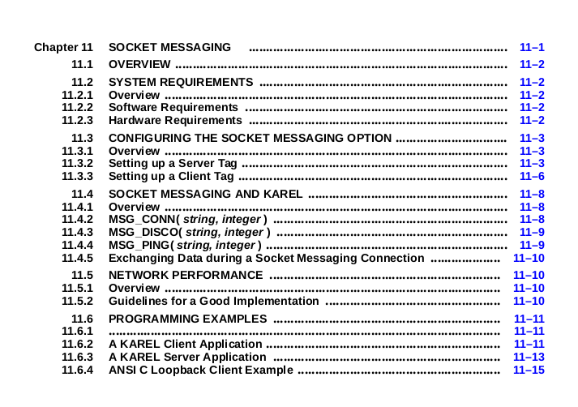
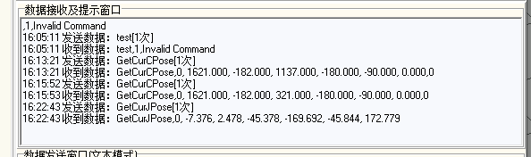

FANUC

> ==注：==Faunuc机器人通常使用karel语言

## fanuc comm :star:

### 仿真环境配置 1.5

#### ==任务完成标志==

正常运行Fanuc仿真软件，创建demo

#### VMware workstation

[下载链接](https://github.com/201853910/VMwareWorkstation/releases/tag/17.0)

> 安装：sudo chomod +x ....
>
> ​			sudo ./....

#### windows 10 iso

[镜像下载](https://next.itellyou.cn/Original/#cbp=Product?ID=f905b2d9-11e7-4ee3-8b52-407a8befe8d1)

#### VM安装windows10

[ref1](https://blog.csdn.net/jiexijihe945/article/details/137593845)

[ref2](https://blog.csdn.net/FCH112702/article/details/131257996)

==注：==windows激活：[ref3](https://blog.csdn.net/shenzixincaiji/article/details/90702477)

```BASH
slmgr.vbs /upk （此时弹出窗口显未“已成功卸载了产品密钥”）
slmgr /ipk W269N-WFGWX-YVC9B-4J6C9-T83GX （弹出窗口提示：“成功的安装了产品密钥”）
slmgr /skms zh.us.to （弹出窗口提示：“密钥管理服务计算机名成功的设置为zh.us.to”）
slmgr /ato （此时将弹出窗口提示：“成功的激活了产品”，可能会没弹）
```


### fanuc软件与control center通讯连接

#### 任务完成标志

ROBOGUIDE能收发字符串数据

driver: fanuc:arrow_right:roboeye_server.kl

control center :arrow_right:runtime:arrow_right:apps:arrow_right:report_cur_pose.py

#### 通讯实现方式

[karel 编程参考](https://zhuanlan.zhihu.com/p/363958006)

[ip 设定与socket messatge 设置](https://blog.csdn.net/u012682116/article/details/137001049)

- 机器人厂商已提供通讯插件，无需用户对通讯数据进行解码（例如：Estun）
- 机器人厂商仅提供Socket通讯指令， 需要用户通过==机器人程序创建Socket==（机器人作为Client）， 并自行解码通讯数据（例如： 那智/OTC）

==注：==测试时机器人作server（maybe

##### hello world test

```pascal
PROGRAM Test1
%NOPAUSE = ERROR+COMMAND+TPENABLE
VAR
  ent_val   : INTEGER
  exit_loop : BOOLEAN
BEGIN
  WRITE ( CR, CR, CR, CR, CR, CR, CR, CR, CR, CR )
  exit_loop = FALSE
  REPEAT
    WRITE ( 'Hello,world', CR )
    WRITE ( '0 END : ' )
    READ( ent_val )
    IF ent_val = 0 THEN
      exit_loop = TRUE
    ENDIF
  UNTIL exit_loop
  WRITE ( 'Done.', CR )
END Test1
```

##### communication test

###### 示教器准备

>  程序目录：
>
> 1. ～/repos/roboeye/robotics/driver
>      fanuc
> 2. ~/repos/roboeye/control_center
>      runtime/apps/report_cur_pose.py

默认：127.0.0.1

虚拟机ip：192.168.0.70

主机ip：	192.168.0.28


1. 使能 KAREL_ENB
2. 设置**协议**与**服务器IP**
3. ~~上位机地址 （主机通讯）~~
4. 端口号 变量$HOSTS_CFG (服务端)

> ==注：==新建工作单元机器人选项需要选择
>
> * KAREL （R632）
> * ==User Socket Msg==

###### 程序执行

1. socket__new_server 设置机器人端为服务器/客户端
2. socket__start 开启socket服务
   1. check server status
   2. disconnect
   3. connect
   4. status :arrow_right:0
3. 输入cmd（GetCurJPose, 0GetCurPose(revised), GetErrorID)

#### ~~fanuc socket messaging~~

##### contents




### ~~控制方案敲定~~

#### ==任务完成标志==

调研目前业界常用方案，并确认一种或多种方案

### 机器人控制实现 

#### 任务完成标志

主机发送控制指令，ROBOGUIDE执行命令并驱动机器人

#### 当前问题 5.21

1. ~~control center 如何发送cmd到ROBOGUIDE（理解通讯助手发送cmd流程）~~
   
2. ==client 发送信息为bytes类型，而ROBOGUIDE 接受数据为str==
   
   ==注：==需要解析ROBOGUIDE所受到数据
3. ==ROBOGUIDE 端运动实现(KAREL)==
   * ~~ROBOGUIDE 接受MOVE命令（如: GetCurpose)~~
   * KAREL 调用TP程序
     [ref](http://www.360doc.com/content/22/1112/10/29968938_1055588114.shtml)
     * 内置routine **CALL_PROG()** :heavy_check_mark:

#### report_cur_pose执行流程

```python
	class _RequestWriter:
    def __init__(self, cmd_name: str, request_content: bytes = b""):
        self.version = _SUPPORTED_VERSION
        self.cmd_name = cmd_name.ljust(_CMD_NAME_BYTES_LEN, "\0").encode()
        self._request_content = request_content
    
    def get_current_pose(self) -> Tuple[APose, EulerPose]:
        request_writer = _RequestWriter("GetCurPose")
        self._send_request(request_writer)
        response_reader = self._recv_response()
        self._check_response(request_writer, response_reader)

        cpose = response_reader.read_cpose()
        cpose.rotation_mode = self._rotation_mode
        apose = response_reader.read_apose()
        return apose, cpose   
    	
       def _send_bytes(self, message: bytes):
        self._client_socket.sendall(message)
        
    def _send_request(self, request_package: _RequestWriter):
        request_msg = request_package.version  # _SUPPORTED_VERSION = b"0"
        request_msg += request_package.cmd_name 
        request_msg += request_package.request_content_len
        request_msg += request_package.request_content

        logging.info(f"Commonclient send request {request_msg!r}")
        self._send_bytes(request_msg)

```

> ==注：==
>
> 1. sendall()函数为发送命令到ROBOGUIDE（这里发送的是bytes类型的，而接受方是str类型）
> 2. self.cmd_name = cmd_name.ljust(_CMD_NAME_BYTES_LEN, "\0").encode()

#### comm between robot & pc（非control center 实现）

> 1. FANUC 解析收到指令
> 2. 返回要求协议格式
> 3. TP程序

[ref1](https://github.com/kobbled/kl-socket)

```python
import socket
import time

ip = "192.168.0.70"
port = 5000

def main():

  with socket.socket(socket.AF_INET, socket.SOCK_STREAM) as sock:
    print("Connecting to {}:{} ...".format(ip, port))
    sock.connect((ip, port))
    print('reading')
    try:
      while True:
        try:
          s = bytearray(input(), "utf8")
          sock.sendall(s)
          data = sock.recv(1024)          
          print('Response:', data.decode('ascii'))
          time.sleep(0.3)
        except socket.error:
          pass
    except KeyboardInterrupt:
      sock.close()

if __name__ == '__main__':
  main()
```


#### set_point_move

步骤：

1. 新建TP程序，“MOVE TO POIN”
2. KAREL 调用TP程序
   [ref](http://www.360doc.com/content/22/1112/10/29968938_1055588114.shtml)

ref: 《FANUC America Corporation ……KAREL Reference Manual》5.2 BUILT-IN ROUTINES （内置……)

TP程序

```python
/PROG SIMPLE_MOVE
/ATTR
OWNER        = MNEDITOR;
COMMENT      = "Simple Move Program";
PROG_SIZE    = 1234;
CREATE       = DATE 20-05-2024 TIME 12:34:56;
/END ATTR

/PROG SIMPLE_MOVE
/ATTR
OWNER        = MNEDITOR;
COMMENT      = "Simple Move Program";
PROG_SIZE    = 1234;
CREATE       = DATE 20-05-2024 TIME 12:34:56;
MODIFIED     = DATE 20-05-2024 TIME 12:34:56;
/END ATTR

/DECL
-- 定义位置变量
P[1]  = PR[1];  -- 起始位置
P[2]  = PR[2];  -- 目标位置

-- 定义IO变量
DO[1] = OFF;    -- 初始化输出信号
/END DECL

/LABEL

1:  ! 初始化操作;
2:  DO[1] = OFF ;     -- 确保输出信号关闭
3:  WAIT 1.00(sec);   -- 等待1秒

4:  ! 移动到起始位置;
5:  J P[1] 100% FINE ;-- 快速移动到起始位置

6:  ! 移动到目标位置;
7:  L P[2] 100mm/sec FINE ;-- 线性移动到目标位置

8:  ! 打印信息;
9:  PRINT "Move completed" ;

10: ! 结束程序;
11: DO[1] = ON ;      -- 打开输出信号
12: WAIT 1.00(sec);   -- 等待1秒
13: DO[1] = OFF ;     -- 关闭输出信号

14: END ;
```


```python
# 调用示教器程序
ROUTINE set_point_move : STRING
  VAR
  	A : INTEGER
  BEGIN
  	FORCE_SPMENU(TP_PANEL,SPI_TPUSER,1)
	WRITE('START:PROG_1',CR)
	DELAY 5000
	CALL_PROG('PROG_1',A)
  RETURN('set point move')
  END set_point_move
```


#### 通过control center 发送指令

1. control center 发送指令，ROBOGUIDE 能解析指令
2. ROBOGUIDE 返回消息，control center 解析

##### 自定义通讯协议设计

==见 onboard_trainig:my_socket_……==

要点：

1. python socket 通信
2. string 和 byte
3. pack & unpack

假设每条消息由以下部分组成：

1. 消息类型（1个字节）：例如，`0x01`表示文本消息，`0x02`表示文件传输
2. 消息长度（4个字节）：表示消息体的长度，以网络字节序（大端序）存储
3. 消息体（可变长度）：实际消息的内容，根据消息长度确定

##### 当前通讯协议

==详细见control_center:report_cur_pose.py 与 onboard_trainig:my_socket_server_control.py==

| 说明 | 协议版本  | 接口名称     | 请求内容长度 | 请求内容 |
| ---- | --------- | ------------ | ------------ | -------- |
| 字节 | 0         | 1 - 15       | 16 - 23      |          |
| 内容 | '0‘ - ’9‘ | 'GetCurPose' | 0            |          |
|      |           |              |              |          |

回复协议：

| 说明 | 协议版本  | 接口名称     | 回复内容长度 | 回复内容         |
| ---- | --------- | ------------ | ------------ | ---------------- |
| 字节 | 0         | 1 - 15       | 16 - 23      | n                |
| 内容 | '0‘ - ’9‘ | 'GetCurPose' | n            | 请求自定义的内容 |

0 15 8 n

==注：==仅涉及bytes和str转换

```python
def request_content_len(self) -> bytes:
        return f"{len(self._request_content):0{_INT8_SIZE_BYTES_LEN}d}".encode()
response_status = response.read_char()
```

格式化字符串 {....:....}

`:0{8}d`表示用8位宽度格式化整数，前面补零。

* 0 表示用0填充
* {8} 表示宽度，表示字段的宽度为8
* d 表示整数类型

```python
def read(self, bytes_len: int) -> bytes:
        data = self._response_content[
            self._read_content_index : self._read_content_index + bytes_len
        ]
        self._read_content_index += bytes_len
        return data

    def read_char(self) -> str:
        return self.read(_CHAR_BYTES_LEN).decode()
```


```PYTHON
 CPose
    0GetCurPose,0, 2535.000, 985.107, 790.539, 180.000, -90.000, 0.000,0
    "002535.00000985.107000790.539000180.000000-90.0000000.00000000"
JPose  
	GetCurJPose,0, 23.007, 60.456, 1.592, 86.257, -23.059, -85.933	
    23.007000060.45600001.5920000086.2570000-23.059000-85.933000
```


```PYTHON
  pose_type = self.read_char()
        if pose_type != _CPOSE_TYPE:
            raise ValueError(f"Read CPOSE type error, '{pose_type}'")
        coords = [self.read_float() for _ in range(6)]
        for _ in range(_POSE_MODE_BYTES_LEN):
            self.read_char()
```

##### KAREL BUILT-IN ROUTINES

1. CURJPOS
   返回当前关节位置
2. CNV_JPOS_REL
   检查当前关节值是否为真值
3. BYTES_AHEAD
   返回输入字节长度
4. SET_FILE_ATR
   在文件打开前设置文件属性

==注：== 与传输收发数据有关的内置函数

1. OPEN FILE
   让 particular data file 或者 communication port 与 file ariable 相关联（这里我们为 port ）
2. WRITE
3. READ
4. BYTES_AHEAD
   返回在 read-ahead buffer的输入数据的字节数
5. CNV_REAL_STR
   把 REAL value 格式化为字符串
6. SUB_STR
   截取字符串
7. STR_LEN
   字符串长度
8. UNINIT
   判断变量是否初始化

```python
# 后面补0，长度为10
ROUTINE str_len_ten(str: STRING): STRING
VAR 
len: INTEGER
cur_len: INTEGER
new_str: STRING[254]
i: INTEGER
 BEGIN
	len = 10
    cur_len = STR_LEN(str)
    new_str = ''
    IF cur_len < len THEN
    	new_str = str
        FOR i = cur_len +1 TO 10 DO
        new_str = new_str + '0'
        ENDFOR
    ELSE
    	new_str = SUB_STR(str, 1, 10)
    ENDIF
  RETURN(new_str)
 END str_len_ten
```

==注：==STRING 类型不能使用下标索引的方式获取每个字符


```python
# ROBOGUIDE 返回数据
ROUTINE socket__write_into_string_buffer(this : T_SOCKET; fl : FILE; buffer : STRING)
  BEGIN
    IF UNINIT(buffer) THEN
      RETURN
    ENDIF

    WRITE fl(buffer::STR_LEN(buffer))
    WRITE fl(CR)
    this.status = IO_STATUS(fl)
    CLR_IO_STAT(fl)

  END socket__write_into_string_buffer

ROUTINE socket__update_connection_status(this : T_SOCKET; fl : FILE)
  BEGIN
    this.status = IO_STATUS(fl)
  END socket__update_connection_status

```

```python
pose_str = pose_str + str_len_ten(SUB_STR(single_pose_str,2,11))
```

```python
# request content lent
# 8位长度整数，前面补0
ROUTINE str_len_eight(str: STRING): STRING
VAR 
len: INTEGER
cur_len: INTEGER
new_str: STRING[254]
i: INTEGER
int_cnv_str: STRING[254]
new_str_noblank: STRING[254]
 BEGIN
	len = 8
    cur_len = STR_LEN(str)
    new_str = ''
    CNV_INT_STR(cur_len, 1, 0,new_str)
    new_str_noblank = SUB_STR(new_str,2,8)
    IF cur_len < len THEN    	
        FOR i = STR_LEN(new_str_noblank) +1 TO 8 DO
        new_str_noblank = '0' + new_str_noblank
        ENDFOR
    ELSE
    	new_str_noblank = SUB_STR(str, 1, 8)
    ENDIF
  RETURN(new_str_noblank)
 END str_len_eight
    
ROUTINE str_len_eight(str: STRING): STRING
VAR 
cur_len: INTEGER
new_str: STRING[254]
i: INTEGER
int_cnv_str: STRING[254]
new_str_noblank: STRING[254]
 BEGIN
    cur_len = STR_LEN(str)
    new_str = ''
    CNV_INT_STR(cur_len, 1, 0,new_str)
    new_str_noblank = SUB_STR(new_str,2,8)	
    FOR i = STR_LEN(new_str_noblank) +1 TO 8 DO
    new_str_noblank = '0' + new_str_noblank
    ENDFOR
  RETURN(new_str_noblank)
 END str_len_eight
    
ROUTINE str_len_eight(str: STRING): STRING
VAR 
cur_len: INTEGER
new_str: STRING[254]
i: INTEGER
int_cnv_str: STRING[254]
new_str_noblank: STRING[254]
 BEGIN
    cur_len = STR_LEN(str)
    new_str = ''
    CNV_INT_STR(cur_len, 1, 0,new_str)
    new_str_noblank = SUB_STR(new_str,2,8)	
    FOR i = STR_LEN(new_str_noblank) +1 TO 8 DO
    new_str_noblank = '0' + new_str_noblank
    ENDFOR
  RETURN(new_str_noblank)
 END str_len_eight
```

##### ~~当前问题~~

1. ~~content_len 部分成功~~
2. ~~recv_str 不能正常发送~~

```python
# 分块发送
WHILE i <= length DO
		IF (i + chunk_size - 1 ) > length THEN		
			chunk = SUB_STR(buffer, i, length -i + 1)
		ELSE
			chunk = SUB_STR(buffer, i, chunk_size)
		ENDIF
		WRITE fl(chunk::STR_LEN(chunk))
		i = i + chunk_size
	ENDWHILE   
```


##### GetCurPose :heavy_check_mark:

```python
IF recv_str = 'GetCurPose' THEN
      ret_str = '00'+get_cartesian_pose +'GETCURPOS1'+ get_joint_pos
    ENDIF
```

##### ~~当前问题~~

1. control center 发送指令 supported ersion(1) + command(15) + content_len(8) + content(unknown)

   * ==读取content_len 非零内容（content 长度）==

     ```python
     ROUTINE read_content_len (content_len: STRING) : INTEGER
         VAR
         new_str: STRING
         content_len_int: INTEGER
          i: INTEGER
          flag: INTEGER
          new_str = ''
          flag = 0
          BEGINE     	
             FOR i = 0 TO STR_LEN(content_len) DO
             	IF(i <>'0')
                 	flag = flag + 1
                  ENDIF
             ENDFOR
             new_str = SUB_STR(content_len, STR_LEN(content_len)-flag + 1, flag)
             CONV_STR_INT(new_str, content_len_int)
             RETURN(content_len_int)
            END read_content_len
            
     ```

   * KAREL 读取相应内容

2. 如何解析不同内容的content

   

##### GetVar :heavy_check_mark:

| 说明           | 字节 | 回复内容                            |
| -------------- | ---- | ----------------------------------- |
| 状态           | 0    | '0': 成功                           |
| 变量值数据长度 | INT4 | 定长整数n,不足四位补0, 例如: "0000" |
| 变量值数据     |      |                                     |

操作寄存器

```python
# 变量类型id 
	UNKNOW = 0;
    INT32 = 1;
    FLOAT64 = 2;
    STRING = 3;
    CPOSE = 4;
    APOSE = 5;
    
plugins {
  name: "RB1"
  type: ROBOT_DRIVER
  robot_driver {
    manufacturer: FAKE_ROBOT
    var_binding {
      name: "var1"
      remote_name: "remote_var1"
      initial_mode: SYNC_TO_REMOTE
    }
    var_binding {
      name: "var2"
      remote_name: "remote_var2"
      initial_mode: SYNC_TO_REMOTE
    }
    io_binding {
      name: "io1"
      remote_name: "remote_io1"
      initial_mode: SYNC_TO_REMOTE
    }
  }
}

```

control center 发送内容

```python
0GetVar\x00\x00\x00\x00\x00\x00\x00\x00\x00 00000019 0001 0011 remote_var1
0GetVar\x00\x00\x00\x00\x00\x00\x00\x00\x00 00000009 0001 0001 1
```

截取字符串 4 4 

```python
--传入内容 recv_content
ROUTINE analysis_recv_content(recv_content: STRING): STRING    
  VAR
    var_type_str: STRING[254]
    var_type: INTEGER
    var_name: STRING[254]
    var_name_tmp: STRING[254]
    var_name_len: INTEGER
    var_name_int: INTEGER   
    staus: INTEGER
    var_content: INTEGER
    var_content_str: STRING[254]      
    length: INTEGER    
       
  BEGIN  	 
  	 var_content = -1
     var_type_str  = SUB_STR(recv_content, 1,  4)
     var_type = read_content_len(var_type_str)
     var_name = SUB_STR(recv_content, 5, 4)
     var_name_len = read_content_len(var_name)  
     var_name_int = read_content_len(SUB_STR(recv_content,9, var_name_len))
     IF var_type = 0 THEN
        WRITE('UNKNOWN DATA', CR)
        var_content = -1
     ENDIF
     IF var_type = 1 THEN
         WRITE('INT32', CR)
         --GET_INT_REG(var_name_int, var_content, status)
        GET_REG(var_name_int, FALSE, var_content, var_real_value, status)
         var_content = 2
     ENDIF
     IF var_type = 2 THEN
         WRITE('FLOAT 64', CR)
         var_content = -1
    ENDIF
    IF var_type = 3 THEN
         WRITE('STRING', CR)
    ENDIF
    IF var_type = 4 THEN
         WRITE('CPOSE', CR)
    ENDIF
    IF var_type =5 THEN
         WRITE('APOSE', CR)
    ENDIF
    CNV_INT_STR(var_content,1,0,var_content_str)
    length = STR_LEN(var_content_str)    
    RETURN(SUB_STR(var_content_str,2,length))     
   END analysis_recv_content
   
```

==注：==

1. GET_INT_REG 无法识别
2. 当设置数据为 $0.--$ 显示异常

##### SetVar :heavy_check_mark:

getvar 已经获取端口，set修改值  SET_INT_REG

```python
0SetVar\x00\x00\x00\x00\x00\x00\x00\x00\x00 00000016 0001 0001 1 0003 400

get_pos_array = contro_center_get_pos(revise_value_str)
         get_pos.X = get_pos_array[1]
         get_pos.Y = get_pos_array[2]
         get_pos.Z = get_pos_array[3]
         get_pos.W = get_pos_array[4]
         get_pos.P = get_pos_array[5]
         get_pos.R = get_pos_array[6]
         SET_POS_REG(revise_port,get_pos,status)
```


```python
ROUNTINE control_center_set_var()
  VAR
        var_type_str: STRING[254]
        var_type: INTEGER
        var_name: STRING[254]
        var_name_tmp: STRING[254]
        var_name_len: INTEGER
        var_name_int: INTEGER   
        staus: INTEGER
        var_content: INTEGER
        var_content_str: STRING[254]      
        length: INTEGER  
        revise_port: INTEGER
        revise_value_len: INTEGER
        revise_value: INTEGER
        revise_value_len_index: INTEGER
         revise_value_index: INTEGER
   BEGIN
     var_content = -1
     var_type_str  = SUB_STR(recv_content, 1,  4)
     var_type = read_content_len(var_type_str)
     var_name = SUB_STR(recv_content, 5, 4)
     var_name_len = read_content_len(var_name)
    -- revised port
     revise_port = read_content_len(SUB_STR(recv_content,9, var_name_len))
     revise_value_len_index = 9+var_name_len
     revise_value_len = read_content_len(SUB_STR(recv_content, revise_value_len_index, 4))
     revise_value_index = 9+var_name_len+4
    revise_value = SUB_STR(recv_content,revise_value_index,revise_value_len)
     IF var_type = 0 THEN
        WRITE('UNKNOWN DATA', CR)
        var_content = -1
     ENDIF
     IF var_type = 1 THEN
         WRITE('INT32', CR)
          SET_INT_REG(revise_port, revise_value, status)
     ENDIF
     IF var_type = 2 THEN
         WRITE('FLOAT 64', CR)
         var_content = -1
    ENDIF
    IF var_type = 3 THEN
         WRITE('STRING', CR)
    ENDIF
    IF var_type = 4 THEN
         WRITE('CPOSE', CR)
    ENDIF
    IF var_type =5 THEN
         WRITE('APOSE', CR)
    ENDIF
```


##### GetIO :heavy_check_mark:

```python
0GetIO\x00\x00\x00\x00\x00\x00\x00\x00\x00\x00 00000009 0001 0001 1
```

```python
ROUTINE control_center_get_io(recv_content: STRING): STRING
      VAR
        var_type_str: STRING[254]
        var_type: INTEGER
        var_name: STRING[254]
        var_name_tmp: STRING[254]
        var_name_len: INTEGER
        var_name_int: INTEGER   
        revise_io_port: INTEGER     
        value: STRING[254]
        status: INTEGER
        ret_value: STRING[254]
        
      BEGIN
        var_content = -1
         var_type_str  = SUB_STR(recv_content, 1,  4)
         var_type = read_content_len(var_type_str)
         var_name = SUB_STR(recv_content, 5, 4)
         var_name_len = read_content_len(var_name)
        -- io_port
        revise_io_port = read_content_len(SUB_STR(recv_content,9, var_name_len))          
         IF var_type = 0 THEN
             WRITE('PHYSICAL_DIGITAL_INPUT', CR)
            GET_PORT_VAL(8, revise_io_port, value, status)
     	ENDIF
         IF var_type = 1 THEN
             WRITE('PHYSICAL_DIGITAL_OUTPUT', CR)
              GET_PORT_VAL(9, revise_io_port, value, status)
         ENDIF
         IF var_type = 2 THEN
             WRITE('PHYSICAL_ANALOG_INPUT', CR)
            status = 1
        ENDIF
        IF var_type = 3 THEN
             WRITE('PHYSICAL_ANALOG_INPUT', CR)
            status = 1
        ENDIF
        IF var_type = 11 THEN
             WRITE('VIRTUAL_DIGITAL_INPUT', CR)
            GET_PORT_VAL(1, revise_io_port, value, status)
        ENDIF
        IF var_type =12 THEN
             WRITE('VIRTUAL_DIGITAL_OUTPUT', CR)
            GET_PORT_VAL(2, revise_io_port, value, status)
        ENDIF
        IF var_type =13 THEN
             WRITE('VIRTUAL_ANALOG_OUTPUT', CR)
            GET_PORT_VAL(3, revise_io_port, value, status)
        ENDIF
        IF var_type =14 THEN
             WRITE('VIRTUAL_ANALOG_OUTPUT', CR)
            GET_PORT_VAL(4, revise_io_port, value, status)
        ENDIF
        CNV_INT_STR(status,1,0,status_str)	
        ret_value = SUB_STR(status_str,2,1) + str_len_ten_reverse(value)
        RETURN(ret_value)
      END control_center_get_io

```

==注：==

1. PHYSICAL_ANALOG_INPUT
1. 
2. PHYSICAL_DIGITAL_INPUT


##### SetIO :heavy_check_mark:

==SET_PORT_...==

SET_PORT_ASG

```python
0SetIO\x00\x00\x00\x00\x00\x00\x00\x00\x00\x00 00000028 0001 0010 remote_io1+000000001
```

KLIOTYPS.kl(port_type: INTEGER)

```python
CONST
io_all = 0 -- Any I/O type
io_din = 1 -- Digital input
io_dout = 2 -- Digital output
io_anin = 3 -- Analog input
io_anout = 4 -- Analog output
io_tool = 5 -- Tool output
io_plcin = 6 -- PLC input
io_plcout = 7 -- PLC output
io_rdi = 8 -- Robot digital input
io_rdo = 9 -- Robot digital output
io_brake_out = 10 -- Brake output
io_opin = 11 -- operator panels input
io_opout = 12 -- operator panels output
io_sopin = 11 -- Same as io_opin
io_sopout = 12 -- Same as io_sopout
io_estop = 13 -- Emergency stop
io_tpin = 14 -- Teach pendant digital input
io_tpout = 15 -- Teach pendant digital output
io_wdi = 16 -- weld inputs
io_wdo = 17 -- weld outputs
io_gpin = 18 -- Grouped inputs
io_gpout = 19 -- Grouped outputs
io_uopin = 20 -- User operator's panel input
io_uopout = 21 -- User operator's panel output
io_ldin = 22 -- laser DIN
io_ldout = 23 -- laser DOUT
io_lain = 24 -- laser AIN
io_laout = 25 -- laser AOUT
io_wstk_in = 26 -- weld stick input
io_wstk_out = 27 -- weld stick output
io_mem_boo = 28 -- memory image boolean's
io_mem_num = 29 -- memory image din's
io_dummy_boo = 30 -- dummy boolean port type
io_dummy_num = 31 -- dummy numeric port type
io_proc_axes = 32
io_iopin = 33 -- Internal operator's panel input
io_iopout = 34 -- Internal operator's panel output
io_flag = 35 -- Flag (F[ ])
io_marker = 36 -- Marker (M[ ])

max_log_port = 36

-- physical only
io_keep_rly = 41 -- Backuped internal relay
io_rly = 42 -- No backuped internal relay
io_keep_reg = 43 -- Backuped internal register
io_reg = 44 -- No backuped internal register

max_phy_port = 44

io_min_type = 1 -- same as io_din
io_max_type = 44 -- same as max_log_port

```


```PYTHON
ROUTINE control_center_set_io(recv_content: STRING): INTEGER
      VAR
        var_type_str: STRING[254]
        var_type: INTEGER
        var_name: STRING[254]
        var_name_tmp: STRING[254]
        var_name_len: INTEGER
        var_name_int: INTEGER   
        revise_io_port: INTEGER
        io_value_index: INTEGER
        io_value_str: STRING[254]
        io_value: INTEGER
        status: INTEGER
        status_str: STRING[254]
        var_content: INTEGER
        var_content_str: STRING[254]      
        length: INTEGER    
        value: INTEGER
        
      BEGIN
        var_content = -1
         var_type_str  = SUB_STR(recv_content, 1,  4)
         var_type = read_content_len(var_type_str)
         var_name = SUB_STR(recv_content, 5, 4)
         var_name_len = read_content_len(var_name)
        -- io_port
        revise_io_port = read_content_len(SUB_STR(recv_content,9, var_name_len))
        --io_value
        io_value_index = 9 + var_name_len
        io_value_str = SUB_STR(recv_content, io_value_index, 15)
        CNV_STR_INT(io_value_str, io_value)
        IF io_value > 0 THEN
        	value = 1
        ELSE
        	value = 0
         ENDIF
         IF var_type = 0 THEN
             WRITE('PHYSICAL_DIGITAL_INPUT', CR)
            SET_PORT_VAL(8, revise_io_port, value, status)
     	ENDIF
         IF var_type = 1 THEN
             WRITE('PHYSICAL_DIGITAL_OUTPUT', CR)
              SET_PORT_VAL(9, revise_io_port, value, status)
         ENDIF
         IF var_type = 2 THEN
             WRITE('PHYSICAL_ANALOG_INPUT', CR)
            status = 1
        ENDIF
        IF var_type = 3 THEN
             WRITE('PHYSICAL_ANALOG_INPUT', CR)
            status = 1
        ENDIF
        IF var_type = 11 THEN
             WRITE('VIRTUAL_DIGITAL_INPUT', CR)
            SET_PORT_VAL(1, revise_io_port, value, status)
        ENDIF
        IF var_type =12 THEN
             WRITE('VIRTUAL_DIGITAL_OUTPUT', CR)
            SET_PORT_VAL(2, revise_io_port, value, status)
        ENDIF
        IF var_type =13 THEN
             WRITE('VIRTUAL_ANALOG_OUTPUT', CR)
            SET_PORT_VAL(3, revise_io_port, value, status)
        ENDIF
        IF var_type =14 THEN
             WRITE('VIRTUAL_ANALOG_OUTPUT', CR)
            SET_PORT_VAL(4, revise_io_port, value, status)
        ENDIF
       CNV_INT_STR(status,1,0,status_str)
	   RETURN(SUB_STR(status_str,2,1))
    END control_center_set_io

```

==注：==control center 发送指令 “+” 未处理

##### Move :heavy_check_mark:

[MOVE TO](https://www.robot-forum.com/robotforum/thread/24471-move-the-robot-using-pr-in-karel/)

~~karel 读取pose，再修改TP程序~~

CNV_JPOS_REL

==CNV_REL_JPOS==

==CNV_STR_CONF==
CNV_CONF_STR

==注：==使用上述命令新建 JOINTPOS 类型变量

```PYTHON
PROGRAM TestRoutine
%NOPAUSE = ERROR+COMMAND+TPENABLE
%NOLOCKGROUP
%ALPHABETIZE
%NOPAUSESHFT

VAR   
  P1,
  P2,
  P3,
  P4: XYZWPR
  J1,
  J2: JOINTPOS
  jpos_array: ARRAY[6] OF REAL
  jpos_str: STRING[254]
  status: INTEGER
  
ROUTINE jpos_array_str(jpos_array: ARRAY[*] OF REAL): STRING
  VAR
  str,
  jpos_str: STRING[254]
  i: INTEGER  
  BEGIN
  	jpos_str = ''
  	FOR i = 1 TO 6 DO
  		CNV_REAL_STR(jpos_array[i],1,3,str)
  		jpos_str = jpos_str + ' ' + str
  	ENDFOR
  	RETURN(jpos_str)
  END jpos_array_str
  
BEGIN 
  jpos_array[1] = 0
  jpos_array[2] = 0
  jpos_array[3] = 0
  jpos_array[4] = 0
  jpos_array[5] = 0
  jpos_array[6] = 0  
  CNV_REL_JPOS(jpos_array,J1,status)
  --J1 = CURJPOS(0,0)
  SET_JPOS_REG(5,J1,status)
  J2 = GET_JPOS_REG(4,status)
  --WRITE('CUR JOINT POS IS ', J1,CR)
  WRITE('GET JPOS REG ',J2,CR)
  MOVE TO J1
END TestRoutine
```


KAREL 读取pose，并用SET_POS_REG设置位置寄存器，最后使用 MOVE TO ……指令移动到指定位置

```python
0Move\x00\x00\x00\x00\x00\x00\x00\x00\x00\x00\x00 00000081 1+00000.000+00000.000+00000.000+00000.000+00000.000+00000.000 000000000 +04000.000 0
0SetVar\x00\x00\x00\x00\x00\x00\x00\x00\x00 00000083 0004 0001 3 0070 0+00397.200-00294.450+00639.530+00133.100+00040.680+00173.930 000000000
0SetVar\x00\x00\x00\x00\x00\x00\x00\x00\x00 00000016 0001 0001 1 0003 400
```

```python
ROUTINE control_center_move(recv_content: STRING): INTEGER
	VAR
    	jpos_array: ARRAY[6] OF REAL
    	j: JOINTPOS
        pos_type,
        pos_str: STRING[254]
         pos_real: REAL
        i,
        start,
        status: INTEGER
    BEGIN
    	start = 2
    	pos_type = SUB_STR(recv_content, 1, 1)
        IF pos_type = '0' THEN
        	WRITE('RECIEVE CPOS ',CR)
        ENDIF
        IF pos_type = '1' THEN 
        	FOR i = 1 to 6 THEN
            	pos_str = SUB_STR(recv_content, start, 10)
                CNV_STR_REAL(pos_str, pos_real)
                jpos_array[i] = pos_real
                start = start + 10                
             ENDFOR
             CNV_REL_JPOS(jpos_array, j, status)
             MOVE TO j
         RETURN(status)
    END control_center_move
```


[CNV_REL_JPOS 内置函数的参数不正确](https://www.robot-forum.com/robotforum/thread/22834-help-with-intp-322-alarm-code/?postID=97118&highlight=INTP-322#post97118)

==注：==

1. 速度设置未配置

##### MoveTrajectory :heavy_check_mark:

```python
0MoveTrajectory\x00 00000166 0002
1+00003.430+00034.830-00051.110-00000.590+00091.120+00007.640 000000000
+00100.000 1 0+00452.142+00050.091+00470.546+00092.820-00036.660+00158.950 000000000 +00100.000 1
```

```python
0MoveTrajectory\x0000000166 0002 0+01807.000+00876.000+01594.687-00180.000-00090.000+00000.000 000000000 +00010.000 1 0+01807.000+00876.000+01594.687-00180.000+00090.000+00000.000000000000+00010.0001
      
```

```PYTHON
ROUTINE control_center_move(recv_content: STRING): STRING
  VAR
  	c_pos_tmp,
  	c_pos: XYZWPR
    cpos_array,
	jpos_array: ARRAY[6] OF REAL
	J1: JOINTPOS6
	J2: JOINTPOS
    pos_type,
    pos_str: STRING[254]
    pos_real: REAL
    i,
    start,
    status: INTEGER
    status_str: STRING[254]    
    speed: REAL
    interpo_type: STRING[254]
  BEGIN  	
  	--WRITE('RECV_CONTENT LENGTH ',STR_LEN(recv_content),CR)
	start = 2
	pos_type = SUB_STR(recv_content, 1, 1)
    IF pos_type = '0' THEN      	  	  
    	FOR i = 1 TO 6 DO
        	pos_str = SUB_STR(recv_content, start, 10)
            CNV_STR_REAL(pos_str, pos_real)
            cpos_array[i] = pos_real                
            start = start + 10                
    	ENDFOR  
    	start = start + 9
    	CNV_STR_REAL(SUB_STR(recv_content,start,10),speed)
    	--$SPEED = speed
    	IF speed > 3000 THEN
    		--$SPEED = 3000
    	ENDIF    	
    	start = start + 10
    	interpo_type = SUB_STR(recv_content,start,1)
    	c_pos.X = cpos_array[1]
    	c_pos.Y = cpos_array[2]
    	c_pos.Z = cpos_array[3]
    	c_pos.W = cpos_array[4]
    	c_pos.P = cpos_array[5]
    	c_pos.R = cpos_array[6]
    	c_pos.CONFIG_DATA.CFG_TURN_NO1 = 0
    	c_pos.CONFIG_DATA.CFG_TURN_NO2 = 0
    	c_pos.CONFIG_DATA.CFG_TURN_NO3 = 0
    	c_pos.CONFIG_DATA.CFG_FLIP = FALSE
    	c_pos.CONFIG_DATA.CFG_LEFT = FALSE
    	c_pos.CONFIG_DATA.CFG_UP = TRUE
    	c_pos.CONFIG_DATA.CFG_FRONT = TRUE
    	IF interpo_type = '0' THEN
    	  --$MOTYPE = LINEAR
    	  MOVE TO c_pos
    	ENDIF
    	IF interpo_type = '1' THEN
    	  --$MOTYPE = JOINT
    	  MOVE TO c_pos
    	ENDIF
    ENDIF
    IF pos_type = '1' THEN 
    	WRITE('ENTER JPOSE MOVE',CR)
    	FOR i = 1 TO 6 DO
        	pos_str = SUB_STR(recv_content, start, 10)
            CNV_STR_REAL(pos_str, pos_real)            
            jpos_array[i] = pos_real                
            start = start + 10                
    	ENDFOR           	        	
        CNV_REL_JPOS(jpos_array,J1,status) 
        J2 = J1
        SET_JPOS_REG(7,J2,status) 
        start = start + 9
        CNV_STR_REAL(SUB_STR(recv_content,start,10),speed)
        --$SPEED = speed
        IF speed > 3000 THEN
    		--$SPEED = 3000
    	ENDIF    	
    	start = start + 10
    	interpo_type = SUB_STR(recv_content,start,1)
    	IF interpo_type = '0' THEN
    	  --$MOTYPE = LINEAR
    	  MOVE TO J2 
    	ENDIF
    	IF interpo_type = '1' THEN
    	  --$MOTYPE = JOINT
    	  MOVE TO J2 
    	ENDIF            
    ENDIF 
    CNV_INT_STR(status,1,0,status_str)
	RETURN(SUB_STR(status_str,2,1))           
  END control_center_move
```


==注：==

1. 读取也有长度限制

2. 运动速度

   * linear 1-3000 mm/s
   * deg/s

3. 插补方式

   * linear interpolation
   * joint interpolation

   ==注:== $SPEED \$MOTYPE

##### all_command_test :heavy_check_mark:

###### ~~当前问题~~

1. ~~control center MoveTrajectory 指令发送数据不满足当前协议定义~~
   
   缺失速度与插补方式数据（10 + 1)

   ```python
   def _send_request(self, request_package: _RequestWriter):
           request_msg = request_package.version
           request_msg += request_package.cmd_name
           request_msg += request_package.request_content_len
           request_msg += request_package.request_content
   
           logging.info(f"Commonclient send request {request_msg!r}")
           self._send_bytes(request_msg)
   ```

```python
py_binary(
    name = "all_command_test",
    srcs = [
        "all_command_test.py",
    ],
    env = {
        "CONTROL_CENTER_CFG_DIR": "~/repos/roboeye/control_center/apps",
    },
    deps = [
        "//roboeye/control_center/control_center/runtime:utils",
    ],
)
```


```python
import logging
import time

from control_center.core import context, plugin_manager
from control_center.core.utils import short_dbg_str
from control_center.runtime import utils
from control_center.core.type_defs import IOType, MoveMode

from control_center.proto import control_center_pb2

from control_center.robot_clients import client_interface

logger = logging.getLogger(__name__)


@utils.register_app
def all_command_test(app_ctx: context.Context, plugin_mgr: plugin_manager.PluginManager):

    roboeye = plugin_mgr.get_roboeye_driver()
    robot = next(iter(plugin_mgr.get_robot_drivers().values()))

    interval = app_ctx.get_var("interval_ms") / 1000.0
    print_gap = int(1 / interval)
    cnt = 0

    while True:
        message = input() .lower()       
        if message == 'getcurpose':
            apose, cpose = robot.get_current_pose()

            # if cnt == 0:
            #     logger.info(f"current cpose: {short_dbg_str(cpose)}")
            #     logger.info(f"current apose: {short_dbg_str(apose)}")

            roboeye.update_apose(apose)
            roboeye.update_cpose(cpose)            
        elif message == 'move':
            robot.move(control_center_pb2.APose(joint_coord = [0, 0, 10 ,0 , 0, 0]))
            robot.move(control_center_pb2.EulerPose(xyz_abc=[1807.0, 876.0, 1594.687, -180.0, -90.0, 0.0]))
            robot.move(control_center_pb2.EulerPose(xyz_abc=[1807,876,928.687,180,-90,0]))   
            robot.move(control_center_pb2.EulerPose(xyz_abc=[1807.0, 1561.0, 928.687, -180.0, -90.0, 0.0]))    
            robot.move(control_center_pb2.EulerPose(xyz_abc=[1245.0, 1561.0, 428.687, 180.0, -90.0, 0.0]))       
        elif message == 'getvar' :                                    
            msg_get_var = robot.get_var("3")
            print(msg_get_var)
        elif message == 'setvar':
             robot.set_var("1", 10)
             robot.set_io
        elif message == 'getio' :                                    
            msg_get_io = robot.get_io("1")
            print(msg_get_io)
        elif message == 'setio' :                                    
            msg_get_io = robot.set_io("1", 0)
            print(msg_get_io)
        elif message =='movetrajectory':
            move_point_lst = []
            move_point_lst.append(
                client_interface.MovePoint(
                    control_center_pb2.EulerPose(xyz_abc=[1245.0, 1561.0, 428.687, 180.0, -90.0, 0.0]),
                    10,
                    MoveMode.LINEAR,
                    None,
                )
            )            
            move_point_lst.append(
                client_interface.MovePoint(
                    control_center_pb2.APose(joint_coord = [0, 0, 10 ,0 , 0, 0]),
                    10,
                    MoveMode.JOINT_POINTS,
                    None,
                )
            )      
            move_point_lst.append(
                client_interface.MovePoint(
                    control_center_pb2.APose(joint_coord = [0, 0, -30 ,0 , 0, 0]),
                    10,
                    MoveMode.JOINT_POINTS,
                    None,
                )
            )                   
            robot.move_trajectory(move_point_lst)
        else:
            print('unknown command')       
        cnt = (cnt + 1) % print_gap
        time.sleep(cnt)     


if __name__ == "__main__":
    utils.main()

```


###### 奇异点

1. 手腕奇异点：机器人手腕三个轴线重合时，会出现奇异点，导致手腕的旋转自由度丧失
2. 肩部奇异点：当机器人肩部的两个关节轴线重合时，会出现奇异点，导致肩部的运动自由度受限


###### exhibit robot test

```python
vars {
  name: "interval_ms"
  type: INT32
  int32_value: 200
}
vars {
  name: "1"
  type: INT32
  int32_value: 100
}
vars {
  name: "2"
  type: STRING
  string_value: "set_string_var"
}
vars {
  name: "3"
  type: CPOSE
  cpose_value{
    xyz_abc: [1807,876,928.687,180,-90,0]
    rotation_mode: xyz
  }
}
vars {
  name: "4"
  type: APOSE
  apose_value{
    joint_coord: [94.22, -1.29, 28.44, 1.42, 64.53, -3.28]
  }
}

ios {
  name: "1"
  int32_value: 1
}

plugins {
  name: "roboeye"
  type: FAKE_ROBOEYE_DRIVER
}
plugins {
 name: "RB1"
 type: ROBOT_DRIVER
 robot_driver {
   manufacturer: FANUC
  #  listen_port: 6000
   remote_ip: "192.168.0.70"
   remote_port: 5000
   var_binding{
      name : "1"
      remote_name : "1"
      initial_mode: SYNC_TO_REMOTE
   }
   var_binding{
      name : "2"
      remote_name : "2"
      initial_mode: SYNC_TO_REMOTE
   }
   var_binding{
      name : "3"
      remote_name : "3"
      initial_mode: SYNC_TO_REMOTE
   }
   var_binding{
      name : "4"
      remote_name : "4"
      initial_mode: SYNC_TO_REMOTE
   }
   io_binding {
      name: "1"
      remote_name: "1"
      initial_mode: SYNC_TO_REMOTE
    }
 }
}
default_app: "all_command_test"

```


```python
import logging
import time

from control_center.core import context, plugin_manager
from control_center.core.type_defs import MoveMode
from control_center.proto import control_center_pb2
from control_center.robot_clients import client_interface
from control_center.runtime import utils

logger = logging.getLogger(__name__)


@utils.register_app
def all_command_test(app_ctx: context.Context, plugin_mgr: plugin_manager.PluginManager):

    roboeye = plugin_mgr.get_roboeye_driver()
    robot = next(iter(plugin_mgr.get_robot_drivers().values()))

    interval = app_ctx.get_var("interval_ms") / 1000.0
    print_gap = int(1 / interval)
    cnt = 0

    while True:
        apose, cpose = robot.get_current_pose()

        roboeye.update_apose(apose)
        roboeye.update_cpose(cpose)

        robot.move(control_center_pb2.APose(joint_coord=[30, 0, 10, 0, -90, 0]))
        robot.move(control_center_pb2.EulerPose(xyz_abc=[300.0, 200.0, 500.687, 180.0, -90.0, 0.0]))
        robot.move(control_center_pb2.APose(joint_coord=[60, 0, 10, 0, -90, 0]))

        msg_get_var = robot.get_var("3")
        print(msg_get_var)

        robot.set_var("1", 10)
        robot.set_io

        msg_get_io = robot.get_io("1")
        print(msg_get_io)

        msg_get_io = robot.set_io("1", 0)
        print(msg_get_io)

        move_point_lst = []
        move_point_lst.append(
            client_interface.MovePoint(
                control_center_pb2.EulerPose(xyz_abc=[300.0, 200.0, 500.687, 180.0, -90.0, 0.0]),
                400,
                MoveMode.LINEAR,
                None,
            )
        )
        move_point_lst.append(
            client_interface.MovePoint(
                control_center_pb2.APose(joint_coord=[0, 0, 10, 0, -90, 0]),
                20,
                MoveMode.JOINT_POINTS,
                None,
            )
        )
        move_point_lst.append(
            client_interface.MovePoint(
                control_center_pb2.APose(joint_coord=[0, 0, -30, 0, -90, 0]),
                20,
                MoveMode.LINEAR,
                None,
            )
        )
        robot.move_trajectory(move_point_lst)

        cnt = (cnt + 1) % print_gap
        time.sleep(cnt)


if __name__ == "__main__":
    utils.main()

```

```python
py_binary(
    name = "all_command_test",
    srcs = [
        "all_command_test.py",
    ],
    env = {
        "CONTROL_CENTER_CFG_DIR": "~/repos/roboeye/control_center/apps",
    },
    deps = [
        "//roboeye/control_center/control_center/runtime:utils",
    ],
)
```


### code review 

1. STRING 长度限制254 太小 :heavy_check_mark:
   使用数组储存，每个数据长度81

   ```python
   TYPE
   	RECV_CONTENT_STRUCT = STRUCTURE
       	array_len: INTEGER
           recv_cont: STRING[254]
            recv_cont_array: ARRAY[20] OF STRING[254]
       ENDSTRUCTURE
       
   IF recv_content_len > 254 THEN
   	
   ```
   
   ```PYTHON
    i = 1
           WHILE i <  recv_content_len_int DO
           	IF(i + chunk_size -1) > recv_content_len_int THEN
           	  socket__read_into_string_buffer(server, ComFile, recv_content_subpackage,recv_content_len_int-i+1)
               recv_content_stru.recv_cont = recv_content_stru.recv_cont + recv_content_subpackage
           	ELSE
           	  socket__read_into_string_buffer(server, ComFile, recv_content_subpackage,chunk_size)
           	   recv_content_stru.recv_cont = recv_content_subpackage
           	ENDIF
           	  i = i + chunk_size
           ENDWHILE
   ```
   
   
   
   ```PYTHON
   ROUTINE sub_reading(server: T_SOCKET;chunk_size: INTEGER; recv_content_len: INTEGER; cmd_str: STRING): RECV_CONTENT_STRUCT
     VAR
       i,    
       reading_index: INTEGER
       pos_array_len: INTEGER
       pos_array_len_real: REAL
       read_content: RECV_CONTENT_STRUCT
       recv_content_subpackage,
       recv_content: STRING[254]   
       
     BEGIN
     	reading_index = 1
       IF cmd_str = 'MoveTrajectory' THEN
         socket__read_into_string_buffer(server, ComFile, read_content.move_times_str,4) 
         pos_array_len_real = (recv_content_len - 4)/81
         CNV_REAL_INT(pos_array_len_real,pos_array_len)
         FOR  i = 1 TO pos_array_len DO
            socket__read_into_string_buffer(server, ComFile, recv_content,81)
             read_content.recv_cont_array[i] =  recv_content          
           ENDFOR
         CNV_STR_INT(read_content.move_times_str, read_content.move_times)
       ELSE
         WRITE('ENTER OTHER COMMAND',CR)
         WRITE('READ CONTENT LEN ',recv_content_len,CR)
         WHILE reading_index <  recv_content_len DO
           	IF(reading_index + chunk_size -1) > recv_content_len THEN
           	  WRITE('ENTER NO CHUNK',CR)
           	  socket__read_into_string_buffer(server, ComFile, recv_content_subpackage,recv_content_len-i+1)
           	  WRITE('RECV_CONTENT ', read_content.recv_cont,CR)
           	  read_content.recv_cont = read_content.recv_cont + recv_content_subpackage
           	  WRITE('RECV_CONTENT ', read_content.recv_cont,CR)
           	ELSE
           	  WRITE('ENTER CHUNK',CR)
           	  socket__read_into_string_buffer(server, ComFile, recv_content_subpackage,chunk_size)
           	  read_content.recv_cont = recv_content_subpackage
           	ENDIF
           	  reading_index = reading_index + chunk_size
           ENDWHILE
        ENDIF
       RETURN(read_content)
     END sub_reading
   ```
   
   
   
   ```PYTHON
   		reading_index = 1
   	    IF recv_str = 'MoveTrajectory' THEN
   	      socket__read_into_string_buffer(server, ComFile, read_content.move_times_str,4) 
   	      pos_array_len_real = (recv_content_len_int - 4)/81
   	      CNV_REAL_INT(pos_array_len_real,pos_array_len)
   	      FOR  i = 1 TO pos_array_len DO
   	         socket__read_into_string_buffer(server, ComFile, recv_content,81)
   	          read_content.recv_cont_array[i] =  recv_content          
   	        ENDFOR
   	      CNV_STR_INT(read_content.move_times_str, read_content.move_times)
   	    ELSE
   	      WRITE('ENTER OTHER COMMAND',CR)
   	      WRITE('READ CONTENT LEN ',recv_content_len,CR)
   	      WHILE reading_index <  recv_content_len_int DO
   	        	IF(reading_index + chunk_size -1) > recv_content_len_int THEN
   	        	  WRITE('ENTER NO CHUNK',CR)
   	        	  socket__read_into_string_buffer(server, ComFile, recv_content_subpackage,recv_content_len_int-i+1)
   	        	  WRITE('RECV_CONTENT ', read_content.recv_cont,CR)
   	        	  recv_content_stru.recv_cont = recv_content_stru.recv_cont + recv_content_subpackage
   	        	  WRITE('RECV_CONTENT ', read_content.recv_cont,CR)
   	        	ELSE
   	        	  WRITE('ENTER CHUNK',CR)
   	        	  socket__read_into_string_buffer(server, ComFile, recv_content_subpackage,chunk_size)
   	        	  recv_content_stru.recv_cont = recv_content_subpackage
   	        	ENDIF
   	        	  reading_index = reading_index + chunk_size
   	        ENDWHILE
   	     ENDIF
   ```
   
2. GetCurPose 指令返回数据 
   return config data

   ```python
   IF cpose.CONFIG_DATA.CFG_FRONT = TRUE THEN
         pose_str = pose_str + '0'
       ELSE
         pose_str = pose_str + '1'
         ENDIF
       IF cpose.CONFIG_DATA.CFG_UP = TRUE THEN
         pose_str = pose_str + '0'
       ELSE
         pose_str = pose_str + '1'
         ENDIF
       IF cpose.CONFIG_DATA.CFG_FLIP = TRUE THEN
         pose_str = pose_str + '0'
       ELSE
         pose_str = pose_str + '1'
       ENDIF    
       pose_str = pose_str + '001'
       IF cpose.CONFIG_DATA.CFG_TURN_NO1 = 0 THEN
       	pose_str = pose_str + '0'
       ENDIF
       IF cpose.CONFIG_DATA.CFG_TURN_NO1 = 1 THEN
       	pose_str = pose_str + '1'
       ENDIF
       IF cpose.CONFIG_DATA.CFG_TURN_NO1 = -1 THEN
       	pose_str = pose_str + '-1'
       ENDIF
       IF cpose.CONFIG_DATA.CFG_TURN_NO2 = 0 THEN
       	pose_str = pose_str + '0'
       ENDIF
       IF cpose.CONFIG_DATA.CFG_TURN_NO2 = 1 THEN
       	pose_str = pose_str + '1'
       ENDIF
       IF cpose.CONFIG_DATA.CFG_TURN_NO2 = -1 THEN
       	pose_str = pose_str + '-1'
       ENDIF
       IF cpose.CONFIG_DATA.CFG_TURN_NO3 = 0 THEN
       	pose_str = pose_str + '0'
       ENDIF
       IF cpose.CONFIG_DATA.CFG_TURN_NO3 = 1 THEN
       	pose_str = pose_str + '1'
       ENDIF
       IF cpose.CONFIG_DATA.CFG_TURN_NO3 = -1 THEN
       	pose_str = pose_str + '-1'
       ENDIF
   ```
   
3. Move pose -> mode 
   根据实际数据设置
   
   
   ```python
   		c_pos.CONFIG_DATA.CFG_TURN_NO1 = 0
       	c_pos.CONFIG_DATA.CFG_TURN_NO2 = 0
       	c_pos.CONFIG_DATA.CFG_TURN_NO3 = 0
       	c_pos.CONFIG_DATA.CFG_FLIP = FALSE
       	c_pos.CONFIG_DATA.CFG_LEFT = FALSE
       	c_pos.CONFIG_DATA.CFG_UP = TRUE
       	c_pos.CONFIG_DATA.CFG_FRONT = TRUE
   ```
   
   
   
4. 指定 str 长度

   ```python
   ROUTINE str_len_eight(str: STRING; len: INTEGER): STRING
     VAR 
     cur_len: INTEGER
     new_str: STRING[254]
     i: INTEGER
     int_cnv_str: STRING[254]
     new_str_noblank: STRING[254]
   
    BEGIN
       cur_len = STR_LEN(str)
       new_str = ''
       CNV_INT_STR(cur_len, 1, 0,new_str)
       new_str_noblank = SUB_STR(new_str,2,8)	
       FOR i = STR_LEN(new_str_noblank) +1 TO len DO
       new_str_noblank = '0' + new_str_noblank
       ENDFOR
       RETURN(new_str_noblank)
    END str_len_eight
   ```

5. cnv_real_str

   ```python
   ROUTINE CNV_REAL_STR_NO_BLANK(data_real: REAL; length: INTEGER; num_digits: INTEGER; data_str_noblank: STRING)
   	VAR 
       	str: STRING
           str_len: INTEGER
        BEGIN    	
       	CNV_REAL_STR(data_real, length, num_digits, str)
           str_len = STR_LEN(str)
           data_str_no_blank = SUB_STR(str, 2, str_len)
        END CNV_REAL_STR_NO_BLANK
   ```

6. CNV_INT_STR

   ```PYTHON
   ROUTINE CNV_INT_STR_NO_BLANK(data_int: INTEGER; length: INTEGER; base: INTEGER; data_str_noblank)
   	VAR
       	str: STRING[254]
            str_length: INTEGER
   	BEGIN    	
       	CNV_INT_STR(data_int, length, base, str)
           str_length = STR_LEN(str)
           data_str_noblank = SUB_STR(str, 2, )
   	END CNV_INT_STR_NO_BLANK
   ```

7. pose_mode_str

   ```PYTHON
   ROUTINE pose_mode_str(cpose: XYZWPR): STRING
       VAR
       	pose_str: STRING[254]
               
        BEGIN
       	pose_str = ''
           IF cpose.CONFIG_DATA.CFG_FRONT = TRUE THEN
             pose_str = pose_str + '0'
           ELSE
             pose_str = pose_str + '1'
             ENDIF
           IF cpose.CONFIG_DATA.CFG_UP = TRUE THEN
             pose_str = pose_str + '0'
           ELSE
             pose_str = pose_str + '1'
             ENDIF
           IF cpose.CONFIG_DATA.CFG_FLIP = TRUE THEN
             pose_str = pose_str + '0'
           ELSE
             pose_str = pose_str + '1'
           ENDIF    
           pose_str = pose_str + '001'
           IF cpose.CONFIG_DATA.CFG_TURN_NO1 = 0 THEN
       	pose_str = pose_str + '0'
           ENDIF
           IF cpose.CONFIG_DATA.CFG_TURN_NO1 = 1 THEN
               pose_str = pose_str + '1'
           ENDIF
           IF cpose.CONFIG_DATA.CFG_TURN_NO1 = -1 THEN
               pose_str = pose_str + '-1'
           ENDIF
           IF cpose.CONFIG_DATA.CFG_TURN_NO2 = 0 THEN
               pose_str = pose_str + '0'
           ENDIF
           IF cpose.CONFIG_DATA.CFG_TURN_NO2 = 1 THEN
               pose_str = pose_str + '1'
           ENDIF
           IF cpose.CONFIG_DATA.CFG_TURN_NO2 = -1 THEN
               pose_str = pose_str + '-1'
           ENDIF
           IF cpose.CONFIG_DATA.CFG_TURN_NO3 = 0 THEN
               pose_str = pose_str + '0'
           ENDIF
           IF cpose.CONFIG_DATA.CFG_TURN_NO3 = 1 THEN
               pose_str = pose_str + '1'
           ENDIF
           IF cpose.CONFIG_DATA.CFG_TURN_NO3 = -1 THEN
               pose_str = pose_str + '-1'
           ENDIF
           RETURN(pose_str)
         END pose_mode_str
   ```

8. set_pose_mode

   ```python
   ROUTINE set_cpose_mode(recv_content: STRING; set_cpose: XYZWPR)
   	VAR
           get_pos: XYZWPR
           get_pos_array: ARRAY[6] OF REAL
           get_pos_str: STRING[254]
           get_pos_real: REAL
           i,
           start: INTEGER
           move_type_front,
           move_type_upper,
           move_type_flip,
           j_4_mode,
           j_5_mode,
           j_6_mode: STRING[254]
     BEGIN
     	start = 2
     	FOR i = 1 TO 6 DO
        	get_pos_str = SUB_STR(recv_content,start,10)
        	CNV_STR_REAL(get_pos_str,get_pos_real)     	
        	get_pos_array[i] = get_pos_real
        	start = start + 10
     	ENDFOR
       	set_cpose.X = get_pos_array[1]
           set_cpose.Y = get_pos_array[2]
           set_cpose.Z = get_pos_array[3]
           set_cpose.W = get_pos_array[4]
           set_cpose.P = get_pos_array[5]
           set_cpose.R = get_pos_array[6]
           move_type_front = SUB_STR(recv_content, start,1)
       	IF move_type_front = '0' THEN
       		set_cpose.CONFIG_DATA.CFG_FRONT = TRUE
       	ELSE
       		set_cpose.CONFIG_DATA.CFG_FRONT = FALSE
       	ENDIF
       	start = start + 1
       	move_type_upper = SUB_STR(recv_content,start,1)
       	IF move_type_upper = '0' THEN
       		set_cpose.CONFIG_DATA.CFG_UP = TRUE
       	ELSE
       		set_cpose.CONFIG_DATA.CFG_UP = FALSE
       	ENDIF
       	start = start + 1
       	move_type_flip = SUB_STR(recv_content,start,1)
       	IF move_type_flip = '0' THEN
       		set_cpose.CONFIG_DATA.CFG_FLIP = TRUE
       	ELSE
       		set_cpose.CONFIG_DATA.CFG_FLIP = FALSE		    	    	
       	ENDIF
       	set_cpose.CONFIG_DATA.CFG_LEFT = FALSE   
       	start = start + 4
       	j_4_mode = SUB_STR(recv_content,start,1)
       	IF j_4_mode = '0' THEN
       		set_cpose.CONFIG_DATA.CFG_TURN_NO1 = 0
       	ELSE
       		set_cpose.CONFIG_DATA.CFG_TURN_NO1 = 1
       	ENDIF
       	start = start + 1
       	j_5_mode = SUB_STR(recv_content,start,1)
       	IF j_5_mode = '0' THEN
       		set_cpose.CONFIG_DATA.CFG_TURN_NO2 = 0
       	ELSE
       		set_cpose.CONFIG_DATA.CFG_TURN_NO2 = 1
       	ENDIF
       	start = start + 1
       	j_6_mode = SUB_STR(recv_content,start,1)
       	WRITE('J_6_MODE ',j_6_mode,CR)
       	IF j_6_mode = '0' THEN
       		set_cpose.CONFIG_DATA.CFG_TURN_NO3 = 0 
       	ELSE
       		set_cpose.CONFIG_DATA.CFG_TURN_NO3 = 1
       	ENDIF    	 	    	     
     END set_cpose_mode
       
   ```

9. 防止没读到数据

   ```python
   FOR i = 1 TO 5 DO
     	IF i = 2 THEN
     		go to end_it
     	ENDIF
     	WRITE('i = ',i,CR)
     	END_IT::
     ENDFOR	
   ```

### code review pro

1. command_len 15
2. content_len 8
3. move_times_len 4
4. move_point_len 81


### 用户文档

```python\
plugins {
  name: "roboeye"
  type: ROBOEYE_DRIVER
  roboeye_driver {
    middleware_ip: "127.0.0.1"
    middleware_port: 5000
  }
}

 plugins{
 name: "RB1"
 type: ROBOT_DRIVER　　　　
 robot_driver {
   manufacturer: FANUC
   remote_ip: "192.168.2.5"
   remote_port: 6000
   var_binding{
      name : "1"
      remote_name : "1"
      initial_mode: SYNC_TO_REMOTE
   }
   var_binding{
      name : "3"
      remote_name : "3"
      initial_mode: SYNC_TO_REMOTE
   }
   var_binding{
      name : "4"
      remote_name : "4"
      initial_mode: SYNC_TO_REMOTE
   }
 }
}
```


### 测试内容

测试 control center 与 fanuc 正常通讯

1. 测试 fanuc 机器人返回正确信息（GetCurPose，GetVar，SetVar）
2. 测试机器人正确设置信息（SetVar，SetIO）
3. 测试机器人单点控制（Move) &  多点控制 （MoveTrajectory）
4. 测试现有 TCP 标定 app 与手眼标定 app

#### 测试问题

当关节角度小于 $180 \degree$ fanuc 回传值与协议有异


1. 完善 fanuc 通信配置，目前已提测

2. 完善 fanuc 通信文档配置

   * 机器人 ip 地址、端口配置
   * 示教器运行 pc 程序

3. 了解 TCP 工具标定原理
   $$
   T_{BT} = T_{BE}T_{ET}
   $$

4. 了解 手眼标定（眼在手外）自动标定方案


### check reachable(joint) :star:

#### 逆运动学求解

代数解

1. 给定 TF 矩阵，求解关节角度
2. 由所求关节角度计算 TF 矩阵，再对比给定的
3. 关节限制


### 开机自启动  :star:

1. 开机自启动server.pc 程序
2. move 指令异常程序正常执行

## Control center

[参考资料 control center](https://e34j74nspv.feishu.cn/wiki/Pieow4cVTiNARnkbuVRcFm68nYe)

Control center 为通用的机器人程序，后面为每个品牌的==机器人实现一个driver==，同时适配少量的基础指令，即可达到一样的机器人程序控制不同品牌的机器人

### Context

Context模块会提供所有变量和IO的数据管理。包括==数据的初始化、读写以及与机器人端的同步==

> - `optional`: the field may or may not be set. If an optional field value isn’t set, a default value is used.
> - `repeated`: the field may be repeated any number of times (including zero). The order of the repeated values will be preserved in the protocol buffer. Think of repeated fields as dynamically sized arrays.
> - `required`: a value for the field must be provided, otherwise the message will be considered “uninitialized”. If `libprotobuf` is compiled in debug mode, serializing an uninitialized message will cause an assertion failure. In optimized builds, the check is skipped and the message will be written anyway. However, parsing an uninitialized message will always fail (by returning `false` from the parse method). Other than this, a required field behaves exactly like an optional field.

### pluginManager

#### Roboeye Driver

负责与==Roboeye的middleware通信==，通过现有的TCP协议，收发视觉相关的数据

#### ==Robot Driver==

负责与==机器人通信==，确保机器人完成指令的执行。这里允许有多个Robot Driver对象，同时管理多个机器人

> ==注：==Robot Driver 需要屏蔽不同机器人品牌之间指令的差异。通过统一的接口调用，可以实现对不同品牌机器人的统一调度。


### Robot Communicator

[胖 client 瘦 service](https://zhuanlan.zhihu.com/p/355365764)

#### 胖client，瘦server类型

这~~里~~类实现里，机器人已经提供了一套==完整的控制协议的==。建立连接后，==可以在driver端适配该协议==，实现对机器人的控制

#### 瘦client，胖server类型

这类实现里，driver会组织简单的数据协议与robot communicator进行通信。主要的业务逻辑和指令解析、执行都会放在communicator

### 机器人通讯

#### TCP/IP

robot driver :arrow_right:robot communicator

## ~~仿真环境搭建~~

[参考资料](https://e34j74nspv.feishu.cn/wiki/wikcn8j3GomifSV5xbNTjzGQNcf)


## MECH MIND

[机器人通信参考](https://docs.mech-mind.net/zh/robot-integration/latest/full-control/fanuc-setup-instructions.html)

## 手眼标定 

### 眼在手外（eye to  hand）

#### 基本介绍

==机械臂基底坐标系到相机坐标系的变换矩阵$^{camera}_{base}M$==

手眼标定坐标系

- 机械臂基底坐标系 – **base**
- 机械臂末端坐标系 – **end**
- 相机坐标系 – **camera**
- 标定板坐标系 – **board**

实现方法：

1. 把标定板固定在机械臂末端
2. 使用相机拍摄不同机械臂姿态下的标定板图片n张，n>3

对每张图片，都有：
$$
_{base}^{camera}M = _{board}^{camera}M*_{end}^{board}M*_{base}^{end}M
$$
经过变形，可得
$$
_{end}^{board}M = _{board}^{camera}M^{-1} *{_{base}^{camera}M}*_{base}^{end}M^{-1}
$$
其中，${_{base}^{camera}M}$ 可由通过拍摄的标定板图片直接求解，$_{base}^{end}M$ 可由机械臂末端位姿参数求得，$_{end}^{board}M$ ==未知量==，由于标定板固定在机械臂末端，所以对每组图片，该转换矩阵都相同
$$
_{board}^{camera}M_1^{-1} *{_{base}^{camera}M}*_{base}^{end}M_1^{-1} = _{board}^{camera}M_2^{-1} *{_{base}^{camera}M}*_{base}^{end}M_2^{-1}
$$
左乘 $_{board}^{camera}M_2$，右乘 $_{base}^{end}M_1$，可得
$$
_{board}^{camera}M_2*_{board}^{camera}M_1^{-1} *{_{base}^{camera}M} ={_{base}^{camera}M}*_{base}^{end}M_2^{-1}*_{base}^{end}M_1
$$
从而得出方程组 $AX = XB$，其中，$A = _{board}^{camera}M_2*_{board}^{camera}M_1^{-1} ,\ B = _{base}^{end}M_2^{-1}*_{base}^{end}M_1$


#### 自动标定

1. 手动示教机器人到相机成像中心

2. 规划机器人运动路径，满足金字塔约束条件
   $$
   \left\{
   \begin{array}{lr}
   f_x \cdot x - (v_{max}-c_x)\cdot z < 0\\
   f_x \cdot x - (v_{min}-c_x)\cdot z > 0\\
   \vdots
   \end{array}
   \right.
   $$
   


### 眼在手内（eye in hand）

机械臂末端坐标系到相机坐标系的变换矩阵 $^{camera}_{end}M$

实现方法：

1. 把标定板放在固定位置不动
2. 移动机械臂末端，从不同角度拍摄n张标定板图片 

#### an overview of hand-eye calibration


#### self-calibration

5次以上平移运动与2次以上旋转运动

摄像机内参数为
$$
K =\begin{bmatrix}
f_u&s&u_0\\
0&f_v&v_0\\
0&0&1
\end{bmatrix}
$$
其中，$f_u,\ f_v$ 分别为图像平面上 u 轴和 v 轴的尺度因子，$[u_0,v_0]$ 是图像平面与光轴的交点，$s$ 为畸变因子


### ~~求解AX = XB~~


### 机器人移动位置选择 

key words: hand-eye calibration; ping-pong; feature point 

==随机生成锥面，可以拍摄到球体各个位置？==


### self-calibration


## 位姿修正

1. 熟悉middleware有关如何判断当前位姿是否达到修正位姿，由判断xyz平移差值与欧拉角大小改为判断xyz平移差值与xyz夹角大小
2. 熟悉有关planner下matrix_utils部分有关矩阵的操作

### 某一向量夹角

```python
import numpy as np

def extract_axis_vector(matrix, axis):
    return matrix[:, axis]

def calculate_angle(vec1, vec2):
    dot_product = np.dot(vec1, vec2)
    norms = np.linalg.norm(vec1)  *  np.linalg.norm(vec2)
    cos_theta = dot_product  / norms
    return np.arccos(cos_theta)

R1 =  np.array([
            [0,-1,0],
            [1,0,0],
            [0,0,1]
        ])
R2 =  R2 = np.array([
            [1,0,0],
            [0,0,-1],
            [0,1,0]
        ])
z_axis_R1 = extract_axis_vector(R1,2)
z_axis_R2 = extract_axis_vector(R2,2)
angle_rad = calculate_angle(z_axis_R1, z_axis_R2)
angle_deg = np.degrees(angle_rad)
print(f"rad : {angle_rad}")
print(f"deg : {angle_deg}")
```


### 限位实现

```python
def extract_axis_vector(self, matrix, axis):
    return matrix[:3, axis]

def  calculate_angle(self, vec1, vec2):
    dot_product = np.dot(vec1, vec2)
    norms = np.linalg.norm(vec1)  *  np.linalg.norm(vec2)
    cos_theta = dot_product  / norms
    theta_rad = np.arccos(cos_theta)
    theta_deg = np.degrees(theta_rad)
    return theta_deg

def _check_pose_correction_threshold_axis(self, flag, corrected_robot_pose, tf_initial):
    tf_relative_as_euler = matrix_utils.from_matrix_to_euler(
        corrected_robot_pose, self.settings.rotation_mode, True
    )
    z_axis_relative = self.extract_axis_vector(corrected_robot_pose,2)
    z_axis_initial = self.extract_axis_vector(tf_initial,2)
    z_angle_deg = self.calculate_angle(z_axis_relative, z_axis_initial)

    y_axis_relative = self.extract_axis_vector(corrected_robot_pose,1)
    y_axis_initial = self.extract_axis_vector(tf_initial,1)    
    y_angle_deg = self.calculate_angle(y_axis_relative, y_axis_initial)

    x_axis_relative = self.extract_axis_vector(corrected_robot_pose,0)
    x_axis_initial = self.extract_axis_vector(tf_initial,0)	
    x_angle_deg = self.calculate_angle(x_axis_relative, x_axis_initial)
    if flag == PoseCorrectionResult.SUCCESS and (
        (
            self.translation_threshold
            and self.translation_threshold < abs(tf_relative_as_euler[0])
        )  # x
        or (
            self.translation_threshold
            and self.translation_threshold < abs(tf_relative_as_euler[1])
        )  # y
        or (
            self.translation_threshold
            and self.translation_threshold < abs(tf_relative_as_euler[2])
        )  # z
        or (
            self.rotation_threshold and self.rotation_threshold < abs(z_angle_deg)
        )  # a
        or (
            self.rotation_threshold and self.rotation_threshold < abs(y_angle_deg)
        )  # b
        or (
            self.rotation_threshold and self.rotation_threshold < abs(x_angle_deg)
        )  # c
    ):
        flag = PoseCorrectionResult.CAPTURE_AGAIN

        return flag

```


test

```python
import unittest
import os
import numpy as np
import settings
from unittest import mock

from roboeye_app.pose_correction_roboeye import PoseCorrectionResult, PoseCorrectionRoboeye

os.environ["PROMETHEUS_CLIENT_PORT"] = "9092"

import test

import api_pb2

settings.MIDDLEWARE_CONFIG_DIR = test.default_config_dir()
Settings = list(settings.MiddlewareSettings.load_configs(test.default_config()).values())[0]

ResponseType = api_pb2.Response.ResponseType


class PoseCorrectionTest(unittest.TestCase):
    def test_calculate_angle(self):
        Settings.configs["pose_correction_threshold_x"] = 0
        app_client = mock.Mock()
        pose_correction = PoseCorrectionRoboeye(app_client, Settings)
        tf_relative = np.eye(4)
        tf_relative[:2, 3] = 1
        R1 =  np.array([
            [1,0,0,1],
            [0,1,0,1],
            [0,0,1,1],
            [0,0,0,0]
        ])
        R2 =   np.array([
            [1,0,0,0],
            [0,0,-1,0],
            [0,1,0,0],
            [0,0,0,0]
         ])
        z_axis_R1 = pose_correction.extract_axis_vector(tf_relative, 2)
        z_axis_R2 = pose_correction.extract_axis_vector(R1, 2)
        angle_angle = pose_correction.calculate_angle(z_axis_R1, z_axis_R2)
        self.assertIsNotNone(angle_angle)
        self.assertEqual(angle_angle, 0)

    def test_check_pose_correction_threshold_axis(self):
        Settings.configs["pose_correction_threshold_x"] = 0
        app_client = mock.Mock()
        pose_correction = PoseCorrectionRoboeye(app_client, Settings)
        tf_relative = np.eye(4)
        tf_relative[:2, 3] = 1
        tf_initial = np.array([
            [1,0,0,1],
            [0,1,0,1],
            [0,0,1,1],
            [0,0,0,0]
        ])
        flag = pose_correction._check_pose_correction_threshold_axis(
            PoseCorrectionResult.SUCCESS, tf_relative, tf_initial
        )
        self.assertEqual(flag, PoseCorrectionResult.SUCCESS)

      
if __name__ == "__main__":
    unittest.main()
```

build 

```bash
py_test(
    name = "test_roboeye_pose_correction_axis",
    srcs = [
        "test_roboeye_pose_correction_axis.py",
    ],
    data = [
        ":test_data",
    ],
    imports = [
        "../",
    ],
    deps = [
        "//roboeye/middleware/roboeye_app:pose_correction_roboeye",
        "//roboeye/middleware/test",
    ],
)


```


### 修改

1. 比较坐标偏移量

2. corrected_robot_pose = [-446.16225972, 1012.15879006, 1756.71786295, -53.32810764, 8.8877674, -175.52704376] zyx
   cur_robot_pose = [-446.34, 1012.17, 1756.68, 99.72, 170.07, -26.63] zyz

   * zyz 转换成tf矩阵

   ```python
   def print_matrix_as_euler(self, info, mtx, seq="ZYX", degree=True):
           offset = matrix_utils.from_matrix_to_euler(mtx, seq, degree)
           logging.info(f"{info}:{offset}")
   ```

   /home/syzn/repos/roboeye/middleware/roboeye_app/matrix_column.py

   roboeye_app/matrix_column.py


## ~~碰撞检测~~


## TCP 工具标定

### 坐标系

$^{B}_{E}T$ 为机器人末端坐标系相对于机器人基坐标系的变换关系

$^{E}_{T}T $ 为工具坐标系相对于末端坐标系的变换关系

$^{B}_{T}T $ 为工具坐标系相对于基坐标系的变化关系
$$
^{B}_{E}T \cdot^{E}_{T}T =^{B}_{T}T
$$

$$
\begin{bmatrix}
^B_ER&^B_EP\\
0&1
\end{bmatrix}
\begin{bmatrix}
^E_TR&^E_TP\\
0&1
\end{bmatrix}
=
\begin{bmatrix}
^B_TR&^B_TP\\
0&1
\end{bmatrix}
$$

则有
$$
^B_ER ^E_TP + ^B_EP = ^B_TP
$$
其中，$^B_TP,\ ^E_TP$ 为定值，$^E_TR$ 为定值


