# 碰撞检测 （夹爪与工件）

## point cloud

```cpp
using Point = pcl::PointXYZRGBNormal;
using PointCloud = pcl::PointCloud<Point>;
weight = 
height = 
```

## depth map


## 点云与深度图互换

相机内参矩阵
$$
K = \begin{bmatrix}
f_x&0&c_x\\
0&f_y&c_y\\
0&0&1
\end{bmatrix}
$$
其中，$f_x,\ f_y$ 为焦距（以像素为单位），$c_x,\ c_y$ 为主点（图像中心坐标）

点云的每个点 $(X,\ Y,\ Z)$ 的 3D 坐标可以通过以下公式计算：
$$
Z = D(u,v)
$$

$$
X = \frac{(u-c_x)\cdot z}{f_x},\ Y = \frac{(v-c_y)\cdot Z}{f_y}
$$

其中，$(u,\ v)$ 是图像中像素的二维坐标，$D(u,\ v)$ 是深度图中对应像素的深度值


## 碰撞实例

### 总结

1. 非目标工件点云缺失
   * 部分缺失
     * 与夹爪接触部分存在点云 
     * 与夹爪接触部分完全没有点云
   * 完全缺失
2. 进攻/撤退（运动）过程发生碰撞
3. 抓取工件点云缺失/被遮挡，而遮挡工件点云缺失严重（或者碰撞 pixels 达不到阈值) 导致碰撞，如下文 eva8
3. 目标工件点云没有被完全移除，导致碰撞检测出现误判

### T017

* 非目标工件点云缺失

  ```
  2024-12-02-09-43-09
  
  # 使用工件方向计算 attack
  I0218 16:26:21.930588 16211 grasp_plan.cpp:395] valid_grasp_id:  59 object_id: 2
  I0218 16:26:21.930591 16211 grasp_plan.cpp:395] valid_grasp_id:  60 object_id: 2
  I0218 16:26:21.930594 16211 grasp_plan.cpp:395] valid_grasp_id:  61 object_id: 2
  I0218 16:26:21.930598 16211 grasp_plan.cpp:395] valid_grasp_id:  70 object_id: 2
  I0218 16:26:21.930600 16211 grasp_plan.cpp:395] valid_grasp_id:  126 object_id: 4
  I0218 16:26:21.930603 16211 grasp_plan.cpp:398] find num of valid grasp: 5
  
  
  # 不检查运动过程
  I0218 16:31:59.257862 18046 grasp_plan.cpp:395] valid_grasp_id:  5 object_id: 0
  I0218 16:31:59.257867 18046 grasp_plan.cpp:395] valid_grasp_id:  6 object_id: 0
  I0218 16:31:59.257869 18046 grasp_plan.cpp:395] valid_grasp_id:  7 object_id: 0
  I0218 16:31:59.257871 18046 grasp_plan.cpp:395] valid_grasp_id:  58 object_id: 2
  I0218 16:31:59.257874 18046 grasp_plan.cpp:395] valid_grasp_id:  59 object_id: 2
  I0218 16:31:59.257876 18046 grasp_plan.cpp:395] valid_grasp_id:  60 object_id: 2
  I0218 16:31:59.257879 18046 grasp_plan.cpp:395] valid_grasp_id:  61 object_id: 2
  I0218 16:31:59.257880 18046 grasp_plan.cpp:395] valid_grasp_id:  62 object_id: 2
  I0218 16:31:59.257881 18046 grasp_plan.cpp:395] valid_grasp_id:  63 object_id: 2
  I0218 16:31:59.257884 18046 grasp_plan.cpp:395] valid_grasp_id:  64 object_id: 2
  I0218 16:31:59.257885 18046 grasp_plan.cpp:395] valid_grasp_id:  65 object_id: 2
  I0218 16:31:59.257887 18046 grasp_plan.cpp:395] valid_grasp_id:  70 object_id: 2
  I0218 16:31:59.257889 18046 grasp_plan.cpp:395] valid_grasp_id:  116 object_id: 4
  I0218 16:31:59.257890 18046 grasp_plan.cpp:395] valid_grasp_id:  117 object_id: 4
  I0218 16:31:59.257892 18046 grasp_plan.cpp:395] valid_grasp_id:  126 object_id: 4
  I0218 16:31:59.257894 18046 grasp_plan.cpp:395] valid_grasp_id:  127 object_id: 4
  I0218 16:31:59.257896 18046 grasp_plan.cpp:395] valid_grasp_id:  128 object_id: 4
  I0218 16:31:59.257898 18046 grasp_plan.cpp:395] valid_grasp_id:  158 object_id: 5
  I0218 16:31:59.257899 18046 grasp_plan.cpp:395] valid_grasp_id:  172 object_id: 5
  I0218 16:31:59.257901 18046 grasp_plan.cpp:395] valid_grasp_id:  173 object_id: 5
  I0218 16:31:59.257903 18046 grasp_plan.cpp:398] find num of valid grasp: 20
  ```

  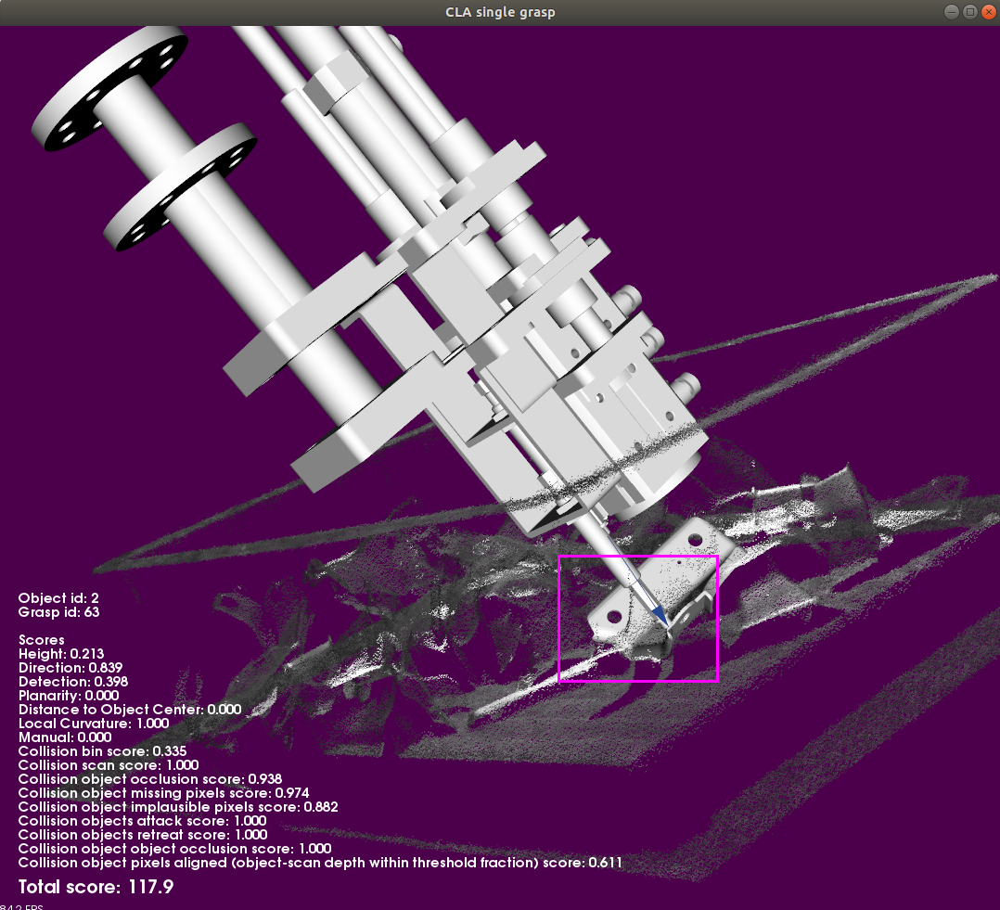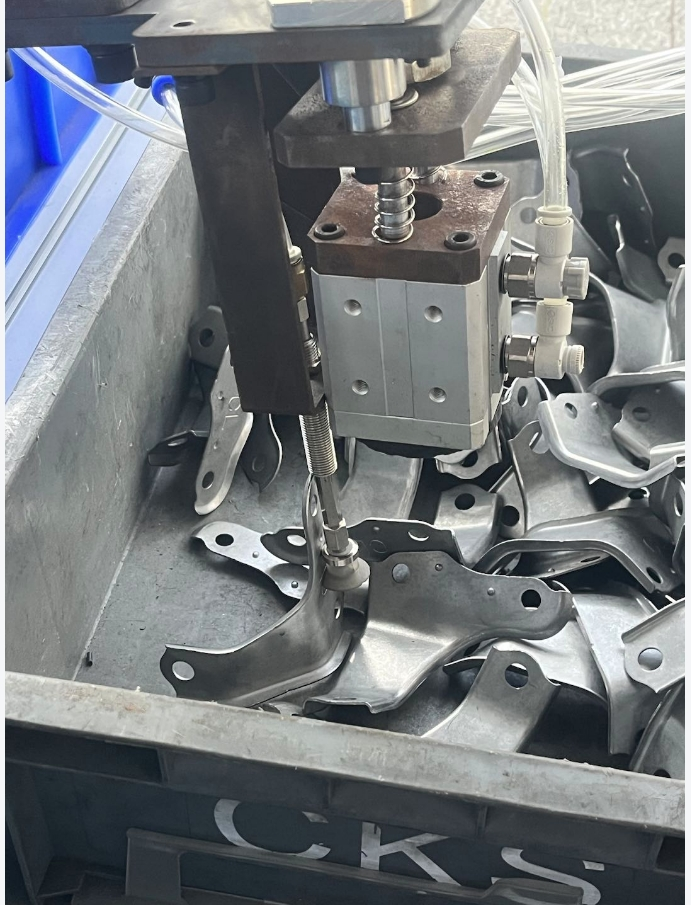

* 夹爪与框碰撞 :heavy_check_mark:

  ```
  early_stop_grasp_num: 1000
  2025-01-20-14-46-47
  ```

  

  * ~~夹爪点云~~
  * 夹爪与框检测算法
    * 框壁平面沿着法向量方向增加厚度 :x:
      $\text{nomal\_vector} \in [\text{-length}, \text{bin\_sides\_threshold}]$
    * 增加夹爪与料框外壁碰撞检测 :heavy_check_mark:
  
* 夹爪与工件

  ```python
  workflow_dataset_info {
      workflow_dataset_id: "roboeye/T017/T017_3D/2025-03-24-17-01-17"
      last_processor_name: "CLA"
  }
  ```

  
  
* ==夹爪与框碰撞(数据有误)==
  本地回放正常被过滤

  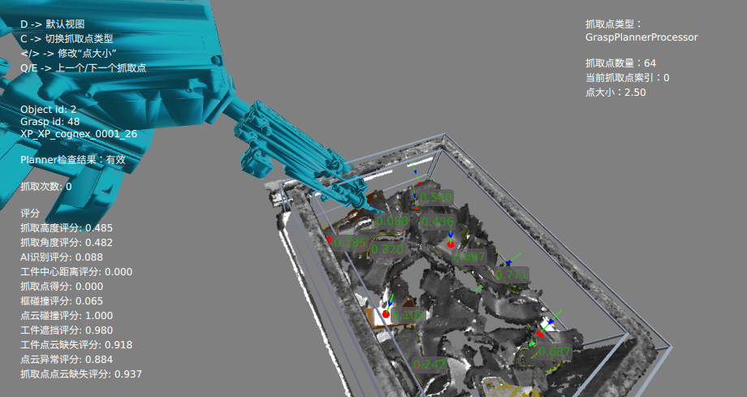 

### P020

* ~~本体碰撞~~

  ```
  2024-12-04-18-01-57
  ```
  
  ==注：==连续拍照，碰撞数据被清除
  
* 夹爪与非目标工件碰撞(进攻过程) 

  * 抓取点位姿不碰撞，但抓取过程会发生碰撞

  ```
  2025-01-14-12-09-20
  
  #initial motion check
  valid_grasp_id:  23 object_id: 0
  I0220 15:27:15.340397  8943 grasp_plan.cpp:395] valid_grasp_id:  24 object_id: 0
  I0220 15:27:15.340402  8943 grasp_plan.cpp:395] valid_grasp_id:  25 object_id: 0
  I0220 15:27:15.340407  8943 grasp_plan.cpp:395] valid_grasp_id:  26 object_id: 0
  I0220 15:27:15.340411  8943 grasp_plan.cpp:395] valid_grasp_id:  304 object_id: 9
  I0220 15:27:15.340415  8943 grasp_plan.cpp:395] valid_grasp_id:  305 object_id: 9
  I0220 15:27:15.340420  8943 grasp_plan.cpp:395] valid_grasp_id:  306 object_id: 9
  I0220 15:27:15.340423  8943 grasp_plan.cpp:395] valid_grasp_id:  307 object_id: 9
  I0220 15:27:15.340428  8943 grasp_plan.cpp:395] valid_grasp_id:  308 object_id: 9
  I0220 15:27:15.340438  8943 grasp_plan.cpp:395] valid_grasp_id:  309 object_id: 9
  I0220 15:27:15.340442  8943 grasp_plan.cpp:395] valid_grasp_id:  418 object_id: 10
  I0220 15:27:15.340447  8943 grasp_plan.cpp:395] valid_grasp_id:  419 object_id: 10
  I0220 15:27:15.340451  8943 grasp_plan.cpp:395] valid_grasp_id:  420 object_id: 10
  I0220 15:27:15.340456  8943 grasp_plan.cpp:395] valid_grasp_id:  421 object_id: 10
  I0220 15:27:15.340466  8943 grasp_plan.cpp:395] valid_grasp_id:  422 object_id: 10
  I0220 15:27:15.340471  8943 grasp_plan.cpp:395] valid_grasp_id:  423 object_id: 10
  I0220 15:27:15.340474  8943 grasp_plan.cpp:395] valid_grasp_id:  492 object_id: 14
  I0220 15:27:15.340478  8943 grasp_plan.cpp:395] valid_grasp_id:  493 object_id: 14
  I0220 15:27:15.340482  8943 grasp_plan.cpp:395] valid_grasp_id:  494 object_id: 14
  I0220 15:27:15.340490  8943 grasp_plan.cpp:395] valid_grasp_id:  495 object_id: 14
  I0220 15:27:15.340494  8943 grasp_plan.cpp:395] valid_grasp_id:  511 object_id: 16
  I0220 15:27:15.340498  8943 grasp_plan.cpp:395] valid_grasp_id:  512 object_id: 16
  I0220 15:27:15.340510  8943 grasp_plan.cpp:395] valid_grasp_id:  513 object_id: 16
  I0220 15:27:15.340514  8943 grasp_plan.cpp:395] valid_grasp_id:  514 object_id: 16
  I0220 15:27:15.340519  8943 grasp_plan.cpp:395] valid_grasp_id:  515 object_id: 16
  I0220 15:27:15.340523  8943 grasp_plan.cpp:395] valid_grasp_id:  516 object_id: 16
  I0220 15:27:15.340530  8943 grasp_plan.cpp:395] valid_grasp_id:  517 object_id: 16
  I0220 15:27:15.340535  8943 grasp_plan.cpp:395] valid_grasp_id:  518 object_id: 16
  I0220 15:27:15.340540  8943 grasp_plan.cpp:395] valid_grasp_id:  519 object_id: 16
  I0220 15:27:15.340549  8943 grasp_plan.cpp:395] valid_grasp_id:  636 object_id: 17
  I0220 15:27:15.340554  8943 grasp_plan.cpp:395] valid_grasp_id:  637 object_id: 17
  I0220 15:27:15.340559  8943 grasp_plan.cpp:395] valid_grasp_id:  638 object_id: 17
  I0220 15:27:15.340562  8943 grasp_plan.cpp:395] valid_grasp_id:  639 object_id: 17
  I0220 15:27:15.340577  8943 grasp_plan.cpp:395] valid_grasp_id:  640 object_id: 17
  I0220 15:27:15.340582  8943 grasp_plan.cpp:398] find num of valid grasp: 34
  ```
  
  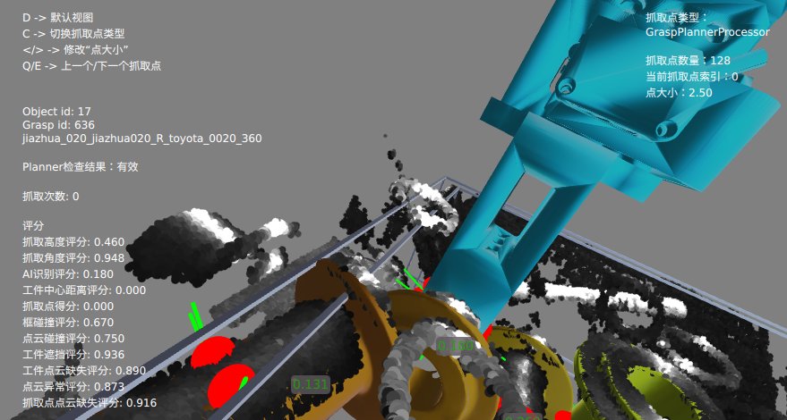
   左：沿工具方向 右：沿世界方向
  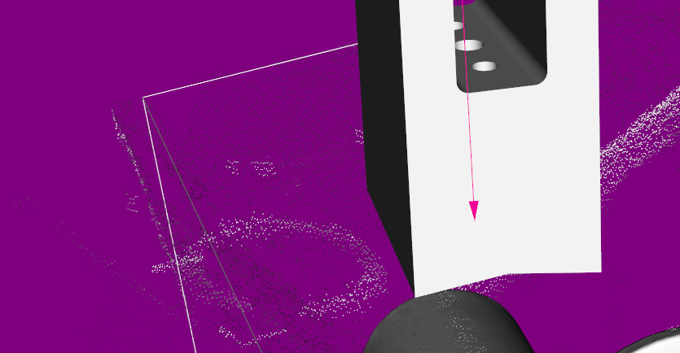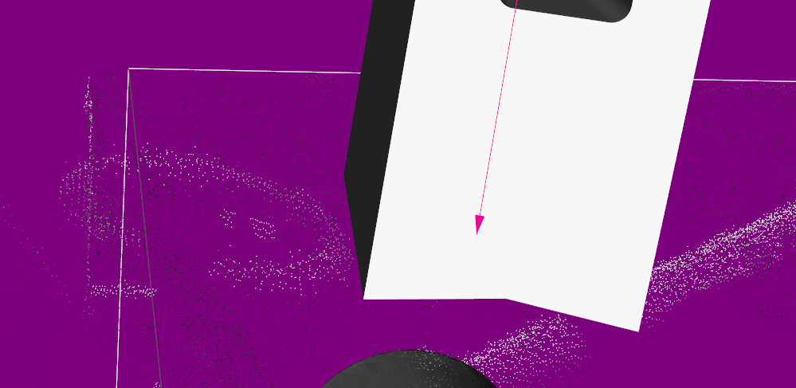
  
* 夹爪与非目标工件碰撞

  ```
  2025-02-12-05-05-20
  2025-02-12-05-45-24
  ```
  
  * 和非目标工件碰撞，但点云碰撞数量小于阈值(16 < 18)
  
    ```python
    I0212 11:13:16.966624 28624 collision_check_pc2pc.cpp:482] grasp id: 340, object id: 14
    Number of collision pixels: 16
    Number of scan missing pixels: 106,num_gripper_pixels_for_scan_missing: 469
    Number of occlusion pixels: 57
    Number of missing pixels: 188
    Number of implausible pixels: 282
    ```
  
    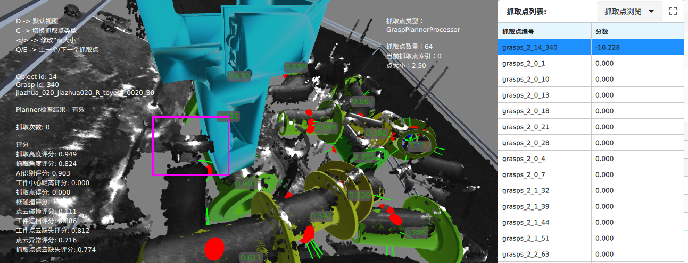
  
  * ==实际无碰撞，但是点云碰撞数量大于阈值== (19 > 18)
  
    ```python
    I0212 10:45:19.165114 21844 collision_check_pc2pc.cpp:482] grasp id: 13, object id: 0
    Number of collision pixels: 19
    Number of scan missing pixels: 12,num_gripper_pixels_for_scan_missing: 540
    Number of occlusion pixels: 10
    Number of missing pixels: 169
    Number of implausible pixels: 293
    ```
  
    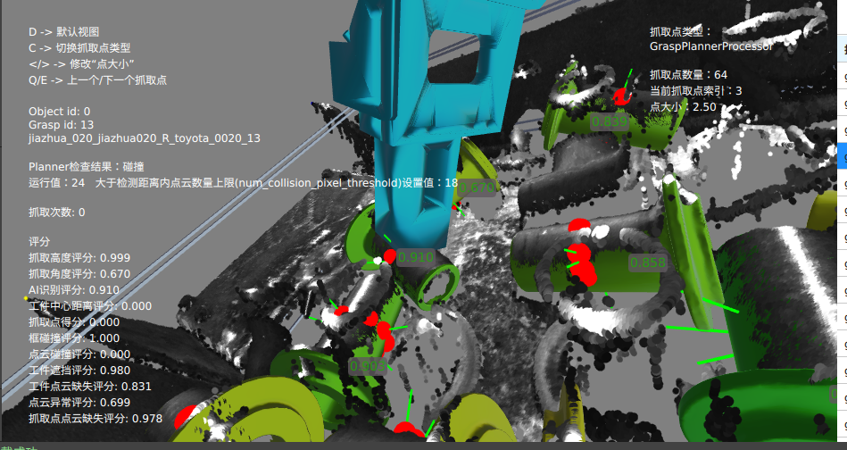

### Eva4

* 目标工件被遮挡，非目标工件未被识别

  ```
  2024-12-31-09-27-09
  ```

  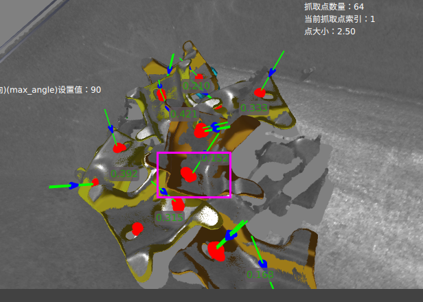 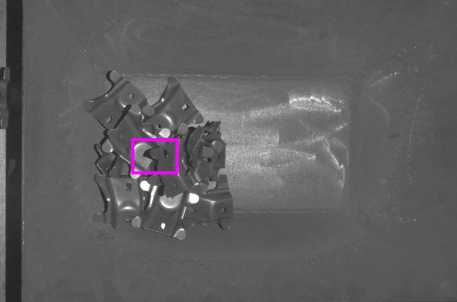 

* 目标工件被遮挡，非目标工件未被识别

  ```
  2025-01-14-10-03-07
  ```

  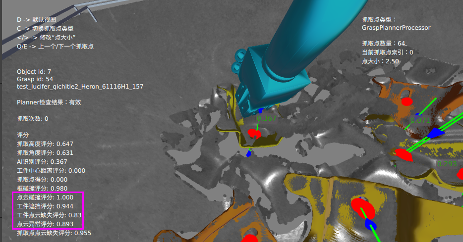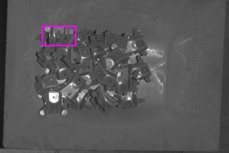

* ==撤退过程与点云缺失非目标工件碰撞==

  ```c
  2024-11-11-09-29-34
  ```

  

  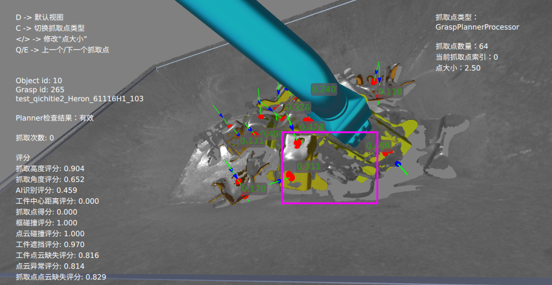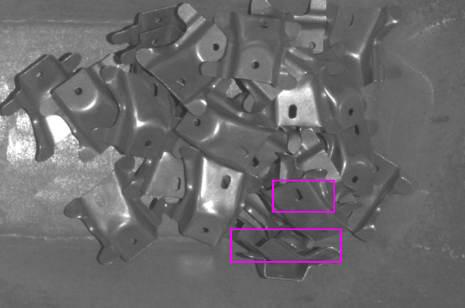

  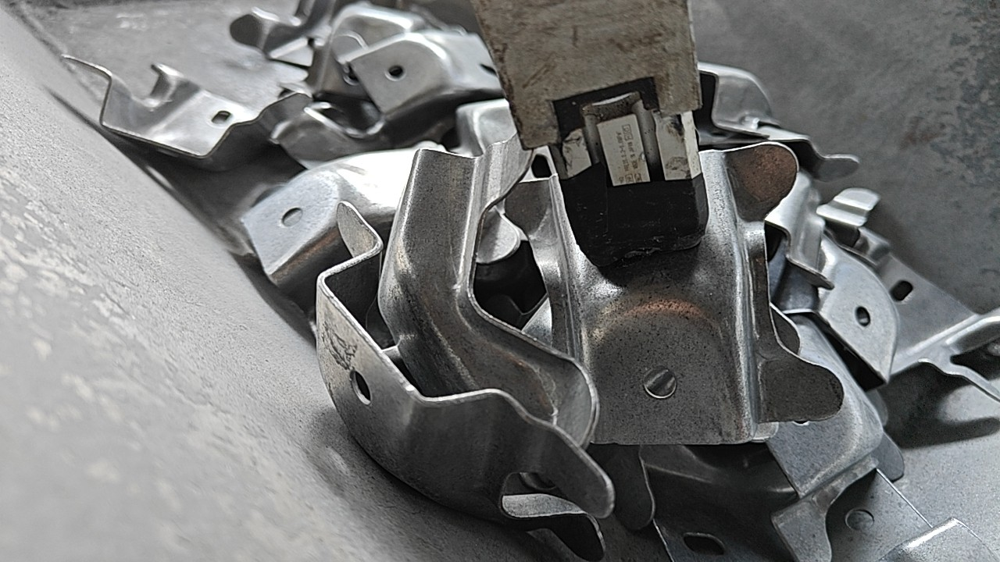

* 外界环境干扰（抓取场景与拍照时候不同）

  ```c
  2024-08-28-15-42-01
  ```

  
  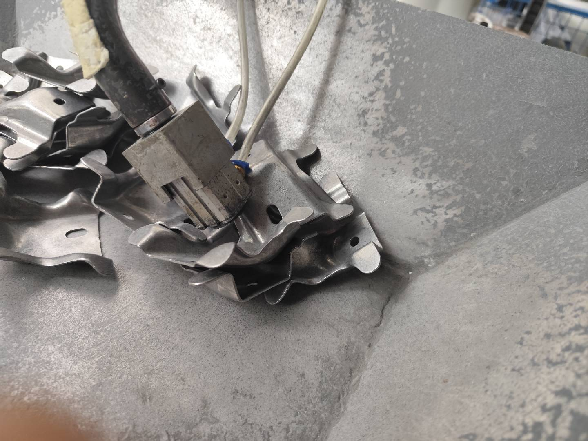

### eva8

* ==工件点云缺失/被遮挡严重，并且非目标工件没别识别出来==

  * 注意辨别缺失与遮挡计算方式

  ```c
  2024-11-05-14-39-13
  ```

  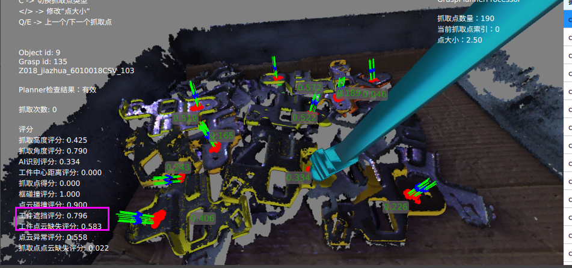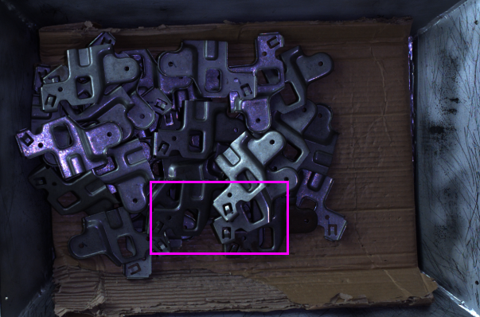

### eva3

* 非目标工件点云缺失

  ```c
  2024-11-15-09-01-10
  ```

  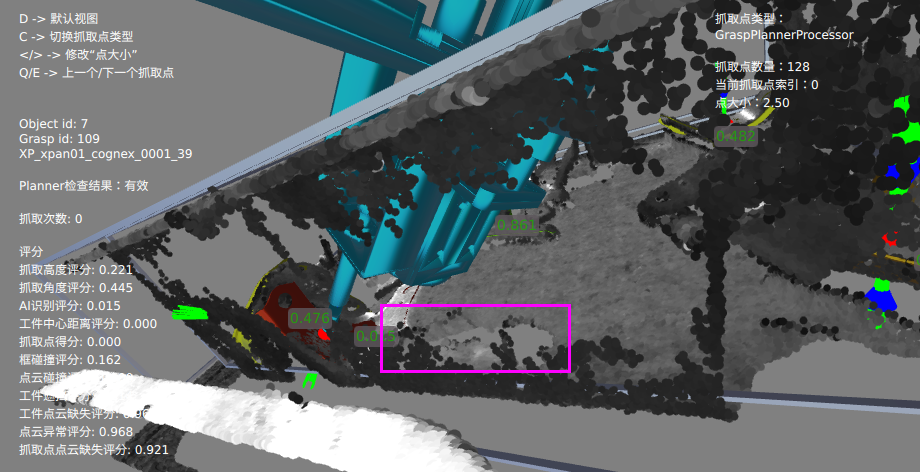

### g005

1. 暂无发现明显碰撞点

   ```c
   2024-08-09-09-34-42
   ```

   

## 碰撞检测策略

### current method

* 点云碰撞
* 工件遮挡
* 工件点云缺失
* 工件点云不可信

碰撞对象

* 夹爪
* 工件
* 框（平面+点云/深度图）

1. collision between gripper and bin
2. gripper and grasp object (collision_check_by_scan) 
   在抓取点位置，检测是否与目标/非目标工件碰撞
   * occlusion_check
   * missing_pixels
   * implausible_pixel
   * object_object_occlusion
   * percent_obj_pixel_aligned
3. gripper and other object (getCollisionScoreWithObjects)
   * attack path
     * fcl
   * retreat path


### ~~完善夹爪与工件碰撞点云计算~~

p020 发现夹爪与工件不发生碰撞情况的点云计算数量比发生碰撞的数量更大

* ==目标工件移除点云不够彻底==

  * 增大remove_obj_pc_threshold 1 -> 2

  ==注：==不使用识别目标工件点云是因为无法确定scene 缺失的目标工件点云是因为什么引起的

  * 使用点云替代深度图
    ==若使用点云，工件缺失的位姿无法获取==

* 碰撞点云计算 Number of collision pixels:

  * 工件点云与夹爪点云距离，由于竖起来的圆柱形工件容易发生点云缺失的情况，可以增大

    夹爪与点云的检测距离 gripper_min_buffer 5 -> 7


### 点云缺失导致碰撞 :pause_button:

* 点云/深度图补全 （Point Cloud Completion）
  * ==当前策略==
    **形态学填充**+**邻域深度传播**，但在**缺失面积较大**或**深度差异过大**的情况下，可能会导致误填充或填充区域错误。
    ==注：==
    
    1. ==点云转深度图丢失部分数据；==
       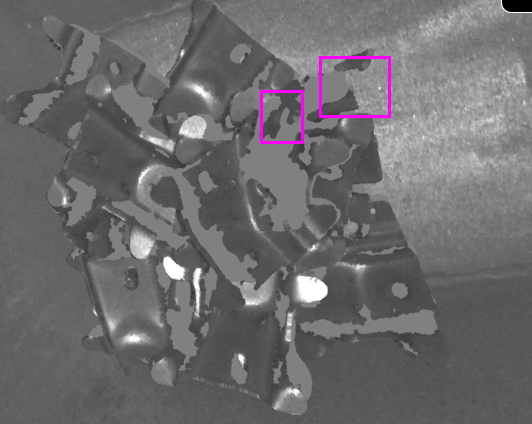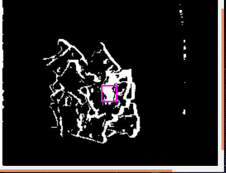
    
    2. ==深度信息有误==
       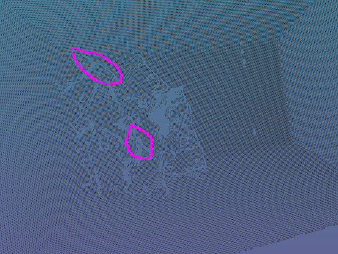
       * 按照相邻高度点云补全
         * ==识别不到工件位姿==
       * ~~按照模型匹配补全点云~~
         * 能识别到工件位姿
    
    * 常见的形态学操作包括腐蚀、膨胀、开运算、闭运算等
      * ==腐蚀（Erosion）：==
        * 用核的最小值替换锚点位置的像素值。
        * 效果：==缩小白色区域，去除小噪声。==
      * 膨胀（Dilation）：
        * 用核的最大值替换锚点位置的像素值。
        * 效果：扩大白色区域，填补小孔洞。
      * ==开运算（Opening）：==
        * 先腐蚀后膨胀。
        * 效果：去除小物体，平滑物体边界。
      * 闭运算（Closing）：
        * 先膨胀后腐蚀。
        * 效果：填补小孔洞，连接邻近物体。
      * 形态学梯度（Morphological Gradient）：
        * 膨胀图减去腐蚀图。
        * 效果：提取物体边缘。
      * 顶帽运算（Top Hat）：
        * 原图减去开运算结果。
        * 效果：提取比邻域亮的区域。
      * 黑帽运算（Black Hat）：
        * 闭运算结果减去原图。
        * 效果：提取比邻域暗的区域。
  
* 融合CAD模型

* 增强路径规划算法
  * 概率路径规划算化（$\text{PRT}^*$, PRM)
  * 冗余区域检测
  
* 工具
  * Open Motion Planning Library (OMPL)
  * PyBullet


### 运动过程导致碰撞 :black_flag:

#### current strategy

* attack/retreat 仅考虑世界 z 轴方向

#### attack/retreat

* 确定 attack/retreat 
  * 世界 z 轴
  * 工件 z 轴
* 确定 attack/retreat 与 grasp 之间的轨迹


#### question

1. 只检查识别到的非目标工件与夹爪（其他未识别到的不做检查:question:)

   * FCL 对象需要确定空间中的位姿
   * check_pc2pc 会检查夹爪与点云的碰撞，包括抓取点与运动过程（TCP 方向）
     * 若 attack 与 retreat 方向不一致，则夹爪模型再计算一次额外的运动过程

2. ~~==转换成深度图，沿用抓取点的计算==~~

   * visualize

     ```cpp
     // if (grasp->getName() == "636" && grasp->getObjectId() == 17) {
                 //     Visualizer::visRegisteredAndTargetPCsWithGrasps(scene_pc_, cam_gripper_pc_for_scan, true, false, nullptr, "", nullptr, grippers_, grasp, nullptr);
                 // }
     ```
     
     
     
   * ~~在一张图中显示运动轨迹~~
   
   * 如果运动过程中仅使用深度图会有部分抓取点发生碰撞也无法检测出来的情况
     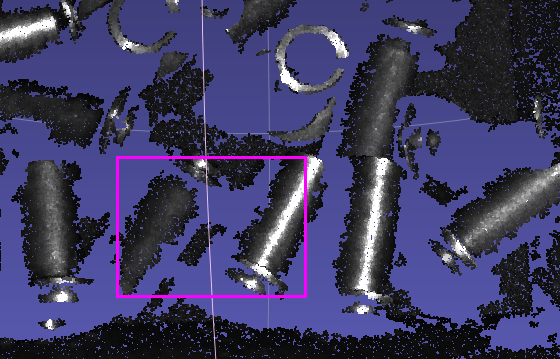 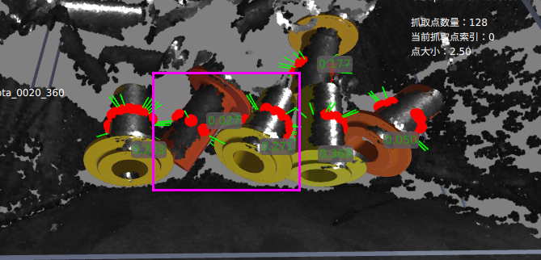
     因此需要在使用深度图做检测前使用 fcl 先检测一遍
     
   * 沿机器人基坐标 z 轴方向移动(标准安装/倒立安装)
   
     * 相机坐标系 
       * 眼在手上 :x:
         暂不考虑眼在手上场景
       * 眼在手外 :heavy_check_mark:
     * 框坐标系
       * 输入深度图 :x:
     * ~~额外参数~~
     
     $$
     Z_B = R_{BC} * R_{CBIN} * Z_{BIN}
     $$
   
     令 $Z_{B} = [0\ 0\ 1]^T$
     
     则可知基坐标轴在框坐标系下的方向
     $$
     Z_{BIN} = R_{BINC} * R_{CB} * Z_B
     $$
     
   * ==耗时增加 0.3s==
   
     * check_pc2pc : 0.2/100, 2 ms per grasp
     
     * initial: 1.287775 s
       after:  2.186718 s
       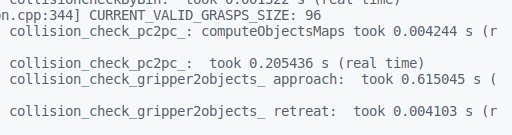 
       
       原始：
       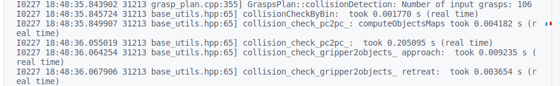
       
       加载运动夹爪点云
       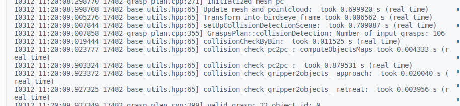
       进攻&抓取方向不同
       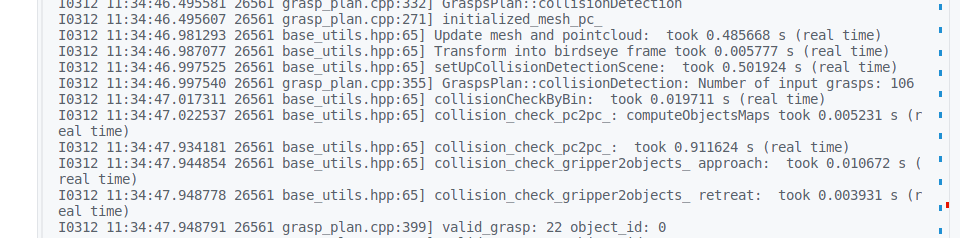
       沿世界方向
       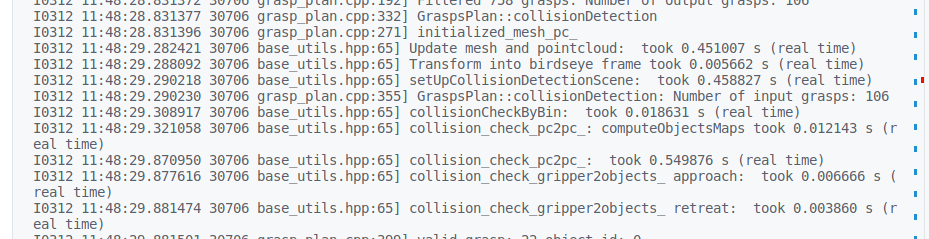
       
     * load gripper pc
       * ~~grasp_descriptor 传入标定矩阵~~
       * 记录下沿着工具坐标系的点云
       * 重新计算沿着世界坐标系点云
       * 耗时对比
         * initial: 0.325
         * tcp: 0.365
         * world: 0.52
         * tcp + wolrd: 0.896
         * tcp + wolrd2: 0.793/0.77
       
     * ==根据 grasp_descriptors 绑定==
     
       * 如何根据 descriptors pose 应用 grasp pose


```base
sudo swapoff -v /swapfile
sudo rm /swapfile                  # 删除旧交换文件
sudo fallocate -l 25G /swapfile      # 创建 4GB 交换文件
sudo chmod 600 /swapfile            # 设置合适权限
sudo mkswap /swapfile               # 格式化为交换空间
sudo swapon /swapfile               # 启用交换空间

```


# 碰撞检测（本体与工件）

本体与未识别工件碰撞

## 限制关节高度 :heavy_check_mark:

在一定程度上影响清框率，与工件对方高度相关


## 使用点云作碰撞检测 :black_flag:

使用点云作补充，同时也还需要 collision_check 的 link 与 template


# 碰撞检测耗时优化

简化本体与夹爪模型作粗检测，再用mesh做精检测

## 简化本体与夹爪模型粗检测

### padding

1. 法向量方向

   沿着中心发散

### 凸包

```PYTHON
mesh_stl = o3d.io.read_triangle_mesh(stl_path)
mesh_stl = mesh_stl.compute_convex_hull()[0]
```


### AABB

axis-aligned bounding box

### OBB

oriented bounding box 


## 碰撞对象组 :black_flag:

### broadphase checking

使用 AABB 作快速检测（粗检测）

```python
AABB
initial
ERROR:root:collision_check_time_cost:0.16785931587219238
after
ERROR:root:collision_check_time_cost:0.1364278793334961

convex_hull
i
ERROR:root:collision_check_time_cost:0.031001806259155273
a
ERROR:root:collision_check_time_cost:0.030857324600219727
```


```python
  def check_collision_between_groups(
            self,
            groups_1: List[Union[GeomPrimitive, fcl.CollisionObject]],
            groups_2: List[Union[GeomPrimitive, fcl.CollisionObject]],
    ) -> bool:
        manager1 = fcl.DynamicAABBTreeCollisionManager()
        manager2 = fcl.DynamicAABBTreeCollisionManager()
        if not groups_1 or not groups_2:
            return False
        
        object_map = {}
        for group in groups_1:
            if isinstance(group, GeomPrimitive):
                group = group.get_collision_object()
            object_map[id(group.collisionGeometry())] = group
            manager1.registerObject(group)

        for group in groups_2:
            if isinstance(group, GeomPrimitive):
                group = group.get_collision_object()
            object_map[id(group.collisionGeometry())] = group
            manager2.registerObject(group)

        manager1.setup()
        manager2.setup()
        manager1.collide(manager2, self.collision_data_, fcl.defaultCollisionCallback)
        broadphase_collision = self.collision_data_.result.is_collision
        if broadphase_collision:
            for contact in self.collision_data_.result.contacts:
                collision_objects = [object_map[id(contact.o1)], object_map[id(contact.o2())]]
                if self.check_collision_between_objects(collision_objects[0], collision_objects[1]):
                    return True
        return False
    
for idx, robot_link in enumerate(all_robot_links):
            if (
                idx < len(self.link_collision_check_enable)
                and not self.link_collision_check_enable[idx]
            ):
                continue
            link_group.append(robot_link)
            if idx < len(all_robot_links) - 2:
                link_group_for_gripper.append(robot_link)

        for idx, robot_link in enumerate(link_group):
            if idx < len(link_group) - 2 and self.check_collision_between_groups([robot_link], link_group[idx +2:]):
                return CollisionDetectionResult.COLLISION_WITH_LINK
        
        if self.gripper_self_collision_check:
            gripper_group = [gripper]
            if self.check_collision_between_groups(link_group_for_gripper, gripper_group):
                return CollisionDetectionResult.COLLISION_WITH_GRIPPER
            
        if self.check_collision_between_groups(link_group, all_env_objects):
            return CollisionDetectionResult.COLLISION_WITH_ENV
            
        if input_bin:
            bin_group = input_bin.get_collision_objects()
            if self.check_collision_between_groups(link_group, bin_group):
                return CollisionDetectionResult.COLLISION_WITH_BIN
        
        if self.check_collision_between_groups(link_group, all_template_objects):
            return CollisionDetectionResult.COLLISION_WITH_TEMPLATE
```


#### 碰撞环境预加载

仅更新 link pose


