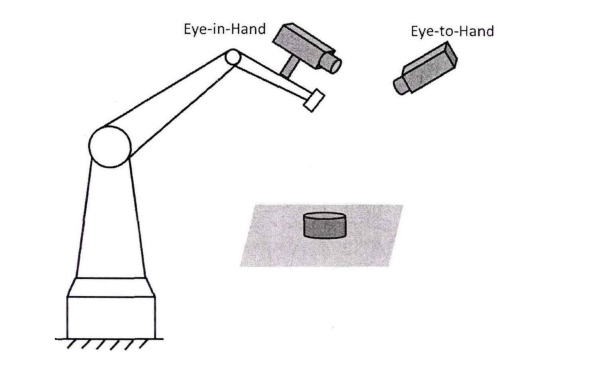
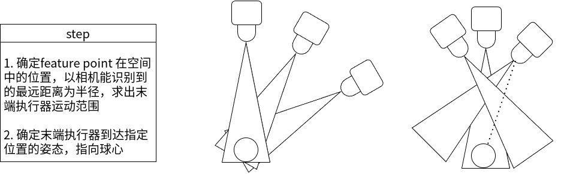

# 手眼标定

keywords: hand-eye calibration, ~~self-calibration~~, single-point, automatic calibration
autonomous hand-eye caliration

## Eye to hand

视觉传感器距离识别物体较远会产生相对定位误差，限制感知作业的范围

## Eye in hand

视觉传感器随着机械臂运动靠近目标物体，视觉测量的误差随之降低，==缺点是不能保证目标物体会一直出现在视场范围。==



## autonomous calibration

~~三组正交平移运动~~ -> 相机内参数自标定

建立机械手末端执行器与摄像机两坐标系之间相对位置的==约束方程组==

### steps :star:



* 末端执行器以 feature point 为球心，当前距离为半径，规划路径为球面 （确定最远路径）
* 末端执行器法兰中心指向球心
  1. 指定末端执行器当前姿态（如与基坐标 z 轴平行）
  2. 计算当前位置（球面）与球心方向向量
  3. 计算旋转轴（product）
  4. 计算夹角
  5. 根据 Rodrigues's formula 计算 rotation matrix
* 确定 transformation matrix

### 当前问题 :star:

1. 机械臂 Move to 指令不按设定位置走

   * 设置基坐标系与工具坐标系

     ```python
     $MNUFRAMENUM[1] = 9
     $MNUTOOLNUM[1] = 9
     ```

     

   [ref-use_tp_program](https://github.com/Backdate/TP-Tools)

   [ref](https://www.robot-forum.com/robotforum/thread/45201-how-to-use-karel-program-to-move-joint/?postID=207508&highlight=fanuc%2Bmove%2Buse%2Bkarel#post207508)
   ==Fanuc recommends not to use Karel for movements since many years.==

2. 点位位姿是否在球面并指向球心（待测试)

   * flange 位置是否在球面 :heavy_check_mark:

   * flange 姿态是否指向球心 :heavy_check_mark:

     初始位姿：$$[790, 0, 700, -180, 0, 0]$$

3. 触发相机拍照 :heavy_check_mark:

   ```python
   move_points = xxx
   times = 0
   success = 0
   while times < move_points:
       if not pass_pose_check
           continue
   	 retry = 1 if success > 0 else 0
           result_log, ret = collect_sample(roboeye, retry)
           if ret == roboeye_driver.HandEyeCalibResult.SUCCESS:
               success += 1
               detect_failure = 0
               logger.info(result_log)
               if success >= total_pose:
                   break
           else:
               logger.error(f"return error: {ret}, detect failed!")
               if (
                   ret == roboeye_driver.HandEyeCalibResult.DETECT_FAILED
                   and success > 0
                   and detect_failure < 3
               ):
                   detect_failure += 1
                   continue
               if not gui_utils.question_messagebox(_(result_log)):
                   break
   ```

4. 适配不同品牌机器人 :star:
   目前策略：计算出旋转矩阵，转换为 cpose，再进行姿态的修正
   
5. 修正相机的偏移量
   flange 中心 -》相机中心

## 优化

1. 限制机械臂移动范围

   * 非半球，开放 $\theta, \varphi$ 设置 :pause_button: 
     如何确定球心转角方向 :question:
     以==机器人世界坐标系==为参考系确定 $$\theta,\ \varphi$$
   * 移动范围非球面，radius 随机 :heavy_check_mark:
   * 分段生成 :question:

2. 生成点位后需要加入可达性检测 :heavy_check_mark:

3. 点位生成需要在可达性检测后（生成球面仅生成单个点）:heavy_check_mark:

   ```python
   move_points = xxx
   times = 0
   while times < move_points:
       if pass_pose_check
        times += 1
        else:
           continue
   
   ```

   

4. ~~test~~

   * 设置随机生成器的种子值（seed），保证生成随机数序列都相同

5. 文件命名 

6. ==已知机器人旋转矩阵，转换成 euler angle 相加和直接矩阵相乘的区别== :star:

   * 不涉及坐标系变换时候，可以直接相加（记录当前向量）


## 机器人工作范围简化

### 圆柱

1. 圆柱轴线的起点：$p_0(x_0,y_0,z_0)$
2. 圆柱轴线方向向量：$d = (d_x, d_y, d_z)$
3. 圆柱的半径：$r$
4. 圆柱的高度：$h$

#### 参数化表示

1. u 表示圆周角度，$u \in [0, 2 \pi]$
2. v 表示沿圆柱轴线的高度，$v \in [0,h]$

$$
P(u, v ) = p_0 + vd + r(cos(u)e_1 + sin(u)e_2)
$$

==注：==$e_1,\ e_2$ 为圆柱横截面上的两个单位向量，互相垂直并且垂直与圆柱的方向向量

### 复用眼在手外

