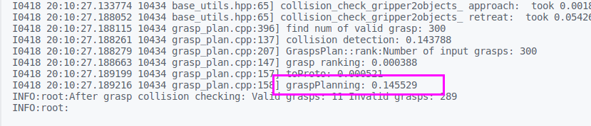
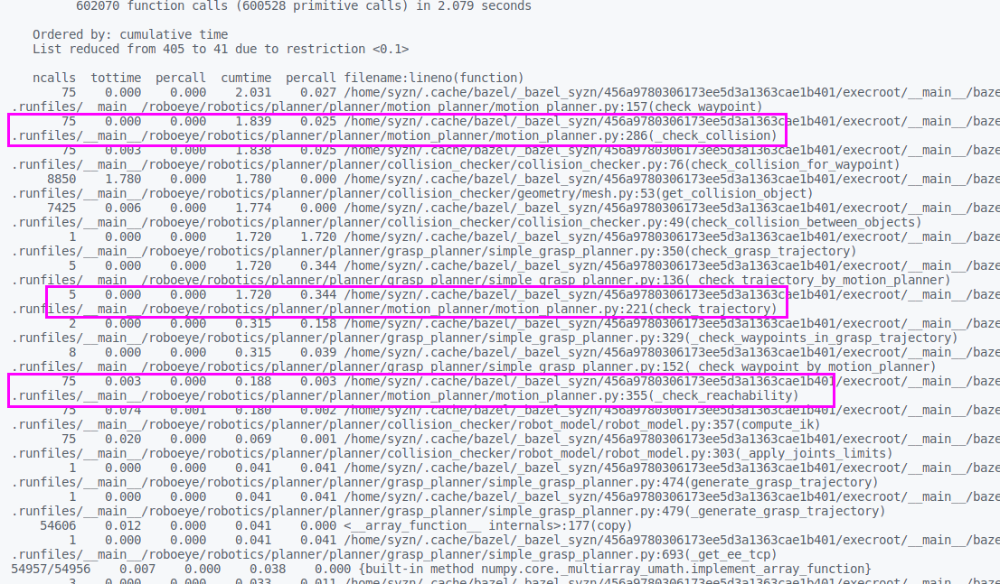
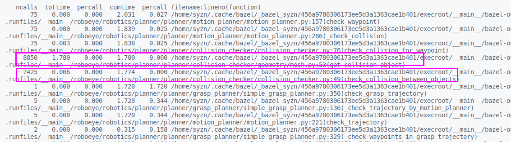
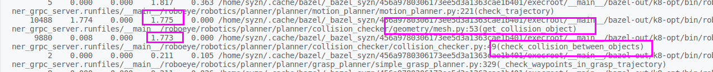
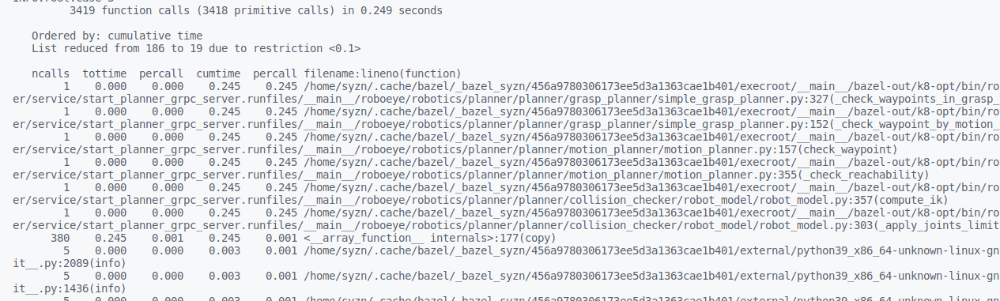

# 耗时基线纳入回归性测试

1. 典型案例

   * 数据准备

     ```python
     workflow_dataset_info {
         workflow_dataset_id: "roboeye/P020/station002/2025-03-12-15-17-02"
         last_processor_name: "pl_20"
     }
     
     home: [ 3.9618974  -1.22173048 -2.23402144  0.26179939  2.00712864 -0.31415927]
     机器人配置 ~.yml
     ```

     /var/lib/roboeye/company_specific/roboeye/project_specific/test/station_specific/unknow_station/workflow_dataset/2025-05-15-17-54-46/2025-05-15-17-54-46/static_data/workflow.cfg

2. 运行完整工作流 workflow _evaluator_demo + planner_grpc_service

3. ==输出性能分析到飞书==


## 回放完整工作流 :heavy_check_mark:

### 启动 planner service 

在客户端程序中，使用子进程管理来启动 grpc 服务端，在客户端运行期间保持服务端运行。客户端退出时，终止服务端进程。（fork + exec)

### 组织 roboeye1.0 数据

#### home

planner_param.home_pose()

#### 机器人配置

RB~.yml config.yml

#### tcp

1. middleware.cfg
2. placeposition.cfg
3. planner_param.tcp_transform()

```python
def planner_server_health_check(self, request: planner_service_pb2.PlannerServerHealthCheckRequest, context:grpc.ServicerContext):
        response = planner_service_pb2.BaseResponse()
        response.status.success = True
        return response
```


## 输出耗时分析 :heavy_check_mark:

### 获取耗时分析数据

profiler 输出数据转换为 json 格式 (复用 middleware regression test)

1. 只保存一次基线建立的数据（不再记录历史数据）
2. 一个工作流包含多个 sample 
   * 保留 workflow_infomation (workflow_dataset_id + cur_time) -> (workflow_dataset_id + sample_id) 
3. 输出数据到飞书
   * 仅保留 workflow_waste_time = run_processor_time - update_scene_waste_time 作为 planner 耗时
   * 若某些工作流耗时超过基线的**一倍**，则输出具体工作流信息
   * 保存工作流数量

### 可视化

```python
snakeviz
Matplotlib
```

### 输出到飞书

```python
send_message_tool
```


### ~~输出到 granfa~~

## 由输出数据建立 timeline

### 所有工作流数据显示

```python
-------- planner processor timeline--------
Result: {{result}}
current timeline is: {{timeline |float|round(3)}} s
maximum allowable percentage is: {{maximum_allowable_percentage}} %

maximum runtime is: {{maximun_runtime|float|round(3)}} s




---------------------timeline {{timeline|float|round(3) }} s---------------------



---------------------maximum runtime {{maximun_runtime|float|round(3)}}s---------------------


{{ avg_runtime[0] }}: {{ avg_runtime[1]|float|round(3) }} s

```


# 降低本体碰撞检测耗时 :heavy_check_mark:

## 耗时分析

以 p020成功输出抓取点为例
夹爪与抓取环境planner耗时：0.1455 s


抓取轨迹检查planner 耗时 2.079s

* 碰撞检测 ==1.839 s==
* 可达性检测 0.188 s



可以看到planner的主要耗时分布于碰撞检测部分，以下为碰撞检测耗时分析：

1. 现场设置采样步长 10 mm 导致待检查插补轨迹点位多
   * 需要更新碰撞对象位姿次数多（==8850 次==），且比较耗时（1.780 s)
   * ~~现场环境恶劣，需要检查较多碰撞对象（link + gripper + env + template），导致耗时久（1.774 s）~~
     

对策：

1. 减少调用次数（==记录无效抓取轨迹==）

   工件碰撞
   以查询的耗时代替更新位姿+碰撞检测耗时

2. 简化碰撞对象模型，降低单次碰撞检测耗时

```python
workflow_dataset_info {
    workflow_dataset_id: "roboeye/P020/station002/2025-03-12-15-17-02"
    last_processor_name: "pl_20"
}

home: [ 3.9618974  -1.22173048 -2.23402144  0.26179939  2.00712864 -0.31415927]
```



* 减少调用次数（==记录无效抓取轨迹==）
  home -> above0 -> grasp

  * 切换home之后，需要刷新记录无效的抓取历史数据/根据不同的 home 记录各自的抓取点历史数据

    * home_1
      * above0_1
        * invalid
          trans + orient
          ~~是否需要加上距离范围~~
      * ……
    * home_2
      * above0_1
        * invalid

    ~~==注：==是否需要适配无above情况~~

    如何验证耗时优化

    * 配置多个抓取点，

  * 记录成功的抓取轨迹
    成功的抓取点计算完整路径，耗时……
  
* 加快单次检测速度

## 无效抓取点检测一次

### 记录无效抓取轨迹

home -> above0 -> grasp
根据 home & above0 维护 invalid_grasps_pose_list

==注：== 是否需要转换（四舍五入）

1. home $1 \cross 6$ 
2. above0 $4 \cross 4$
   * invalid grasp
     所有上方点不可达
   * valid grasp
     部分上方点不可达


### optimize

1. 过滤原因
2. 记录无效抓取点个数
   * 目前只有在切换分支的时候会清空
3. 判断抓取点位姿是否相近

## get_collision_object

### BVH model


层级结构介绍计算的复杂性（collision objects 对比）

[BVH 介绍](https://en.wikipedia.org/wiki/Bounding_volume_hierarchy)

```python
beginModel 分配内存
addSubModel 重新分配内存
endModel 构建 bvh
```

初始化创建一个包含所有 vertices 的 aabb， ~~ques：何时创建层级 aabb~~

#### CollisionObject

```cpp
CollisionObject<S>::CollisionObject(
    const std::shared_ptr<CollisionGeometry<S>>& cgeom_,
    const Transform3<S>& tf)
  : cgeom(cgeom_), cgeom_const(cgeom_), t(tf)
{
  cgeom->computeLocalAABB();
  computeAABB();
}

getAABB()
```

==注：==创建CollisionObject会计算一次aabb（这里可能会导致耗时，与 vertices & triangles 有关/减少不必要的内存花销）
[AABB介绍](https://developer.mozilla.org/en-US/docs/Games/Techniques/3D_collision_detection)

1. 创建BVH model 就使用aabb的 vertices & triangles
2. 只更新 transform 而不是重新构造 CollisionObject
   * setTransform ~~+ computeAABB~~
     ~~narrowphase 不需要用 AABB~~
     
     ```python
     beginReplaceModel
     replaceSubModel
     endReplaceModel
     ```
     
     重新计算 bvh (每个层级AABB)
     
   * ~~collide 使用 CollisionGeometry + transform(python-fcl 不支持)~~
   
   * ~~continuousCollide -> CollisionGeometry + transform~~



### collide

遍历两颗 BVH 树，检查对应 AABB 是否重叠，若两个碰撞对象真的发生碰撞将会是耗时操作


## ~~简化碰撞对象模型~~

BVH 已做类似耗时优化

### convex_hull


### AABB


# 关节空间轨迹插补

1. 已知 initial apose 与 final cpose

2. 求解 final apose

3. 在关节空间中对 initial apose 和 final pose 进行插值

   ```python
   from scipy.interpolate import CubicSpline
   joint_splines = [CubicSpline(t, [q_start[i], q_goal[i]]) for i in range(len(q_start))]
   q_interp = [spline(t_val) for spline in joint_splines for t_val in t]
   ```

   

## 三次样条插值


# 点云提取工件

从点云中筛选工件并估计位姿的核心流程：

1. **预处理**（降噪、下采样）→ 2. **分割**（RANSAC/聚类）→ 3. **特征提取** → 4. **位姿估计**（ICP/PnP/深度学习）→ 5. **后处理**。

# ssh

```
sudo apt update
sudo apt install openssh-server

sudo sytemctl start ssh
sudo systemctl enable ssh
sudo systemctl status ssh

# 查看端口
sudo ss -tulnp | grep sshd

sudo systemctl restart sshd
```


