# UR ROBOT 

[download center](https://www.universal-robots.cn/technical-files/)

密码：easybot

ip: 192.168.135.130

~~port: 30002~~

[control center](https://e34j74nspv.feishu.cn/wiki/Pieow4cVTiNARnkbuVRcFm68nYe)

## COMM 

[Overview of client interfaces](https://www.universal-robots.com/articles/ur/interface-communication/overview-of-client-interfaces/#:~:text=RTDE%20%28Real-Time%20Data%20Exchange%29%20RTDE%20is%20designed%20as,data%20and%20accept%20custom%20set-points%20and%20register%20data.)

* Real-time Interfaces
  * port: 3001-3003
  * 能发送控制指令，但不能返回信息
  * 读取状态信息有限
  
* ==Socket Communication==
  robot acts as client and other device play a role as server.
  
* RTDE (Real-Time Data Exchange)
  [RTDE](https://www.universal-robots.com/articles/ur/interface-communication/real-time-data-exchange-rtde-guide/)
  [INTRODUCTION TO RTDE](https://sdurobotics.gitlab.io/ur_rtde/introduction/introduction.html)
  
  ```BASH
  pip install --user ur_rtde
  ```
  
  
  
  * port: 3004
  
  * ```bash
    git clone https://github.com/UniversalRobots/RTDE_Python_Client_Library.git
    git clone https://gitlab.com/sdurobotics/ur_rtde.git
    ```
    
  * data type
    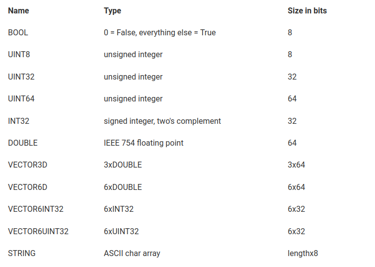

端口	名称	功能
30001	第一客户端端口	客户端可发送脚本代码至服务器，服务器自动以5Hz的频率返回机器人状态与补充消息到客户端
30002	第二客户端端口	客户端可发送脚本代码安全文件传输协议，服务器自动以5Hz的频率返回机器人状态与消息到客户端
==30003	实时反馈端口	客户端可发送脚本代安全文件传输协议，服务器自动以125Hz的频率返回机器人状态与消息到客户端==

原文链接：https://blog.csdn.net/hangl_ciom/article/details/97610882

```python
#socket通讯所需的包
import socket
 
 
#定义了UR机器人的地址和端口
target_ip = ("192.168.100.2" , 30003)
 
#建立一个socket对象
sk = socket.socket()
 
#建立连接
sk.connect(target_ip)
 
#这是发送给UR机器人的一个脚本指令
send_data1 = '''
def svt():
    movej(p[0.4,0.4,0.7,3.14,-1.57,1.57],a=1.4, v=1.05, t=0, r=0)
    movej([0,-1.1,0,-1,0,0])
    
end
'''
 
#发送指令，并将字符串转变格式
sk.send(send_data1.encode('utf8'))
```

### 指令下发规则

• The script must start from a function definition or a secondary function definition
==(either "def" or "sec" keywords)== in the first column
• All other script lines must be indented by at least one white space
• The last line of script must be ==an "end" keyword== starting in the first column

### send_command

特定字符串，如：

```python
send_command = "movej([0,-1.1,0,-1,0,0])"
```


### recieve_content 

[custom_socket_communication](https://underautomation.com/universal-robots)

[content_analysis](https://blog.csdn.net/seing128/article/details/89713207)

#### real-time interface :x:

```python
import socket
import time
import struct
import numpy as np
import math
ip = "192.168.135.130"
port = 30003

def move():
  # move
  send_data = '''
  def test_move_3():
    movej([1,0,0,0,0,0]) 
    movej([0,0,0,0,0,0])\n
  end
  '''
  return send_data

def get_cur_pose():
  send_data = "get_actual_joint_positions()"
  return send_data

def recieve_content(data):
  dic= {'MessageSize': 'i', 'Time': 'd', 'q target': '6d', 'qd target': '6d', 'qdd target': '6d','I target': '6d',
      'M target': '6d', 'q actual': '6d', 'qd actual': '6d', 'I actual': '6d', 'I control': '6d',
      'Tool vector actual': '6d', 'TCP speed actual': '6d', 'TCP force': '6d', 'Tool vector target': '6d',
      'TCP speed target': '6d', 'Digital input bits': 'd', 'Motor temperatures': '6d', 'Controller Timer': 'd',
      'Test value': 'd', 'Robot Mode': 'd', 'Joint Modes': '6d', 'Safety Mode': 'd', 'empty1': '6d', 'Tool Accelerometer values': '3d',
      'empty2': '6d', 'Speed scaling': 'd', 'Linear momentum norm': 'd', 'SoftwareOnly': 'd', 'softwareOnly2': 'd', 'V main': 'd',
      'V robot': 'd', 'I robot': 'd', 'V actual': '6d', 'Digital outputs': 'd', 'Program state': 'd', 'Elbow position': '3d', 'Elbow velocity': '3d'}
  names = []
  dic_len = range(len(dic))
  for key, i in zip(dic,dic_len):
    fmtsize=struct.calcsize(dic[key])
    data1,data=data[0:fmtsize],data[fmtsize:]
    fmt="!"+dic[key]
    names.append(struct.unpack(fmt, data1))
    dic[key]=dic[key],struct.unpack(fmt, data1)
    # print(dic)

  a=dic["q actual"]
  a2=np.array(a[1])
  print(a2*180/math.pi)

def main():

  with socket.socket(socket.AF_INET, socket.SOCK_STREAM) as sock:
    print("Connecting to {}:{} ...".format(ip, port))
    sock.connect((ip, port))
    print('reading')

    try:
      while True:
        try:        
          command = move()
          # command= get_cur_pose()
          sock.sendall(command.encode('utf-8'))
          print('send message success')
          data = sock.recv(1220)      
          # print(data) 
          recieve_content(data)            
          time.sleep(2)
          command_2 = move()
          sock.sendall(command_2.encode('utf-8'))
          print('send message success')
        except socket.error:
          pass
    except KeyboardInterrupt:
      sock.close()

if __name__ == '__main__':
  main()
```


#### real-time data exchange 

##### basical library

control center 实现 -> 参考estun

```python
```


##### ==other interface api-ur_rtde==

RTDE Control Interface 

RTDE Reieve Interface

RTDE IO interface 

[ref](https://sdurobotics.gitlab.io/ur_rtde/api/api.html#rtde-receive-interface-api)

###### get/set var

```python
# get_cur_pose, get_var, get_io
# set_var, set_io
# move, move_trajectory

# int getOutputIntRegister(int output_id)
# output_id: lower range[18-22] upper range[42-46]
# double getOutputDoubleRegister(int output_id)
# name = port, type = int/float
# 
def get_var(self, remote_name: str, var_type: VarType)-> VarType:
     	estun_var_type = _proto_var_type_to_estun_type(var_type)
        # RequestPackage = collections.namedtuple("RequestPackage", ["id", "cmd"])
        request_package = RequestPackage(
            self._current_message_id(),
            f'GetVarV3({estun_var_type},"{remote_name}",{_PROJECT_SCOPE})',
        )
        self._send_request(request_package)
        response_package = self._recv_response()
        _check_response_id_and_status(response_package, request_package.id)
        return _estun_var_str_to_var_value(estun_var_type, response_package.data)
		
```

==注：== 

* 仅有 int/double 类型寄存器

  * 输入寄存器：用于从外部设备读取数据
  * 输出寄存器：用于向外部设备写入数据

* Get the specified output integer register in either ==lower range [12-19]==or upper range [42-46]. 

  ```python
  read_output_integer_register
  write_output_integer_register
  ```

* setinputregister [18,22], []

* get_var 读取有问题


###### get/set io

```python
# bool getDigitalInState(std::uint8_t input_id)
# uint64_t getActualDigitalInputBits()
# bool getDigitalOutState(std::uint8_t output_id)
# bool setStandardDigitalOut(std::uint8_t output_id, bool signal_level)
#  double getStandardAnalogInput0()
def _get_io_state(self, io_type: str, remote_name: str) -> IOType:
        out_id = int(remote_name)
        if io_type == "IOGetDin":
            receive_sate = int(self._rtde_receive.getDigitalInState(int(remote_name)))
        elif io_type == "IOGetDout":
            receive_sate = int(self._rtde_receive.getDigitalOutState(int(remote_name)))
        elif io_type == "IOGetAin":            
            if out_id == 0 :
                receive_sate = self._rtde_receive.getStandardAnalogInput0()
            elif out_id == 1:
                receive_sate = self._rtde_receive.getStandardAnalogInput1()
            else:
                receive_sate = 2
        elif io_type == "IOGetAout":
            if out_id == 0 :
                receive_sate = self._rtde_receive.getStandardAnalogOutput0()
            elif out_id == 1:
                receive_sate = self._rtde_receive.getStandardAnalogOutput1()
            else:
                receive_sate = 2
        else:
                receive_sate = 2
        return receive_sate
    
```

==注：==analog in/out 只有 0/1

```python
# bool setStandardDigitalOut(std::uint8_t output_id, bool signal_level)
```

###### get_cur_pose

```python
# getActualTCPPose()
# getActualQ()
```

###### move

initial pose : [-91.71, -98.96, -126.22, -46,29, 91.39, -1.78]

1. moveJ

2. moveL
   C20A41

3. movePath

   ```python
   from rtde_control import Path, PathEntry
   
   path = Path()
   path.addEntry(PathEntry(PathEntry.MoveJ, PathEntry.PositionTcpPose, [-0.140, -0.400, 0.100, 0, 3.14, 0, vel, acc, 0.0]))
   path.addEntry(PathEntry(PathEntry.MoveL, PathEntry.PositionTcpPose, [-0.140, -0.400, 0.300, 0, 3.14, 0, vel, acc, blend]))
   path.addEntry(PathEntry(PathEntry.MoveL, PathEntry.PositionTcpPose, [-0.140, -0.600, 0.300, 0, 3.14, 0, vel, acc, blend]))
   path.addEntry(PathEntry(PathEntry.MoveJ, PathEntry.PositionTcpPose, [-0.140, -0.600, 0.100, 0, 3.14, 0, vel, acc, blend]))
   path.addEntry(PathEntry(PathEntry.MoveJ, PathEntry.PositionTcpPose, [-0.140, -0.400, 0.100, 0, 3.14, 0, vel, acc, 0.0]))
   
   rtde_c.movePath(path, False)
   ```


   ```python
   MovePoint = collections.namedtuple("MovePoint", ["pose", "speed", "mode", "io_opt"])
   MovePath = collections.namedtuple("MovePath", ["pose", "speed", "mode", "io_opt", "acc", "blend"])
   ```

* 最大关节速度
  $$131{\degree}/s$$
* 最大速度
  $3000 $ ms

### 当前问题 :question:

#### real-time interface 

1. 发送指令，机器人无回复
   * move 指令回复，通过判断发送点位与当前点位判断成功与否
2. 获取信息较为有限

#### real-time data exchange

1. Output: robot-, joint-, tool- and safety status, analog and digital I/O's and general purpose output registers :heavy_check_mark:
   * **获取信息满足要求**
   * get_cur_pose
     actual_q -> Actual joint positions
     actual_TCP_pose -> Actual Cartesian coordinates of the tool: (x,y,z,rx,ry,rz), where rx, ry and rz is a rotation vector representation of the tool orientation
   * get_io
      i/o actual_digital_input_bits
     actual_digital_output_bits
     analog_io_types
     standard_analog_input0
   * get_var
     output_int_register_X
2. ==Input: digital and analog outputs and general purpose input registers== :question:
   * 输入指令不支持move、get_cur_pose?
   * standard_analog_output_0
   * input_bit_registers0_to_31
     input_int_register_X
3. 如何判断 move_ 指令是否执行成功
   1. 检查机器人当前关节位置，程序状态，机器人模式，机器人状态
   2. 执行命令
      * ==判断关节速度== :heavy_check_mark:
      * 检查程序状态查看点位是否可达
4. 每次都要重新运行程序才能刷新信息 :heavy_check_mark:
   1. 初始化
   2.  数据缓冲区和同步

#### ur_rtde 

1. 如何读写 installation variables :question:

#### ur_client 

1. move 指令，有关pose 类型变量单位转化 （mm -> m, degree -> rad)
2. get_cur_pose，同上


### unit test

```python
# ur_client test
add ur_client_test & resolve all comments
```

[mock](https://www.cnblogs.com/Zzbj/p/10594633.html)

### 机器人程序

#### related source

1. [ur_script](https://github.com/UniversalRobots/urscript_examples?tab=readme-ov-file)
2. [urscrip_tutorials](https://docs.universal-robots.com/tutorials/urscript-tutorials.html)

#### 相关函数

```python
# comm related
socket_open("host_name", port)
socket_read_string()
socket_send_string()

# parse_string

```

#### receive_pose


## ROBOT KINEMATICS

### ==可优化==

1. 奇异点求解
2. 多解选择

### urdf 

[ur_urdf](https://github.com/ros-industrial/robot_movement_interface/blob/master/dependencies/ur_description/urdf/ur10_robot.urdf)

```python
3.14159
1.570795

aws s3 cp meshes/ur10e s3://roboeye-data-dev/robot_model/meshes/ur10e
    
aws s3 ls  s3://roboeye-data-dev/robot_model/meshes/
/home/syzn/repos/roboeye/robotics/planner/planner/collision_checker/robot_model/meshes/ur10
```

#### solidworks_to_urdf 

[ros_solidworks_to_urdf](http://wiki.ros.org/sw_urdf_exporter)

[ref2](https://blog.csdn.net/weixin_45168199/article/details/105755388)

1. 每个关节设置基准轴
2. 每个关节设置各自的参考坐标系（先放置点，再选定坐标系）
3. ==参考坐标系按照DH法则建立==

 ==注:==  旋转方向

#### upload urdf files to s3

```bash
aws s3 cp urdfs/ur10.urdf s3://roboeye-data-dev/robot_model/urdfs/ur10.urdf
// 查看是否上传成功
aws s3 ls s3://roboeye-data-dev/robot_model/urdfs/
aws s3 cp urdfs/ur10e.urdf s3://roboeye-data-dev/robot_model/urdfs/ur10e.urdf
```

#### upload meshes folder to s3

```bash
aws s3 cp meshes/ur10 s3://roboeye-data-dev/robot_model/meshes/ur10 --recursive
aws s3 ls s3://roboeye-data-dev/robot_model/meshes/
aws s3 cp meshes/ur10e s3://roboeye-data-dev/robot_model/meshes/ur10e --recursive
```

==注：==

1. ~~ur10 flange 35.7~~
2. ~~ur10e flange 59.85 (230.85) (290.7)~~

#### infrastruture

```bash
sudo ansible-playbook playbooks/roboeye_studio.yaml --tags robots_config_setup  -e "env_user=$USER"
```

==注：==ansible 目录下

python3版本切换到 python3.9.7

```python
sudo ln -s /usr/local/bin/python3.9 /usr/bin/python3.9
sudo update-alternatives --install /usr/bin/python3 python3 /usr/local/bin/python3.9 1
sudo update-alternative  --config python3
```

python 版本切换到 python3.9.7

```bash
sudo update-alternative  --config python
```


#### middleware 显示fk结果 :question:


#### inertial matrix

$$
\begin{bmatrix}
i_{xx}&0&0\\
0&i_{yy}&0\\
0&0&i{zz}

\end{bmatrix}
$$

长方体：质量 m，长宽高分别是$a,\ b,\ c$
$$
i_{xx} = \frac{1}{12}m(b^2+c)
$$
圆柱体：质量为 m，半径为 r， 高度为h, 假设绕z轴
$$
i_{xx} = i_{yy} = \frac{1}{12}m(3r^2 + h^2)
$$

$$
i_{zz} = \frac{1}{2}mr^2
$$


#### release 

1. 发布新版control center
   ==pipeline -> release==

#### ==test==

1. ```bash
   nc -v 0.0.0.0 5000 
   UpdateAPose,0 ,-90,0,-90,0,0;
   UpdateAPose,-91.70,-98.96,-126.22,-46.29,91.39,-1.78
   ```

   

### forward kinematics 

$$
^{i-1}T_{i} = \begin{bmatrix}
c\theta_1&-s\theta_1&0&0\\
s\theta_1&c\theta_1&0&0\\
0&0&1&0\\
0&0&0&1\\
\end{bmatrix}
\begin{bmatrix}
1&0&0&0\\
0&1&0&0\\
0&0&1&d_1\\
0&0&0&1\\
\end{bmatrix}
\begin{bmatrix}
1&0&0&0\\
0&c\alpha_1&-s\alpha_1&0\\
0&s\alpha_1&c\alpha_1&0\\
0&0&0&1\\
\end{bmatrix}
\begin{bmatrix}
1&0&0&a_1\\
0&1&0&0\\
0&0&1&0\\
0&0&0&1\\
\end{bmatrix}
$$

整理得
$$
^{i-1}T_{i}=\begin{bmatrix}
c\theta_1&-s\theta_1c\alpha_1&s\theta_1s\alpha_1& a_ic\theta_i\\
s\theta_i&c\theta_ic\alpha_i&-c\theta_is\alpha_i&a_is\theta_i\\
0&s\alpha_i&c\alpha_i&d_i\\
0&0&0&1\\
\end{bmatrix}
$$
transformation matrix
$$
T = ^0T_1\cdot ^1T_2 \cdot^2T_3 \cdot^3T_4\cdot ^4T_5 \cdot^5T_6
$$

### inverse kinematics :star:

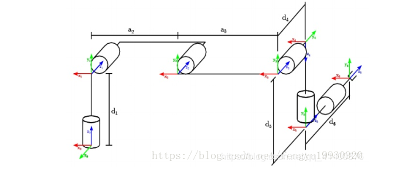

#### urdf-parser-py

[repository](https://github.com/ros/urdf_parser_py)

```bash
pip install urdf-parser-py
```

#### basics

$$
-sin\theta p_x + cos\theta p_y = d\\
\rho = \sqrt{p_x^2 + p_y^2}\\
sin\varphi = \frac{p_y}{\rho}\\
cos\varphi = \frac{p_x}{\rho}
$$

$$
cos\theta sin\varphi - sin\theta cos\varphi = \frac{d}{\rho}
$$

$$
sin(  \varphi-\theta) =\frac{d}{\rho}
$$

$$
cos(\varphi-\theta ) = \pm \sqrt{1 - \frac{d^2}{\rho^2}}
$$

$$
\varphi - \theta = Atan2(\frac{d}{\rho},\pm \sqrt{1 - \frac{d^2}{\rho^2}})
$$

$$
\theta = Atan2(p_y, p_x)-Atan2(d, \pm \sqrt{p_x^2+p_y^2 - d^2})
$$

其中， $p_x^2+p_y^2 - d^2 \geq 0 $

#### solve $$\theta_1, \theta_5,\theta_6$$

已知

[transformation matrix](/home/syzn/A_Engineering/Typora/UR_ROBOT)
$$
T = \begin{bmatrix}
n_x&o_x&a_x&p_x\\
n_y&o_y&a_y&p_y\\
n_z&o_z&a_z&p_z\\
0&0&0&1
\end{bmatrix}
$$

$$
^1T_5 = ^1T_2 * ^2T_3*^3T_4* ^4T_5
$$

$$
(^0T_1)^{-1} * T* {^5T_6} ^{-1}= ^1T_5
$$


##### $\theta_1$ 

==(3, 4)==

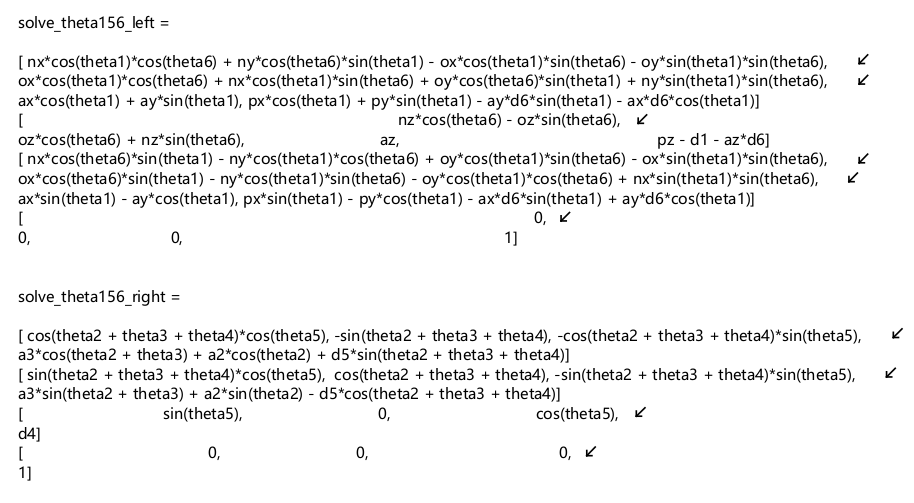


$$
p_xsin\theta_1-p_ycos\theta_1-a_xd_6sin\theta_1+a_yd_6cos\theta_1 = d_4\\
(a_yd_6 - p_y )cos\theta_1 - (a_xd_6-p_x)sin\theta_1 = d_4\\
$$
令 $m =a_yd_6 - p_y , n = a_xd_6-p_x$，可得
$$
\textcolor{red}{\theta_1 = Atan2(m, n) - Atan2(d_4, \pm\sqrt{m^2 + n^2 - d_4^2})}
$$
其中，$m^2 + n^2 - d_4^2 \geq 0 $

##### $\theta_5$

对于 $\theta_5$

==(3, 3)==
$$
-a_ycos\theta_1 + a_x sin\theta_1 = cos\theta_5\\
\textcolor{red}{\theta_5 = \pm arccos(-a_ycos\theta_1 +a_x sin\theta_1)}
$$
##### $\theta_6$

对于， $\theta_6$

==(3, 1)==
$$
-n_ycos\theta_1cos\theta_6 +n_xcos\theta_6sin\theta_1+o_ycos\theta_1sin\theta_6-o_xsin\theta_1sin\theta_6 = sin\theta_5\\
(-n_ycos\theta_1+n_xsin\theta_1)cos\theta_6-(o_xsin\theta_1 -o_ycos\theta_1)sin\theta_6 = sin\theta_5
$$
同理，令 $m = -n_ycos\theta_1+n_xsin\theta_1, n = o_xsin\theta_1 -o_ycos\theta_1$
$$
\textcolor{red}{\theta_6 = Atan2(m, n) - Atan2(sin\theta_5, \pm\sqrt{m^2 + n^2 - sin^2\theta_5})}
$$

又
$$
T = \begin{bmatrix}
n_x&o_x&a_x&p_x\\
n_y&o_y&a_y&p_y\\
n_z&o_z&a_z&p_z\\
0&0&0&1
\end{bmatrix}
$$

$$
n_x * o_x + n_y * o_y + n_z * o_z = 0\\
n_x^2 + n_y^2 + n_z^2 = 1
$$


$$
n_y^2 cos^2 + n_x^2 sin + o_x^2 sin_2 + o_y^2 cos^2  - 1 - a_y^2 cos^2 + a_x^2 sin^2 -……\\
(n_y^2 + o_y^2 - a_y^2) cos^2 + (n_x^2 + o_x^2 - a_x^2 ) sin^2 - 1 - 2* n_x*n_ycossin
$$

$$
m^2  + n^2 - sin^2\theta_5 = 0
$$

$$
\textcolor{red}{\theta_6 = Atan2(m,n) - Atan2(sin\theta_5, 0)}
$$


==(3, 2)==
$$
o_x cos\theta_6 sin\theta_1 - n_y cos\theta_1 sin\theta_6 - o_ycos\theta_1cos\theta_6 + n_xsin\theta_1sin\theta_6 = 0\\
(o_xsin\theta_1 - o_ycos\theta_1)cos\theta_6 -(n_ycos\theta_1 - n_x sin\theta_1)sin\theta_6 = 0
$$

$$
m =o_xsin\theta_1 - o_ycos\theta_1\\
n =n_ycos\theta_1 - n_x sin\theta_1
$$


$$
\textcolor{red}{\theta_6 = Atan2(m, n)-Atan2(0, \pm 1)}
$$


#### solve $\theta_2,\theta_3,\theta_4$

$$
T = ^0T_1\cdot ^1T_2 \cdot^2T_3 \cdot^3T_4\cdot ^4T_5 \cdot^5T_6\\
(^0T_1)^{-1}\cdot T\cdot (^5T_6)^{-1}\cdot (^4T_5)^{-1}  = 1^T_4
$$

##### $\theta_3$
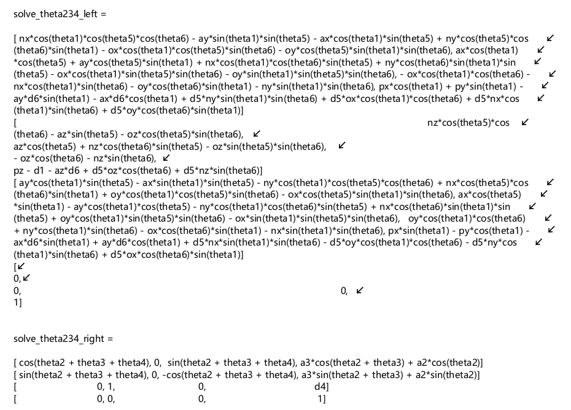

==(1, 4), (2, 4)==

一行四列，二行四列
$$
p_xcos\theta_1 + p_ysin\theta_1 - a_yd_6sin\theta_1 - a_xd_6cos\theta_1 + d_5n_ysin\theta_1sin\theta_6+d_5o_xcos\theta_1cos\theta_6+d_5n_xcos\theta_1sin\theta_6+d_5o_ycos\theta_6sin\theta_1 = a_3cos(\theta_2 + \theta_3)+ a_2cos\theta_2(1) \\
-d_1 + p_z - a_zd_6 + d_5o_zcos\theta_6 + d_5n_zsin\theta_6 = a_3sin(\theta_2 + \theta_3)+ a_2sin\theta_2(2)
$$
令 $ m = d_5(sin\theta_6(n_ysin\theta_1 + n_xcos\theta_1) + cos\theta_6(o_xcos\theta_1 + o_ysin\theta_1))-d_6(a_ysin\theta_1 + a_xcos\theta_1) + p_xcos\theta_1 + p_ysin\theta_1,\\ n = -d_1 + p_z - a_zd_6  + d_5(o_zcos\theta_6 + n_z sin\theta_6)$
$$
m^2  = a_3^2cos^2(\theta_2 + \theta_3 ) + a_2^2cos^2\theta_2 + 2\cdot a_3cos(\theta_2 + \theta_3)\cdot a_2cos\theta_2\\
n^2 = a_3^2sin^2(\theta_2 + \theta_3) + a_2^2sin^2\theta_2 + 2 \cdot a_3sin(\theta_2 + \theta_3)\cdot a_2sin\theta_2\\
m^2 + n^2 = a_3^2 + a_2^2 + 2a_2a_3 (cos(\theta_2 + \theta_3)cos\theta_2 + sin(\theta_2 + \theta_3) sin\theta_2)\\
m^2 + n^2 = a_3^2 + a_2^2 + 2a_2a_3cos\theta_3
$$

```MATLAB
syms theta1 theta2 
f = cos(theta1 + theta2)cos(theta2) + sin(theta1 + theta2)sin(theta2)
```

可得
$$
\textcolor{red}{\theta_3 = \pm arccos(\frac{m^2 + n^2-a_3^2 -a^2_2}{2a_2a_3})}
$$

##### $\theta_2$

由 (1), (2) 可得
$$
m = a_3 (cos\theta_2cos\theta_3 -sin\theta_2sin\theta_3)  + a_2 cos\theta_2\\
m = (a_3cos\theta_3+a_2)cos\theta_2 - a_3sin\theta_3sin\theta_2 (3)\\
$$

$$
n = a_3(sin\theta_2cos\theta_3 + cos\theta_2sin\theta_3) + a_2 sin\theta_2\\
n = (a_3cos\theta_3 + a_2)sin\theta_2 + a_3sin\theta_3 cos\theta_2(4)
$$

令，$p_y =  a_3cos\theta_3+a_2, p_x =a_3sin\theta_3a_3 $
$$
\textcolor{blue}{\theta_2 = Atan2(p_y,p_x) - Atan2(m, \pm \sqrt{p_x^2 + p_y^2 - m^2})}
$$

$$
a_3sin\theta_3m = a_3sin\theta_3(a_3cos\theta_3+a_2)cos\theta_2-a_3sin\theta_3a_3sin\theta_3sin\theta_2 \\
(a_3cos\theta_3+a_2)n = (a_3cos\theta_3+a_2)(a_3cos\theta_3 + a_2)sin\theta_2 + (a_3cos\theta_3+a_2)a_3sin\theta_3 cos\theta_2\\
(a_3cos\theta_3+a_2)n-a_3sin\theta_3m  =[ (a_3cos\theta_3+a_2)(a_3cos\theta_3 + a_2)+a_3sin\theta_3a_3sin\theta_3]sin\theta_2\\
sin\theta_2 = \frac{(a_3cos\theta_3+a_2)n-a_3sin\theta_3m }{a_3^2 + a_2^2 + 2a_2a_3cos\theta_3}
$$

$$
(a_2 + a_3)^2 > 0\\
a_2^2 + a_3^2 + 2a_2a_3 - ...\\
2a_2a_3(1-cos{\theta_3})  \geq 0
$$


再由 (4), 可得
$$
cos\theta_2 = \frac{n -  (a_3cos\theta_3 + a_2)sin\theta_2}{a_3sin\theta_3}\\
cos\theta_2 = \frac{m+a_3sin\theta_3sin\theta_2}{a_3cos\theta_3+a_2}\\
\textcolor{red}{\theta_2  = Atan2(sin\theta_2, cos\theta_2)}
$$


##### $\theta_4$

使用 $^1T_5$，第二行第二列，与第一行第二列，求解 $\theta_2 + \theta_3 + \theta_4$

==(1, 2), (2, 2)==
$$
o_xcos\theta_1cos\theta_6 + n_xcos\theta_1sin\theta_6+ o_ycos\theta_6sin\theta_1 + n_ysin\theta_1sin\theta_6 = -sin(\theta_2+\theta_3+\theta_4)\\
(o_xcos\theta_1 +o_ysin\theta_1)cos\theta_6 + (n_xcos\theta_1 + n_ysin\theta_1)sin\theta_6 = -sin(\theta_2 + \theta_3 + \theta_4)\\
o_zcos\theta_6 + n_zsin\theta_6 = cos(\theta_2 + \theta_3 + \theta_4)
$$
```PYTHON
# revised 
m4 = -(ox + oy) * cos(theta1) * cos(theta6) - (nx + ny) * cos(theta1) * sin(theta6)
```


可得，
$$
\textcolor{red}{\theta_4 = Atan2(-(o_xcos\theta_1 +o_6sin\theta_1)cos\theta_6  -(n_xcos\theta_1 + n_ysin\theta_1)sin\theta_6, o_zsin\theta_6 + n_zcos\theta_6) -\theta_2 - \theta_3}
$$

#### code review

1. ur_client ut 覆盖_connect() :heavy_check_mark:

2. linearalgebra ut

3. planner setting ut.0

   ```python
   tcp_ee:
       final_grasp:
           [70.26574, -1.9371, 356.7887, -179.715, -30.435, 0]
   ```

   

#### ur dh


| $joint_i$ | $d_i$ | $a_i$ | $\alpha_i$       | $\theta_i$ |
| --------- | ----- | ----- | ---------------- | ---------- |
| 1         | $d_1$ | 0     | $\frac{\pi}{2}$  | $\theta_1$ |
| 2         | 0     | $a_2$ | 0                | $\theta_2$ |
| 3         | 0     | $a_3$ | 0                | $\theta_3$ |
| 4         | $d_4$ | 0     | $-\frac{\pi}{2}$ | $\theta_4$ |
| 5         | $d_5$ | 0     | $-\frac{\pi}{2}$ | $\theta_5$ |
| 6         | $d_6$ | 0     | 0                | $\theta_6$ |


#### optimal solution :star:

##### ik_optimize

key words: 雅可比矩阵用于 ik 优化

逆运动学涉及找到一组关节变量，使得机械臂的末端执行器（end effector）达到期望的位置和姿态
$$
\begin{bmatrix}
^{T_6}d_x\\
^{T_6}d_y\\
^{T_6}d_z\\
^{T_6}\delta_x\\
^{T_6}\delta_y\\
^{T_6}\delta_z
\end{bmatrix}
= [^{T_6}J] \cdot \begin{bmatrix}
d\theta_1\\
d\theta_2\\
d\theta_3\\
d\theta_4\\
d\theta_5\\
d\theta_6
\end{bmatrix}
$$

```python 
# 姿态不变？
adjust_q = adjust_jacobian(:, :3) @ (ee_pos - ee_pos_from_solution)
```

##### ==apply joint limits==

找出 $\pm 360\degree$ 的另外解 

==注：==扩展的解太多，导致运算时间过长

1. 根据 mode 筛选一组解

   * 给定 mode
   * 未给定 mode

   $\arccos \theta \in [0, 180\degree]$

   

2. 扩展逆解

3. 根据最小运动法则啥选出唯一解


##### compute_pose_mode 

[robot sigularities](https://www.mecademic.com/academic_articles/singularities-6-axis-robot-arm/):star:

key words: ==arm configuration indicators==

形态

1. 手腕的上下

   * FLIP
   * NOFLIP

   ```python
   def is_wrist_up(transform_matrix):
       z_axis = transform_matrix[:3, 2]
       base_z_axis = np.array([0, 0, 1])
       dot_product = np.dot(z_axis, base_z_axis)
       
       return 0 if dot_product >= 0 else 1
   ```

2. 手臂的左右

   * LEFT
   * RIGHT

3. 手臂的上下

   * UP
   * DOWN

4. 手腕的前后

   * FRONT
   * BACK

| "0": Front"1": Back       |
| ------------------------- |
| 0: Upper arm 1: Lower arm |
| 0: No flip 1: Flip        |

```python
def _compute_pose_mode_by_joints(self, joint_angle: np.ndarray) -> np.ndarray:
        joints = joint_angle * self.joint_sgns - self.settings.joints_base
        l2 = np.abs(self.urdf_.joints[1].origin.xyz[2])
        l3 = np.abs(self.urdf_.joints[2].origin.xyz[1])
        l4 = np.abs(self.urdf_.joints[3].origin.xyz[1])
        l5 = np.abs(self.urdf_.joints[4].origin.xyz[2])

        mode_1 = (
            0
            if l2
            + l3 * np.sin(joints[1])
            + l4 * np.sin(joints[1] + joints[2])
            + l5 * np.cos(joints[1] + joints[2])
            >= 0
            else 1
        )
        mode_2 = 0 if joints[2] + np.pi / 2 - np.arctan(l4 / l5) >= 0 else 1
        mode_3 = 0 if joints[4] >= 0 else 1

        return [mode_1, mode_2, mode_3]
```

```python
value = pose_utils.cartesian_pose_from_string(
                msg[12:], seq=self.euler_seq, degree=self.degree
            )
```

##### 奇异

[ref](https://www.universal-robots.com/media/1810252/cb3_deployment_workshop_online_cn_2c.pdf)

* 关节4与关节6平行，腕部奇异 $\theta_5 = 0^\degree|\pm 180\degree|\pm360\degree$

* 关节234共面，肘部奇异$\theta_3=0$

* 关节56交点在过关节1轴线且平行关节2轴线的平面内时，发生肩部奇异 

  ```python
  [0, -69.26, -43, -67.75, 0, -17.88]
  [0, -256.14, 1345.01, 0.323, -2.053, 2.053]
  ```

  

##### 多解选择

避障&关节限制

* 唯一域

* 最小关节运动准则
  $$
  d_j(\theta_j) = \|^j\theta_t - \theta_{t-\Delta_t}\|,\ j = 1,2,...
  $$

  $$
  \theta_j = argmin\{d_1(\theta^1_t), d_2(\theta^2_t),...,d_j(\theta^j_t)\}
  $$

  ==注：==理论上最小关节运动准则选择的逆解,不能总保证机械臂末端准确跟踪期望笛卡尔轨迹 
  

#### control center test

```python
# test ik
        robot.move(app_ctx.get_var("test_home"))
        move_point = [
            [  58.4 ,  -62.85,  100.91,   53.91,   89.53, -211.66],
            [  58.4 ,  -81.12,  126.18, -133.09,  -89.53,  -31.66],
            [  58.4 ,   33.24, -100.91,  159.63,   89.53, -211.66],
            [  58.4 ,   37.23, -126.18,    0.91,  -89.53,  -31.66],
            [ -91.71,  142.65,  126.22, -180.34,   91.39,   -1.78],
            [ -91.71,  -98.96, -126.22,  313.71,   91.39,   -1.78],
            [ -91.71,  146.85,  100.88, -339.19,  -91.39,  178.22],
            [ -91.71, -117.09, -100.88,  126.5 ,  -91.39,  178.22]
            ]
        time.sleep(2)
        for i in range(len(move_point)):
            robot.move(control_center_pb2.APose(joint_coord=move_point[i]))
            time.sleep(2)
        logging.info("all_command_test done")
        time.sleep(5)
```


## ==ssh connection==

```bash
/var/roboeye/frpc-common-client/frpc-common-client.ini
```

```bash
frpc-common-client/frpc-common-client.ini
[eva5]
type = xtcp
role = visitor
server_name = EVA5_ssh
sk = roboeye/EVA5/EVA5
bind_addr = 127.0.0.1
bind_port = 6405
# when automatic tunnel persistence is required, set it to true
keep_tunnel_open = false

ssh syzn@127.0.0.1 -p 6405
docker restart frpc-common-client
```

#### 远程获取数据

```bash
sftp://g301/
```

#### 复制密钥

```bash
ssh-copy-id
```


### other method

```base
code ~/.ssh/config

Host g005
    hostname 127.0.0.1
    port 6406
    identityfile /home/syzn/.ansible/inventory_key.pem
    user syzn
   
   ssh g005
```


## 查看现场启动版本

```bash
# 列出当前正在运行的 Docker
docker ps
```


## docker 查看日志

```python
docker logs 
```


## ~~convert_rotvec_to_matrix~~

* ~~抓取点设置~~
* 手眼标定 :heavy_check_mark:
  rotvec -> quaternion
* 3D/2D 矫正设置（显示实时位姿）
* 九点标定


## gui 启动

```BASH
export MIDDLEWARE_CONFIG=/var/roboeye/middleware/configs/config.yml                                                                                                                                
export EXTRA_MIDDLEWARE_CONFIG=/var/roboeye/middleware/configs/middleware.cfg
export MIDDLEWARE_CONFIG_DIR=/var/roboeye/middleware/configs

# build
qmake ../RoboEye_Bazel.pri

#/usr/bin/bazel build //roboeye/gui:roboeye_gui --jobs=4
bazel build //roboeye/gui:roboeye_gui //roboeye/tools:crash-file-tools @yaml-cpp//:yaml-cpp
make -j8

~/repos/roboeye/gui/build/RoboEye -data_root_dir=/home/syzn/Desktop/working_dir_all --server --flagfile=/app/RoboEye/roboeye_main.flags
alias ur_gui = ...
```


## 机器人配置失败

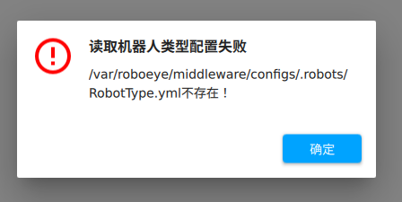

```bash
cd /var/roboeye/roboeye_main
code roboeye_main_custom.flags
```


## middleware log路径

```python
code /var/roboeye/middleware/configs/config.yml
```


## 本地启动 workflow 权限

```bash 
显示目录本身信息
ls -ld
sudo chown syzn file/folder
```


## docker 显示log 信息

```bash 
docker logs -f <container>  2>&1|grep 'error'
docker logs -f --since "2024-08-30T10:00:00" --until "2024-08-30T16:00:00" <container> |
```


## 本地 grasp_planner 数据回放

### PREPARE

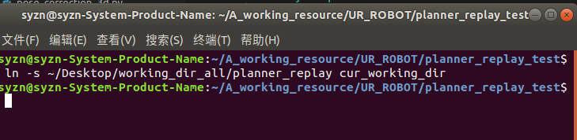

```bash
ln -s ~/Desktok/working_dir_all/planner_replay cur_working_dir
bazel run //roboeye/robotics/planner/planner/tools:grasp_planner_replay_tool -- --inputs_dir /home/syzn/A_working_resource/UR_ROBOT/planner_replay_test
```

==注：== configs 文件夹需要 copy 到本地

```bash
scp -r eva3:/var/roboeye/middleware/configs .
```

==注：==

```bash
# 输入输出数据
detected_objects.objs
grasps.grasps
# 工作流文件
transform_0.transform -》 hand_eye_transform.transform
# home 点需要和现场一致
home_pose.wpt
```

### RUN

```BASH
bazel run //roboeye/robotics/planner/planner/tools:grasp_planner_replay_tool -- --inputs_dir /home/syzn/A_working_resource/UR_ROBOT/planner_replay_test
```


## 本地启动perception

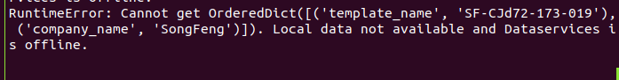

## 测试版本

```python
control center v1.0.57
middleware v1.0.284
roboeye v1.9.600
```


## 机器人抓取流程

1. approach point / attack point 
   * 机器人开始接近工件之前的位置（通常设置为高于/远离工件的实际抓取位置）
2. above point
   * 机器人抓取工件前最后一个垂直位置（工件正上方，直接位于抓取点的上方，一般沿着机器人手臂的 z 轴方向移动）
3. grasp point
   * 与工件实际接触的位置
4. retreat point
   * 完成抓取动作后移开的第一个位置（高于抓取点位置）


## 抓取轨迹自动生成

1. 视觉识别工件生成抓取点
2. 根据抓取点生成进攻/撤退点
   * 沿着工件 z 方向
   * 世界坐标系 z 方向
3. 根据框/深度图生成上方点
   上方点 rx, ry, rz 方向 与进攻点一致


## waypoint

机器人执行任务过程中需要经过的特定位置或序列(中间点)

## 当前问题 

1. joint flag  :heavy_check_mark:
   配置文件加入 apose 独立角度单位flag
   
   ```python
    def _get_joint_pose(self, pose_name, default_value=None):
           pose = np.array(self.get_config(pose_name, default_value), dtype=float)
           if hasattr(self, "joint_as_degree"):
               if self.joint_as_degree:
                   pose *= np.pi / 180.0
           else:
               if self.rotation_as_degree:
                   pose *= np.pi / 180.0
           return pose
   ```
   
2. getplacepoint :heavy_check_mark:
   * getplaceposex 获取放置点/抓取点坐标
   * getnameposex 指定点位名称，根据当前识别输出的抓取点，获取对应的点位坐标
   
3. ur robot mode :heavy_check_mark:

4. roboeye 显示角度而非弧度 :heavy_check_mark:

5. 没有识别结果自动采集 :heavy_check_mark:

   * output.type trigger_3d 只有 error_msg
   
6. grasp_planner_process :heavy_check_mark:

   * check from above0 to attack


## 展厅测试问题

1. 机器人安装设置 :heavy_check_mark:

   * 配置 default 安装文件

2. 机器人移动指令优化 :heavy_check_mark:

   ```python
   2024-09-18 13:54:07,103 [WARNING] ur_client.py:187 - current joint:[-44.0, -88.0, -128.0, -46.0, 91.0, -1.78]
   2024-09-18 13:54:07,104 [WARNING] ur_client.py:190 - path_var: [ 218.44  -360.685  215.027   -1.244    2.804   -0.189]
                   
   2024-09-18 13:55:58,666 [WARNING] ur_client.py:187 - current joint:[-44.0, -88.0, -128.0, -46.0, 91.0, -1.78]
   2024-09-18 13:55:58,666 [WARNING] ur_client.py:190 - path_var: [-1115.014   231.287    13.605    -1.244     2.804    -0.189]              
   ```

3. move_trajectory 支持 apose 类型 waypoint :heavy_check_mark:

   ```python
   rtde_control
   getForwardKinematics
   ```

4. ==抓取流程上方点计算有误==
   当前上方点计算：

   1. x, y 与抓取点一致 or 框中心x, y 一致

      

   * 自动上方点计算 
     * 基于工件 z 方向加上安全距离
     * 复杂环境中，机器人从上方点移动到抓取点可能需要避开其他障碍物或机器设备，这种情况下可以使用路径规划算法（如 PRT 或 $A^*$）自动生成最优路径

5. 协作机器人逆解计算耗时太长:heavy_check_mark:

   * ~~划分区间~~
   * 优化 compute_ik 流程

6. 放置点角度 -》弧度 :heavy_check_mark:

7. 抓取點位姿計算角度 -》 弧度 :heavy_check_mark:

8. grasp to place 有不可达的情况，目前这部分路径没有作可达性检测 :heavy_check_mark:

   * 增加工作点

9. 抓取精度不满足要求 :heavy_check_mark:

   设置一个抓取点，工件以不同姿态放置，抓取工件有较大误差

   * tcp标定满足精度要求 :heavy_check_mark:

   * 重做手眼标定 :heavy_check_mark:
     * 相机识别结果 -》矩阵 -》 cpose :heavy_check_mark:
     * 工件旋转，位姿计算
     
   * 抓取点 :heavy_check_mark: 

     ~~确定机器人收到的抓取点坐标旋转模式是否为旋转矢量~~

     * 手眼标定误差
     * 工件位姿识别误差

   * 确定是否受到机器人本体精度影响

10. 放置精度不满足要求 :heavy_check_mark:

    * 放置点 (quat -> matrix -> cpose)：

      由配置的放置点以及检测到的工件位姿变化，求出最后的机器人放置点位姿 :heavy_check_mark:
    
10. 肘关节奇异过滤/arccos无解 :heavy_check_mark:

12. 断开连接停止运动 :heavy_check_mark:

    * 异步如何确保机器人是否到达指定位置

    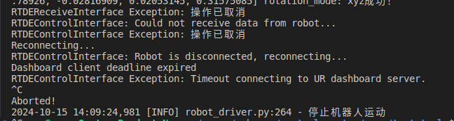

    * 读取euler_type & rotation_as_degree

    

13. ~~断开连接刷新连接信息~~

### docker 安装vim

```bash
apt update
apt install vim
```


```python
roboeye_main: v1.9.627
control_center: v1.0.73
middleware: v1.0.297
```

```python
# stop run
roboeye_main: v1.9.627
control_center: v1.0.78
middleware: v1.0.297
```


## ~~jabil 现场问题~~

1. 碰撞检测是否带上夹爪
2. 上方点计算范围


## p020 现场问题

1. control center 配置外部按钮一键启动及暂停（控制权交接）:heavy_check_mark:
   * robot_driver
   * action_timer :heavy_check_mark:
   
1. ~~扩展虚拟 io -》设置变量代替~~
   
   * ethernet 通信
   
1. 机器人本体碰撞检测 :heavy_check_mark:
   
4. mode 0 有关奇异部分过滤 :heavy_check_mark:

   * ==肩部奇异==

     ==关节56交点在过关节1轴线且平行关节2轴线的平面内，发生肩部奇异==

   ==注：==也可以通过切换home点解决

5. 机器人夹爪与本体碰撞 :heavy_check_mark:

   * ==fcl.collide 是否支持冗余碰撞检测==
     ==computing the minimum distance between a pair of models==

     ```python
     fci.distance(o1, o2, request, result)
     ```

6. ~~圆柱型抓取点生成不按设置~~

   * P020_grasp 抓取点设置了，但是没有生成 & 没有提示为什么被筛

7. robot_stop 机器人停止移动并且移动到指定位置(0.2 mm 误差)，但是raise 移动失败 :heavy_check_mark:

   * ~~通信延迟 : ==机器人还未完全停止==~~
   * 绝对精度增大 最大在 0.3 mm左右
   * ==抓取和放置会往下压，导致法兰位姿与设定不一致==
     ==阈值开放设置==

8. ~~交融半径开放~~

9. 最大抓取角度适配倒装、法兰高度、世界z方向适配倒装 :heavy_check_mark:

   * flange_z_min
   
     ```python
     grasp_z > self.flange_z_min
     ```
   
   * max_angle :heavy_check_mark:
   
     * 正装
   
     $$
     \text{maxangle} \in [0,90\degree]\\
     \text{maxangle} \in [a,b]
     $$
   
     * 倒装
   
       $[a,b]$
   
       $[0, 2\pi]$
   
     $$
     -b + \pi \leq \text{maxangle} \leq -a + \pi\\
     - \pi \leq \text{maxangle} \leq  \pi
     $$
   
     ```python
     ideal_direction {
         w: 1
         y: 0
     }
     ```
   
     
   
   * _generate_grasp_trajectory
     inverted installation
   
     * 基于世界坐标轴 "s"
       $z = z + \text{direction }  * \Delta_z$
       其中，$\text{direction} = \pm 1$
     * ~~基于工具坐标轴 "z"~~
   
   
   
10. 过滤和框有干涉的姿态计算 :heavy_check_mark:

       * 更新home点姿态 
         

       * ~~movel -> movej~~

       * ~~过滤掉会发生碰撞的点，再从 ik 的解中挑选不产生碰撞的~~
         * 根据mode筛选出解
         * 发生碰撞/不可达后，挑选 ik 的其他解


11. 停止后再移动能否在当前位置移动（~~或者回到上一个点再继续~~）:heavy_check_mark:

    *  配置控制权交接 

12. ~~连接开启ethernet/ip后，control & io 接口都无法连接，只有receive 能获取数据~~
    * 获取 var 数据
    
13. control center 连接plc :heavy_check_mark:
    * path：定义数据包传输路径，指定 plc 与目标设备之间的通信路线
    * forward_open
      用于建立设备间 I/O 数据通信会话
    * T -> O 连接点 (==inverse==)
      目标设备 （Target）向发起设备（Originator）传输数据的方向
      T(SYZN) -> O(PLC)
    * T -> O 大小 8 O -> T 4
      T -> O 大小 7 O -> T 3
    
13. 配置 plc 实现外部启停 :heavy_check_mark:
    
    * 读取机器人 I/O 状态
    
      * 配置 action_timer
    
        ```PYTHON
        plugins {
          name: "action_timer"
          type: ACTION_TIMER
          action_timer {
            robot_action{
              monitor_stop_robot_name: "RB1"
            }
          }
        }
        ```
    
        
    
      * 配置控制权交接IO(io 绑定"CB_CONTROL_KEY")
    
        ```python
        io_binding {
              name: "CB_CONTROL_KEY"
              remote_name: "2"
              initial_mode: SYNC_TO_REMOTE
        }
         retry_mode: WAIT_CONTROL_KEY
        ```
    
14. 机器人本体与工件碰撞检测 :heavy_check_mark:
    
    * grasp_planner_api: object_template_data_path
      获取每个工件位姿 :heavy_check_mark:
    * transform_from_original :question:
    * ~~根据位姿生成长方形~~
    * 根据 tp 文件生成长方形 :heavy_check_mark:
    * 添加到collision objects
      
    
    优化：
    
    1. 工件少了某件就剔除（而不是重新创建所有工件）
       * 是否可以根据==object id== 来作删除
    2. 只检测特定轴与工件碰撞
    
    ==注：==当前plannenr超时
    
    * check_distance
    * axis-aligned bounding box
    * ==Broadphase Checking==
    
15. ~~点云缺失本体与工件碰撞~~
    
15. ~~==现场抓取点太多，导致planner超时==~~
    
    * 设定最大检测时间
    * 超过检测时间提示没有抓取点，剩下未检测的
    
    ```python
    64 -> 0.6
    
    32 件
    36 : 18 组 -> 20 ->(filter by max_angle 90)  12s  -> (45) 6s
     72：40 -> 40 -> (filter by max_angle 90) 24s -> (45) 12s 
    
    ```
    
    ==注：== 
    
    1. core grasp_planning 0.1s 
    2. planner grasp_planning 0.5s 
    
16. 开放 blend，accelaration :heavy_check_mark:
    配合现场设置

    ```python
    acc = 6
    blend = 0.03
    ```
    
19. control center 可达性检测优化 :heavy_check_mark:

    * 传入当前起始角度，现在默认是 np.zero(0)

20. ~~圆滑过渡问题~~

    * 设置一系列 waypoint，若中间穿插 apose 需要计算当前 mode 姿态下的逆解，若按当前 apose 移动机器人可能会变化形态，使得整段轨迹变得不平滑

21. ==plc <-> 机器人状态获取== :heavy_check_mark:

    1. 获取机器人状态，并设置 io
    2. 轮询读取机器人状态，设置 i/o （参考action_timer 控制权交接实现）

    ~~用可配置输出 i/o 口反馈状态~~
    机器人（control center) -> plc

    ```python
    zip()
    ```

    

    * 程序运行 :heavy_check_mark:

      ```python
      // 示教器程序 or ？
      bool isProgramRunning()
      ```

      ```python
      uint32_t  getRobotStatus()
      Robot status Bits 0-3: Is power on | Is program running | Is teach button pressed | Is power button pressed 
      ```

      

    * 电源正常 :heavy_check_mark:

      ```python
      # getRobotStatus
      is power on
      ```

      

    * ==操作模式== :question:

      * is recovery mode 
      * is reduced mode 

    * ==保护停止==

      模式切换会导致保护停止
      
      ```python
      logging.error("enter protective stop")
      self._rtde_control.triggerProtectiveStop()
          
      control: triggerProtectiveStop()
      recieve: bool isProtectiveStopped()
      ```
      
      

22. plc 模式切换（触发保护性停止）会导致机器人控制端通讯切断 :heavy_check_mark:
    * 程序暂停，会清除当前移动指令 (==程序处于暂停状态==)
      * 切换回自动运行模式，能否手动运行程序 :x:
      * ==发送控制指令检查是否建立连接，没有则重连==
      * 重新运行程序
    
23. plc 模式切换会改变全局速度，由设置值改为 $16 \%$ :heavy_check_mark:

    ```python
    bool setSpeedSlider(double speed)
    ```

24. 机器人碰撞检测==没有过滤掉夹爪与本体的碰撞==，但是检测到本体之间的碰撞（3轴与5轴、6轴）:heavy_check_mark:
    ==采样步长太大==

    * collision threshold: 35
    
      ```python
      attack link3 and link 5 [ 4.46686155 -1.2749707  -1.90847423  0.63049316  2.41334705  0.43347223] 
      ```
      
      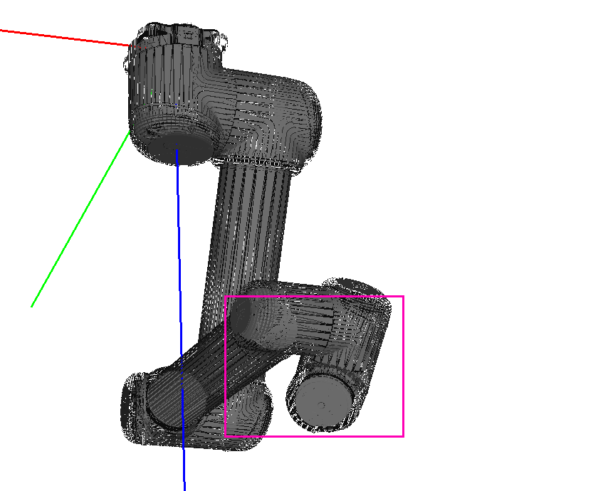
      
      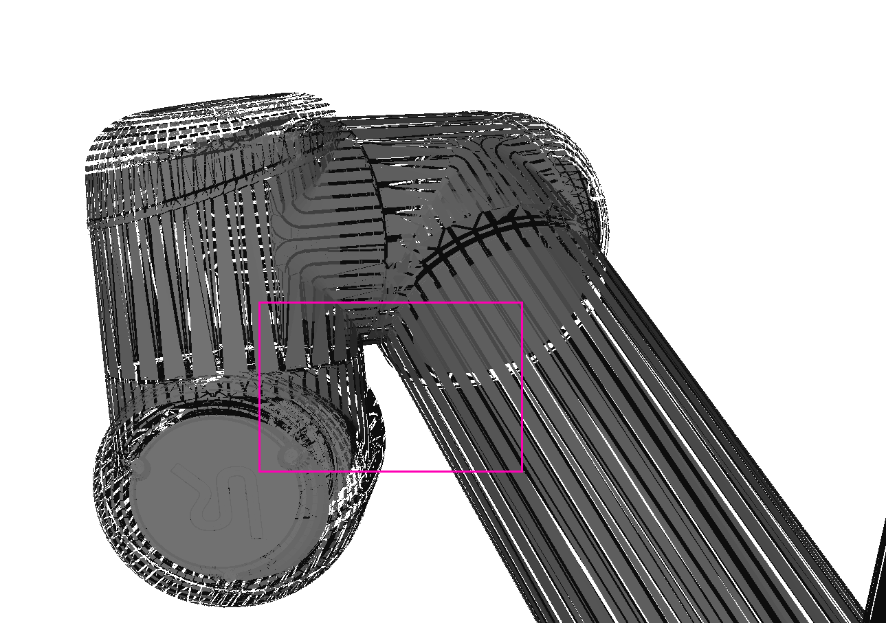
      
    * 夹爪模型是否准确
    
      * 碰撞轨迹
    
      ```python
      2024-12-12 14:35:00,120 - root - INFO - get grasp trajectory grasp success: -00486.885,-00314.856,+00871.117,-00001.035,+00001.524,-00001.773
      2024-12-12 14:35:00,121 - root - WARNING - current rotation mode is rotation vector
      2024-12-12 14:35:00,122 - root - INFO - Get task from robot RB1:UpdateTrajectoryTextXattack
      2024-12-12 14:35:00,122 - root - ERROR - grasp_descriptor(to_20_jiazhua_L_020_toyota_0020_33) is not found in middleware.cfg
      2024-12-12 14:35:00,123 - root - WARNING - current rotation mode is rotation vector
      2024-12-12 14:35:00,123 - root - INFO - get grasp trajectory attack success: -00489.121,-00323.167,+00832.053,-00001.035,+00001.524,-00001.773
      2024-12-12 14:35:00,124 - root - WARNING - current rotation mode is rotation vector
      2024-12-12 14:35:00,124 - root - INFO - Get task from robot RB1:UpdateTrajectoryTextXretreat
      2024-12-12 14:35:00,125 - root - ERROR - grasp_descriptor(to_20_jiazhua_L_020_toyota_0020_33) is not found in middleware.cfg
      2024-12-12 14:35:00,125 - root - WARNING - current rotation mode is rotation vector
      2024-12-12 14:35:00,126 - root - INFO - get grasp trajectory retreat success: -00489.121,-00323.167,+00832.053,-00001.035,+00001.524,-00001.773
      2024-12-12 14:35:00,126 - root - WARNING - current rotation mode is rotation vector
      2024-12-12 14:35:00,127 - root - INFO - Get task from robot RB1:UpdateTrajectoryTextXabove0
      2024-12-12 14:35:00,127 - root - ERROR - grasp_descriptor(to_20_jiazhua_L_020_toyota_0020_33) is not found in middleware.cfg
      2024-12-12 14:35:00,128 - root - WARNING - current rotation mode is rotation vector
      2024-12-12 14:35:00,128 - root - INFO - get grasp trajectory above0 success: -00437.295,-00258.458,+00734.882,-00001.035,+00001.524,-00001.773
      2024-12-12 14:35:00,129 - root - WARNING - current rotation mode is rotation vector
      2024-12-12 14:35:00,130 - root - INFO - Get task from robot RB1:UpdateTrajectoryTextXabove1
      2024-12-12 14:35:00,130 - root - ERROR - grasp_descriptor(to_20_jiazhua_L_020_toyota_0020_33) is not found in middleware.cfg
      2024-12-12 14:35:00,130 - root - WARNING - current rotation mode is rotation vector
      2024-12-12 14:35:00,131 - root - INFO - get grasp trajectory above1 success: -00437.295,-00258.458,+00734.882,-00001.035,+00001.524,-00001.773
      2024-12-12 14:35:00,131 - root - WARNING - current rotation mode is rotation vector
      2024-12-12 14:35:00,133 - root - INFO - Get task from robot RB1:CTStartTrigger3D
      2024-12-12 14:35:00,133 - root - INFO - Get task from robot RB1:UpdateHomeJoints,25.00,-96.00,124.00,-152.00,60.00,-128.00
      ```
    
      * tcp 标定
    
        ```python
        -92.81 0.45 175.35 0.63 -0.61 -1.5
        gripper: {
          # left
          transfrom: [-92.81, 0.45, 175.35, 0.63, -0.61, -1.5],
          # right
          # transfrom: [-40, -173.34, 81.60, 0.74, 1.74, -1.75],
          stl_path: "/home/syzn/repos/roboeye/robotics/planner/planner/configs/jiazhua_L_022.mesh.ply"
        }
        ```
    
        
    
    * ~~只膨胀3轴/夹爪，5轴、6轴不膨胀~~
    
25. CB_CONTROL_KEY 置 0 没有正常停止 :heavy_check_mark:

    * 等待控制权交接需要在异常情况下才会触发
    * ==控制信号置 0 等待控制权==
    
26. ~~roboeye 无响应~~
    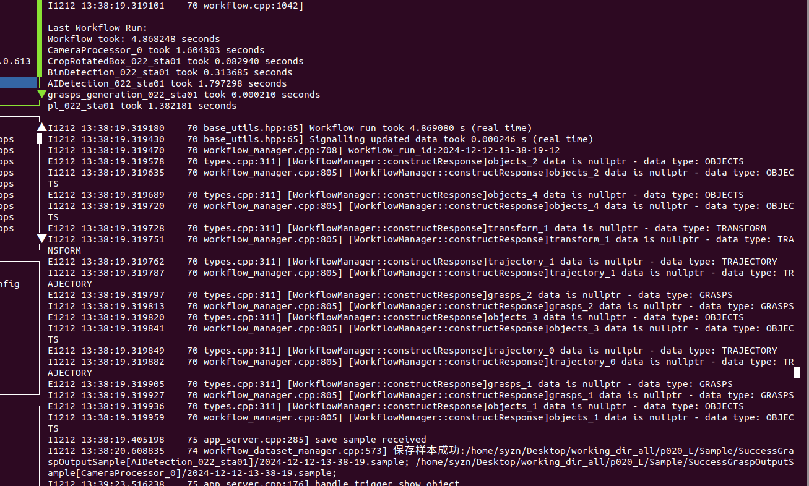

27. ~~左工位停止后无法启动~~

    ```python
    Failed to start control script, before timeout of 5 seconds
    ```

28. ~~左右两个工位耗时不一致~~

    * p020_l

      * home

        ```python
        vars {
          name: "above_pick_021_box01_eyeHome"
          type:APOSE
          apose_value {
               joint_coord:[25, -96, 124, -152, 60, -128]
          }
        }
        ```

      * waste time $\approx$ 9.88 (timeout)
        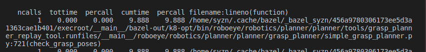

    * p020_r

      * home

        ```python
        vars {
          name: "above_pick_021_box01_eyeHome"
          type:APOSE
          apose_value {
               joint_coord:[-4.2, -116, 143, -150, 97, -83]
          }
        }
        ```

      * waste time $\approx$ 3.114
        
    
29. 固定轨迹部分保护性停止会因为 rtde_control 断开连接而导致程序中止 :heavy_check_mark:
    

    * ==catch runtime error -> _rtde_control connect==
    
      ```python
      raise runtimeerror
      ```
    
    * planner 检测通过，above 1 -> home 发生碰撞？:heavy_check_mark:
      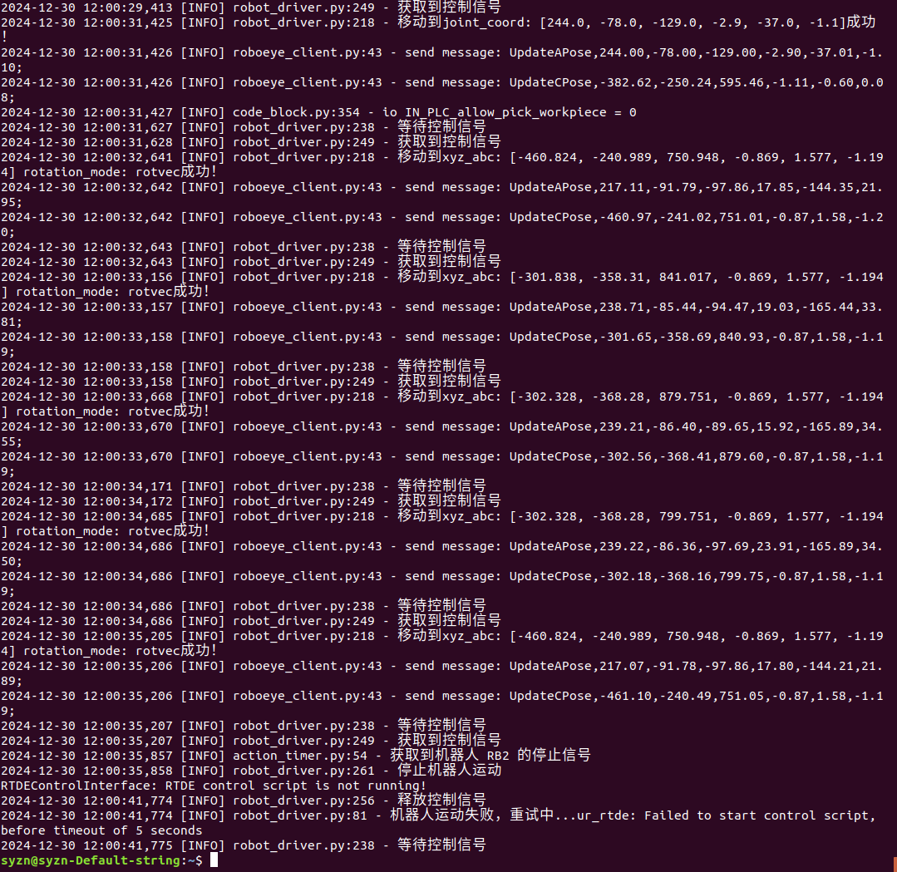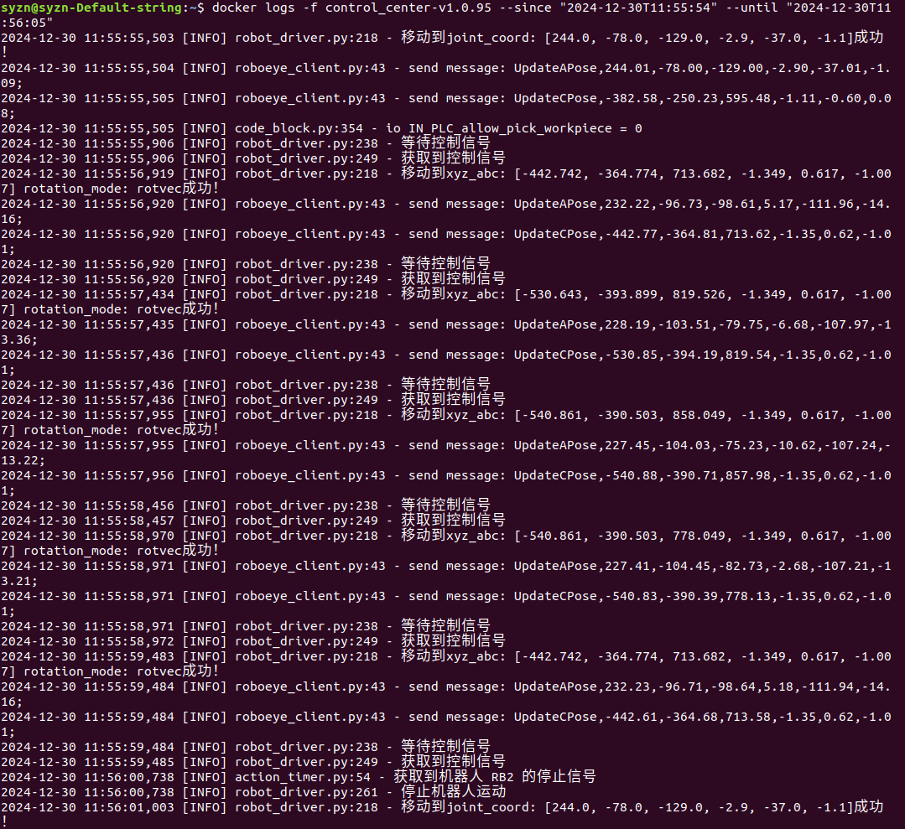
    
    1. 抓取轨迹正常完成
    2. above1 -> 下一个位置发生碰撞（home or other？）
    
    ==上传的home与实际走的home不一致/两次走的home不一致，走的home点未经过检查; above1 -> home 走的是movej，这部分轨迹并没有检查==
    
    ```python
    # left workstation
    # 牛角件
    jiazhua_L_022.mesh.ply 
    # tcp
    transform: [-92.81, 0.45, 175.35, 0.63, -0.61, -1.5],
    # 轴套
    jiazhua_L_020.mesh.ply 
    transform: [39.08, -175.43, 76.43, 1.51, 0.59, -0.61],
    ```
    
30. 固定轨迹暂停后偶发无法继续运行情况 :heavy_check_mark:

    * 新版 center plc 触发暂停会导致程序退出
      

    * ==ur_rtde 重连 raise RuntimeError==

    * 保护性停止启动后，控制端口都连接成功，但程序处于暂停状态
      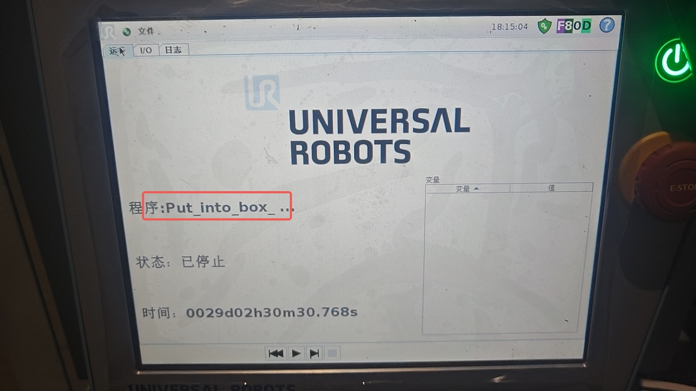

      ```python
      RTDEControlInterface: RTDE control script is not running!
      reuploadScript
      ```

      * reuploadScript 重新运行程序
      * _move_path 会等待程序运行
      * ==移动前判断是否启动程序==
      
    * 释放控制信号后，plc control key 是否置1？

      * control center 显示 control_key 设置为1，实际机器人 io 为 0

31. ==停止应用偶发无法正常退出== :heavy_check_mark:

    * ethernet_client

      ```python
       drive.generic_message()
      ```

    * ur_client

    * action_timer

    * ==由于保护性停止会触发 ur 程序停止，发送移动指令后，若程序没有运行，会阻塞（死循环）==

    * ==退出关闭线程，超时强制退出==

32. ~~固定轨迹部分暂停会有无法立即停止的情况，并且出现轨迹偏离预定轨迹情况~~

    * 由防护停止触发也会引起，ur 防护停止机理
    * 由物理输入触发
    * ==机器各轴速度/停止时间不一致==
      * 增大加速度
      * 使用防护停止

33. 通过 plc 实现外部启/停应用 :heavy_check_mark:

    * 监听应用启/停 io （context，robot？）
    * ==出现线程正常退出，但是没有停止应用情况==

34. ~~点云缺失导致碰撞~~

    * 点云补全
    * 融合CAD模型
    * 增强路径规划算法
      * 概率路径规划算化（$\text{PRT}^*$, PRM)
      * 冗余区域检测
    * 工具
      * Open Motion Planning Library (OMPL)
      * PyBullet

35. 出现未知卡顿问题 :heavy_check_mark:

    * 初始化工作流阻塞

    ```bash
    docker logs -f --since "2025-01-22T14:33:00" --until "2025-01-22T14:37:47" control_center-v1.0.103
    ```

    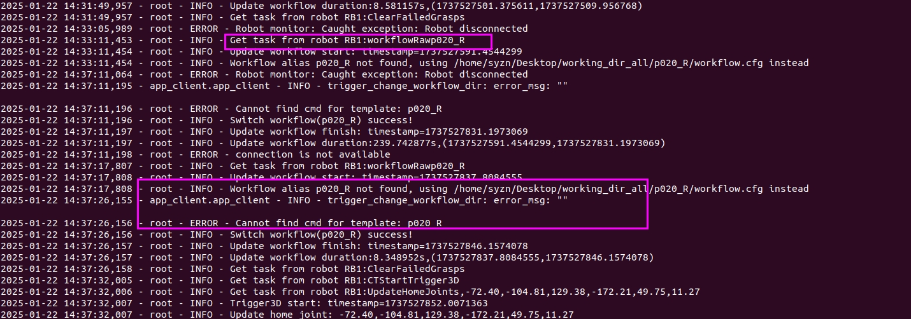

36. 相机拍照耗时异常 :heavy_check_mark:

    * ==手动触发相机拍照会有通信混乱的可能==
    
    * 耗时 40 s+
      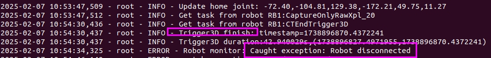
    
37. ~~解决 ur 机器人碰撞恢复后不能正常运行问题~~

37. 本体与工件碰撞 :heavy_check_mark:
    限制部分轴高度
    ~~R1 9:51:47~~
    9:51:27
    
    
    ```python
    home: 227.00,-70.00,-128.00,15.00,115.00,-18.00
    2025-03-12 09:51:27,437 - root - WARNING - current rotation mode is rotation vector
    2025-03-12 09:51:27,438 - root - INFO - get grasp trajectory grasp success: -00469.534,-00336.623,+00918.939,-00000.160,+00002.283,-00001.303
    2025-03-12 09:51:27,438 - root - WARNING - current rotation mode is rotation vector
    2025-03-12 09:51:27,439 - root - INFO - Get task from robot RB1:UpdateTrajectoryTextXattack
    2025-03-12 09:51:27,439 - root - ERROR - grasp_descriptor(to_20_jiazhua_L_020_toyota_0020_58) is not found in middleware.cfg
    2025-03-12 09:51:27,440 - root - WARNING - current rotation mode is rotation vector
    2025-03-12 09:51:27,440 - root - INFO - get grasp trajectory attack success: -00456.292,-00285.139,+00834.239,-00000.160,+00002.283,-00001.303
    2025-03-12 09:51:27,441 - root - WARNING - current rotation mode is rotation vector
    2025-03-12 09:51:27,441 - root - INFO - Get task from robot RB1:UpdateTrajectoryTextXretreat
    2025-03-12 09:51:27,442 - root - ERROR - grasp_descriptor(to_20_jiazhua_L_020_toyota_0020_58) is not found in middleware.cfg
    2025-03-12 09:51:27,442 - root - WARNING - current rotation mode is rotation vector
    2025-03-12 09:51:27,442 - root - INFO - get grasp trajectory retreat success: -00469.534,-00336.623,+00828.939,-00000.160,+00002.283,-00001.303
    2025-03-12 09:51:27,443 - root - WARNING - current rotation mode is rotation vector
    2025-03-12 09:51:27,443 - root - INFO - Get task from robot RB1:UpdateTrajectoryTextXabove0
    2025-03-12 09:51:27,444 - root - ERROR - grasp_descriptor(to_20_jiazhua_L_020_toyota_0020_58) is not found in middleware.cfg
    2025-03-12 09:51:27,444 - root - WARNING - current rotation mode is rotation vector
    2025-03-12 09:51:27,444 - root - INFO - get grasp trajectory above0 success: -00383.469,-00190.196,+00800.909,-00000.160,+00002.283,-00001.303
    2025-03-12 09:51:27,445 - root - WARNING - current rotation mode is rotation vector
    2025-03-12 09:51:27,445 - root - INFO - Get task from robot RB1:UpdateTrajectoryTextXabove1
    2025-03-12 09:51:27,446 - root - ERROR - grasp_descriptor(to_20_jiazhua_L_020_toyota_0020_58) is not found in middleware.cfg
    2025-03-12 09:51:27,446 - root - WARNING - current rotation mode is rotation vector
    2025-03-12 09:51:27,447 - root - INFO - get grasp trajectory above1 success: -00383.469,-00190.196,+00800.909,-00000.160,+00002.283,-00001.303
    
    
    I0312 09:51:27.347625    53 grasp_planner_processor.cpp:159] GraspPlannerProcessor: select object:4
    I0312 09:51:27.347657    53 grasp_planner_processor.cpp:166] GraspPlannerProcessor: select grasp:118
    
    
    ```
    
    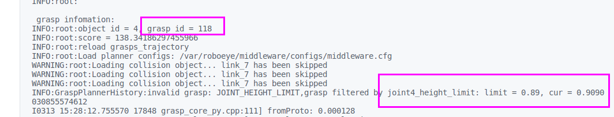``
    
    ```python
    roboeye: v1.9.685
    middleware: v1.0
    ```
    
    
    
39. 夹爪与本体发生碰撞:black_flag:

    ```python
    -72.4, -104.81, 129.38, -172.21, 49.75, 11.27
    -00485.596,+00322.672,+00719.615,-00001.265,+00001.082,-00000.545
    -00378.182,+00255.724,+00779.207,-00001.265,+00001.082,-00000.545
    -00355.551,+00228.855,+00872.833,-00001.265,+00001.082,-00000.545
    -00355.551,+00228.855,+00782.833,-00001.265,+00001.082,-00000.545
    -00485.596,+00322.672,+00719.615,-00001.265,+00001.082,-00000.545
    ```

    本地回放有碰撞

    1. 多个机器人配置（RB1，RB2）
    
    2. 现场用的都是RB2 grasp_plan
    
    3. home 和配置文件 RB2
    
       ```python
       10.11, -122, 129, -81, 131, 22
       ```
    
       
    
    

## 当前版本

```python
center: v1.0.103
middleware: v1.0.313
roboeye: v1.0.665
```

## ==tcp==

```python
# left workstation &station002 & R1
# 牛角件
jiazhua_L_022.mesh.ply 
transform: [-92.81, 0.45, 175.35, 0.63, -0.61, -1.5],
# 轴套
jiazhua_L_020.mesh.ply 
transform: [39.08, -175.43, 76.43, 1.51, 0.59, -0.61],
    
# right workstationl & station001 & R2
# 牛角
jiazhua021_R.mesh.ply
transform: [91.55, 4.28, 175.99, 0, 0.78, 0.08],
# 轴套
jiazhua020_R.mesh.ply
transform: [-40.71, -173.34, 81.60, 0.74, 1.74, -1.75],
```


# NACHI ROBOT

```python
sympy
```


## IK solutions

### collaborative dh


| joint_i | $d_i$ | $a_i$ | $\alpha_i$       | $\theta_i$ |
| ------- | ----- | ----- | ---------------- | ---------- |
| 1       | $d_1$ | 0     | $\frac{\pi}{2}$  | $\theta_1$ |
| 2       | 0     | $a_2$ | 0                | $\theta_2$ |
| 3       | 0     | $a_3$ | 0                | $\theta_3$ |
| 4       | $d_4$ | 0     | $-\frac{\pi}{2}$ | $\theta_4$ |
| 5       | $d_5$ | 0     | $-\frac{\pi}{2}$ | $\theta_5$ |
| 6       | $d_6$ | 0     | 0                | $\theta_6$ |

### ref_dh

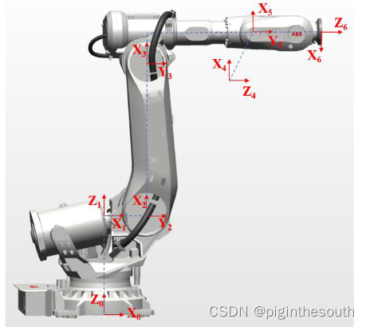

| joint | $d_i$ | $a_i$ | $\alpha_i$       | $\theta_i$ |
| ----- | ----- | ----- | ---------------- | ---------- |
| 1     | $d_1$ | 0     | $0$              | $\theta_1$ |
| 2     | 0     | $a_2$ | $\frac{\pi}{2}$  | $\theta_2$ |
| 3     | 0     | $a_3$ | 0                | $\theta_3$ |
| 4     | $d_4$ | $a_4$ | $-\frac{\pi}{2}$ | $\theta_4$ |
| 5     | 0     | 0     | $\frac{\pi}{2}$  | $\theta_5$ |
| 6     | $d_5$ | 0     | $-\frac{\pi}{2}$ | $\theta_6$ |

### using_dh	

| joint | $d_i$  | $a_i$ | $\alpha_i$       | $\theta_i$ |
| ----- | ------ | ----- | ---------------- | ---------- |
| 1     | $d_1$  | 0     | $\pi$            | $\theta_1$ |
| 2     | 0      | $a_2$ | $\pi/2$          | $\theta_2$ |
| 3     | 0      | $a_3$ | 0                | $\theta_3$ |
| 4     | 0      | $a_4$ | $\frac{\pi}{2}$  | $\theta_4$ |
| 5     | $-d_5$ | 0     | $-\frac{\pi}{2}$ | $\theta_5$ |
| 6     | $d_6$  | 0     | $\frac{\pi}{2}$  | $\theta_6$ |

### current dh

| joint | $d_i$  | $a_i$ | $\alpha_i$       | $\theta_i$                               |
| ----- | ------ | ----- | ---------------- | ---------------------------------------- |
| 1     | $d_1$  | 0     | $\pi$            | $\theta_1$                               |
| 2     | $-d_2$ | $a_2$ | $\pi/2$          | $\theta_2$                               |
| 3     | 0      | $a_3$ | 0                | $\theta_3$ ($\theta_2 - \frac{\pi}{2}$)  |
| 4     | 0      | $a_4$ | $\frac{\pi}{2}$  | $\theta_4$                               |
| 5     | $-d_5$ | 0     | $-\frac{\pi}{2}$ | $\theta_5$                               |
| 6     | 0      | $a_6$ | $\frac{\pi}{2}$  | $\theta_6$ ($\theta_5 + \frac{\pi}{2})$) |
