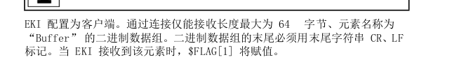
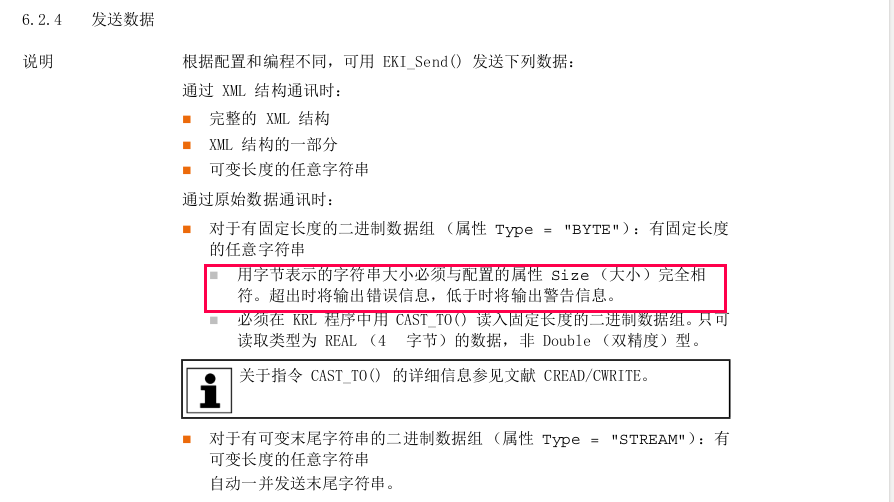
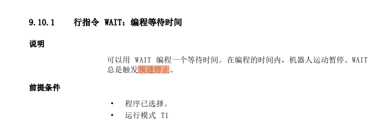
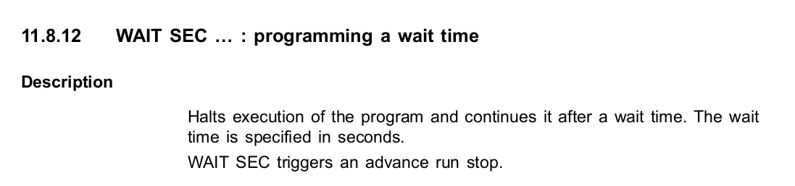

# Kuka

[kuka center](https://www.kukacenter.com/)


## sim

~~WorkVisual + OfficeLite~~

officelite + simpro


## comm

[KRL 编程参考](https://blog.leihub.cn/archives/749)

### ethernet krl

[参考例程](https://blog.leihub.cn/archives/752)

1. xxx.xml
   配置必要的网络通讯、接收数据、发送数据等配置

   ```xml
   <ETHERNETKRL>
       <CONFIGURATION>
           <EXTERNAL></EXTERNAL>
           <INTERNAL></INTERNAL>
       </CONFIGURATION>
       <RECEIVE>
           <ELEMENTS></ELEMENTS>
       </RECEIVE>
       <SEND>
           <ELEMENTS></ELEMENTS>
       </SEND>
   </ETHERNETKRL>
   ```

   * ip & port
   * type: server/client
   * receive 
   * send

#### client&server额外配置

[router](https://www.robot-forum.com/robotforum/thread/45029-kuka-ethernetkrl-and-officelite-communication-issue-with-external-app/?postID=206705&highlight=kuka%2Bethernetkrl%2Bclient#post206705)

```bash
# kuka as server 
192.168.0.2
54600
```

```bash 
# kuka as client
172.31.1.100
59152
```


### 接收数据设置

#### xml

1. 指定数据类型
   * string
   * real
   * int ....
2. 指定处理存储器数据组的方法
   * FIFO :先进先出
   * LIFO

#### binary

##### ~~BYTE 固定长度~~



需要指定读取信息的大小，发送数据也为size大小

* 能否动态更改 size ？

```xml
<RECEIVE>
<RAW>
<ELEMENT Tag="RawData" Type="BYTE" Size="512"
Set_Flag="14"/>
</RAW>
</RECEIVE>
```

==注：==发送数据长度小于定义长度会阻塞；长度大于会截断

##### ==STREAM 可变末尾字符串==

cc 发送数据需要有结束符，机器人回复数据也带有结束符

```XML
<RECEIVE>
        <RAW>
        <ELEMENT Tag="Buffer" Type="STREAM" Set_Flag="2" SIZE="38" EOS="65,66"/>
        </RAW>
    </RECEIVE>
    <SEND/>
```


### 发送数据设置

#### xml

##### 按照 XPath 框架配置

~~可以直接发送字符串~~


#### binary

发送二进制数据直接在 KRL 编程中实现，无须指定配置



### submit intepreter

同时运行多个任务

[continuous communication](https://www.robot-forum.com/robotforum/thread/49131-how-to-use-kuka-robot-s-sps-file-to-establish-continuous-communication-in-the-ba/?postID=225332&highlight=Kuka%2Bsubmit%2Binterpreter#post225332)


```c
;***************************************************;* Customer     :                                  *;* Roboter      :                                  *;* Version      : Vxxxxxx                          *;* Roboter Nr.  : xxxxxx                           *;* Controller Nr: xxxxxx                           *;*                                                 *;* Autor        : Andrew Wang                      *;* Company      :                                  *;* Department   :                                  *;* Telephone    : 86 156-8082-2827                 *;*                                                 *;* Version      : 1.0                              *;* Created      : 12.12.2018                       *;* Modified     :                                  *;* Project      :                                  *;*                                                 *;* Program Name : Real_2_String                   *;* Convert a REAL variant to a string variable;    *;**************************************************
    DEFFCT CHAR[32] Real_2_String(rVar:IN )
    DECL CHAR Ret[32]
    DECL INT Offset,I
    DECL STATE_T state
    DECL REAL rVar
    Offset=0
    FOR I=1 TO 32  
    Ret[I]=0
    ENDFOR
    SWRITE(Ret[],State,offset,"%f",rVar)
    Return (ret[])
    ENDFCT
```


## advance pointer

```
# default
$ADVANCE=3
```





[introduce](https://www.robot-forum.com/robotforum/thread/19657-advance-run-pointer/)

[introduce](https://www.robot-forum.com/robotforum/thread/18973-kuka-advance-run-how-to-set-and-terminate/)

[advance run & main run]

`Wait (and some other instructions) cause advance run pointer to pause.... until main pointer arives. .`

advance run stop


## 安装滑轨特殊配置

安装滑轨后，机器人的 $WORLD 坐标系不再是机器人基座，而是滑轨基座，而 \$BASE 选择 \$nullframe 也是基于滑轨基座。

若需要获取基于机器人基座的位姿，则需要设置 $BASE 坐标系

