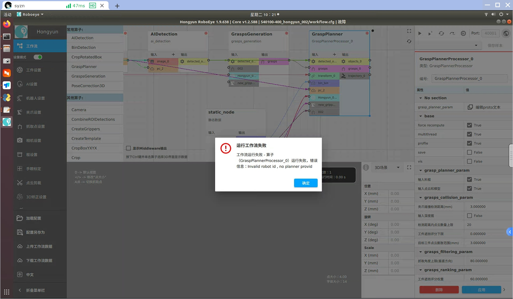
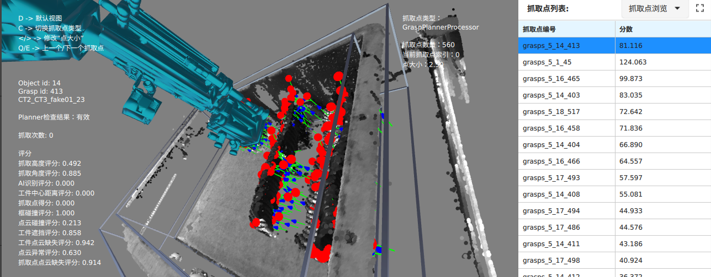
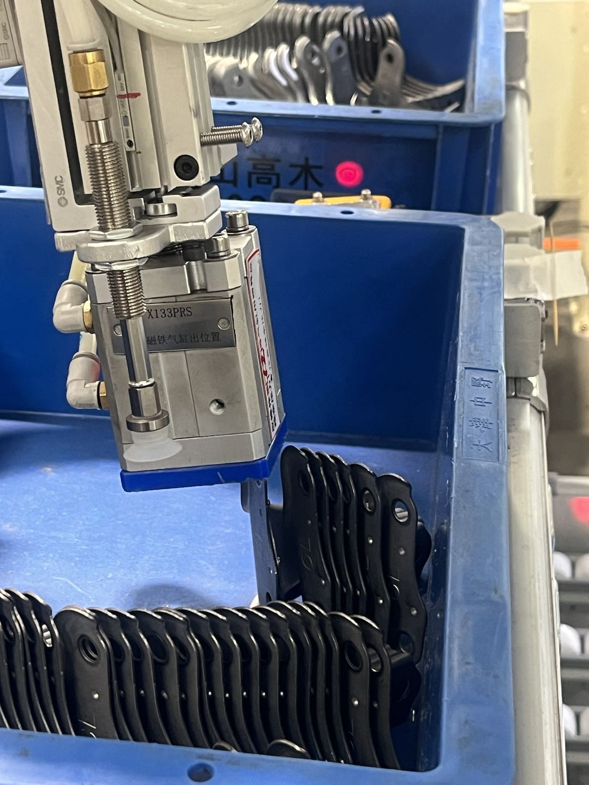
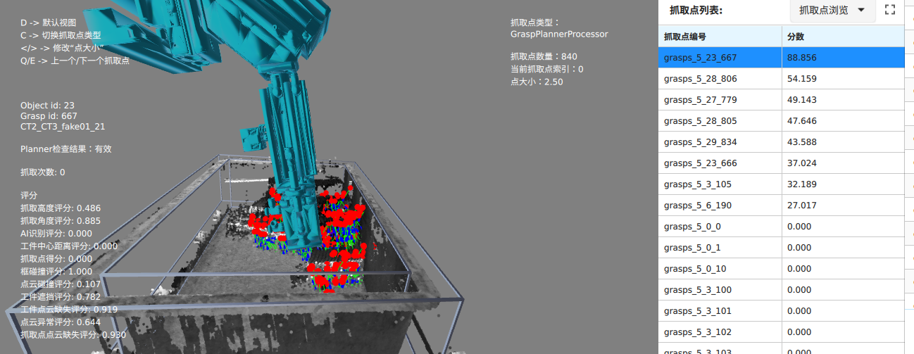
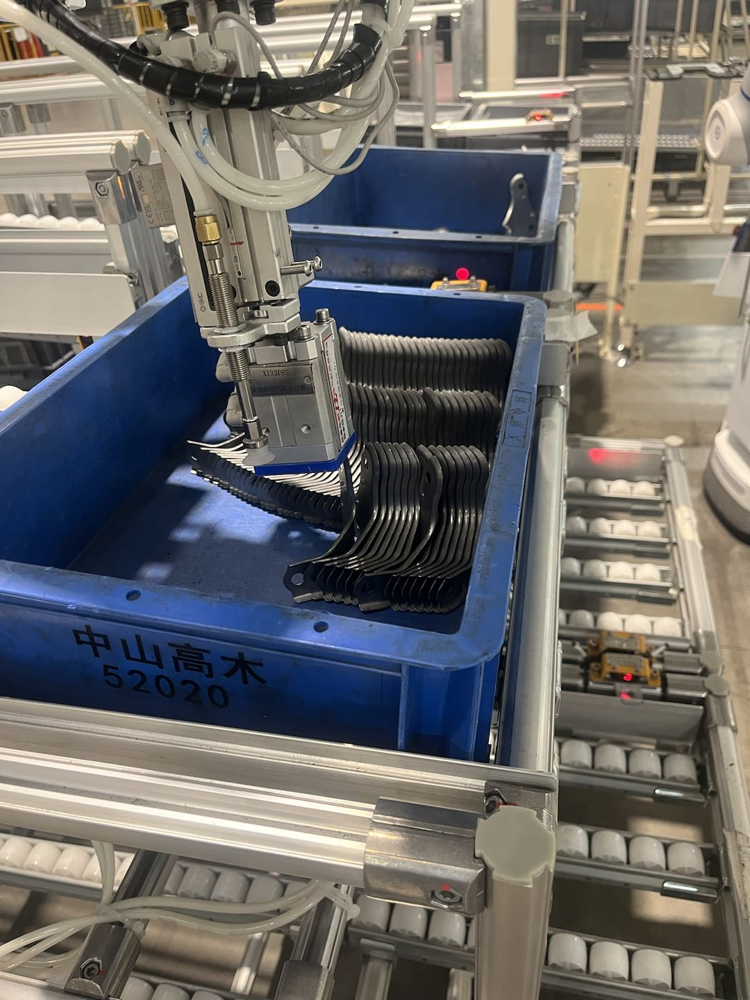
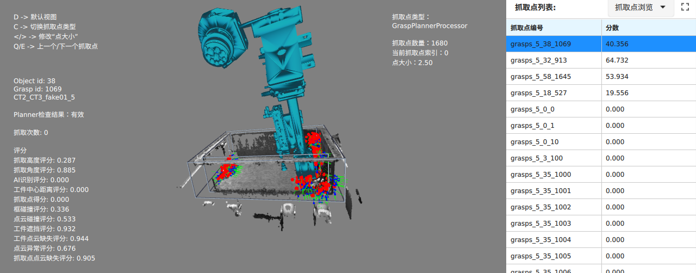

# Lab support routine

## fanuc 移动指令优化 :heavy_check_mark:

1. cpose 支持movej :heavy_check_mark:

   ```python
   POS2JOINT
   ```

   

2. apose 支持movel

   ```python
   JOINT2POS
   ```

3. ~~planner 奇异点 ik 有解 -》 fanuc ik 计算无解~~

## pose_correction_2d check waypoint fail :heavy_check_mark:

flage = 5555

```python
cb.pose_correction_2d(wait_seconds=0.1, place_flag_var='flag') and cb.fetch_place_pose_to_var(place_flag_var='flag', pt_var='place'):
```

1. 位于奇异位置放置点没有检测
   * place pose 加入检查


## control center 显示 object 数量 :heavy_check_mark:

1. middleware -> "GetObjectsCountX"


## middleware 连接成功界面正常切换状态 :heavy_check_mark:

1. 状态更新update_connect_state不生效

2. control center 还未触发连接就显示连接成功

   * loading

     ```python
     def reconnect(self, object, name):
             logging.info(f"connecting to {name}")
             while self.is_loading:
                 if object.connect():
                     logging.info(f"{name} connected")
                     return True
                 time.sleep(0.2)
     
             raise RuntimeError("Task interrupted")
     ```

3. robot 没连接成功也显示连接成功

4. ==redis 读取状态到middleware== (只有机器人状态)

   * ```bash
     # 连接到本地 Redis 默认端口
     r = redis.Redis(host='localhost', port=6379, decode_responses=True)5						
     # 连接到redis
     nc localhost 6379
     ```

==注：== 当前只有配置文件更新才会更新状态（检测到配合文件更新 load_resource）

```python
# version 
middleware: test_robot_status
control: test_set_robot_dead
```


## ur ping :heavy_check_mark:

* rtde_io_interface 没有 isConnected()


## 不连接 2d 显示灰色 :heavy_check_mark:

1. 更新状态


## middleware can not find robot_id :heavy_check_mark:

1. planner 算子直接触发会提示无效 robot_id (robot_id = " "，需要control center 触发 3d 拍照
   
   * 触发 planner 算子值指定当前 settings :question:
   * config 文件排序，指定最小的为起始 robot_id


## middleware reload fail :heavy_check_mark:

1. SyncRobotStatusTask get_configs 会刷新 load_config 状态，从而 reload 检查时候会被跳过
   * get_config 不刷新文件更改时间
     只保留 reload 自动更新 config 文件


## middleware enable_timing_task :heavy_check_mark:

1. 开放到界面设置 :heavy_check_mark:
2. 设置不需要 reload 就生效 :heavy_check_mark:
3. SyncRobotStatusTask 其他参数也从配置文件直接读取
   * sync_status_to_app
   * sync_status_to_planner
   * sync_interval


## ~~机器人程序连接 middleware 不会自动上报坐标~~

1. estun 是否连接成功后会主动上报坐标


## fanuc 机器人程序非正常运行 :heavy_check_mark:

1. roboeye_request 无法正常运行
   * 更换 pc 文件


## ~~correction_3d~~

1. correction_3d 传入当前坐标按照 correction_2d 方式


## center 对接上报错误码接口 :heavy_check_mark:

* roboeye send "Error:{error_id}"
  * error_id -> str
* 自动上报错误码（action_timer)
  * client 实现获取错误码
* 发送 stop_run 前再调用一次上报

```
TypeError: Parameters to generic types must be types. Got <google.protobuf.internal.enum_type_wrapper.EnumTypeWrapper object at 0x7f1c11bd6d60>.
```


## ~~get_place_pose 日志~~

1. 翻译成中文，并提示


## ~~grasp_try_num_max 与 invalid_grasp_max_num~~


## middleware regression :heavy_check_mark:

```python
self.app.trigger_save_sample = mock.Mock(return_value=None)
        self.app.trigger_get_relative_pose_2d = mock.Mock(
            return_value=mock_data.roboeye_mock_data.get_relative_pose_2d_response
        )
```


## t017 抓取不准


## ~~t017 夹爪与工件碰撞~~


## t017 磁铁与工件碰撞（逃逸）

```python
workflow_dataset_info {
    workflow_dataset_id: "roboeye/T017/T017_3D/2025-03-25-13-05-07"
    last_processor_name: "CLA_taoyi"
}

```


1. 抓取点生成逻辑？
   * 点云法向量随机生成
2. 竖直点云缺失
   1. 有部分点云
   2. 完全没有点云
      * 增大夹爪检测范围


对策：

1. ~~优先抓取竖直工件抓取点，即抓取高度优先~~
2. ~~增大夹爪检测范围（针对竖直工件点云缺失情况）~~
   * gripper_depth_dilation_radius_pixels: 3
3. 降低碰撞检测阈值
   * num_collision_pixel_threshold: 75（65）
4. 增大抓取点与工件距离

1. roboeye/T017/T017_3D/2025-03-28-11-15-21
   
   

   ```python
   collision_pixels: 68
   ```

   

2. roboeye/T017/T017_3D/2025-03-29-15-25-41
   
   

   ```python
   Number of collision pixels: 75
   ```

   

3. ```
   roboeye/T017/T017_3D/2025-03-31-10-17-58
   ```

   

   ```python
   Number of collision pixels: 71
   ```

   


## GT027 碰撞


## 问题排查

1. g016 attack 实际可达，planner检测提示不可达 :heavy_check_mark:

   * middleware v1.0.300 planner 无提示
   * 机器人配置错误 motoman-gp12 -> motoman-gp25
   * ~~check_waypoint 不可达~~
   * 机器人逆解计算可能有问题，还在排查，motoman-gp12 正常
   * ~~tcp 标定矩阵~~
   * ==motoman-gp25 urdf 文件有误==
   
2. 展厅安川 motoman_gp12 3d矫正出现超限位姿态没被过滤 :heavy_check_mark:

   * pose

     ```python
     correction_2d_pose = np.array([674.997, -440.951, 716.075, 173.397, -48.117, -10.135])
     apose = np.array[-34.59, -6.46, -8.92,-17.69,-41.52, 29.82]
     ```

3. 与 Puck 讨论 planner 相关参数 :heavy_check_mark:
   $$
   \begin{equation}
   \begin{aligned}
   \text{grasp\_score} =& 高度权重 * 高度得分 + 方向权重 * 抓取方向得分 + \text{ai}检测权重 * 检测得分 + 平整度权重 * 平整分数\\ 
   &+ 到工件中心距离权重 * 到工具中心距离得分 + 弯曲率权重 * 弯曲率得分 + 夹爪与料框碰撞权重 * 框碰撞得分 \\
   &+  夹爪与点云碰撞检测权重 * 点云碰撞得分 + 工件点云遮挡得分权重 * 点云遮挡得分+  工件点云缺失得分权重 * 工件点云缺失得分 \\
   &+ 工件点云异常得分权重 * 异常得分 + 夹爪与其他工件间的碰撞检测权重（进攻方向） * 碰撞得分\\
   &+ 夹爪与其他工件间的碰撞检测权重（撤退方向）* 碰撞得分 + \textcolor{red}{\textnormal{collision\_object\_object\_occlusion\_weight * score}} \\
   & + \textcolor{red}{\textnormal{collision\_object\_pixels\_aligned\_weight * score}} + 人工评分权重 * 人工评分 + 
   点云缺失评分权重 * 点云缺失得分
   \end{aligned}
   \end{equation}
   $$

   * collision 顺序
     1. 夹爪与框碰撞检测
     2. 夹爪与其他工件碰撞
     2. 进攻
     2. 撤退
   
4. ~~hongrong~~

   * updatetrajectory 返回值
   * 获取工件数量接口无法使用

5. eva4 middlware 重启（端口被占用）:heavy_check_mark:

   * 确保端口未被占用

     ```bash
     netstat -antp |grep <port>
     ```

     若找到占用该端口的进程，停止该进程

     ```bash
     kill -9
     ```

6. 12.24 丰通现场讨论 ur 机器人作为客户端连接 middleware :heavy_check_mark:

   * 与贺鲁讨论他们需要做的工作，以及解析字符串的方式
   
7. ~~middleware get_cartesian_pose 获取的不是当前位姿~~

   * 读取的是矫正完成前的位姿

8. GT021

   * 现场使用机器人程序完成与middleware 信息交互

9. 展厅瑕疵检测

   * 轨迹不可达
   
10. GT027 碰撞

   ```python
   Update home joint: 86.25,-76.38,-78.7,155.42,-90.54,-85.53
   get grasp trajectory grasp success: +00184.761,+00962.890,+00564.348,+00002.055,+00000.086,-00002.318
   get grasp trajectory attack success: +00198.423,+00963.518,+00663.409,+00002.055,+00000.086,-00002.318
   get grasp trajectory above0 success: +00249.798,+00861.218,+00879.900,+00002.055,+00000.086,-00002.318
   get grasp trajectory above1 success: +00249.798,+00861.218,+00879.900,+00002.055,+00000.086,-00002.318
   get grasp trajectory retreat success: +00184.761,+00962.890,+00664.348,+00002.055,+00000.086,-00002.318
   ```

   ```python
   86.25,-76.38,-78.7,155.42,-90.54,-85.53
   get grasp trajectory grasp success: +00268.242,+00984.109,+00564.341,+00001.974,+00000.240,-00002.232
   get grasp trajectory attack success: +00281.848,+00986.247,+00663.388,+00001.974,+00000.240,-00002.232
    get grasp trajectory above0 success: +00256.922,+00870.639,+00879.429,+00001.974,+00000.240,-00002.232
   get grasp trajectory above1 success: +00256.922,+00870.639,+00879.429,+00001.974,+00000.240,-00002.232
   get grasp trajectory retreat success: +00268.242,+00984.109,+00664.341,+00001.974,+00000.240,-00002.232
   ```

   * 更新了夹爪模型没有重新加载

   

   

11. T017 碰撞
