# 上报~~碰撞~~抓取点过滤原因

## 目的

```python
enum GraspPlannerCheckResultEnum {
        VALID = 0;
        UNREACHABLE = 1;
        SINGULARITY = 2;
        IN_COLLISION = 3;
        FLANGE_Z = 4;
        FAILED_GRASP = 5;
        UNCHECKED = 6;
        INVALID_CONFIG = 7;
        UNKNOW = 8;
        INVALID_DIRECTION = 9;
        DISABLED_GRASPS = 10;
        OCCLUSION = 11;
        OUT_OF_BIN = 12;
        SCAN_MISSING_PIXELS = 13;
        JOINT_HEIGHT_LIMIT = 14;
    }
```


1. 统计导致~~碰撞~~抓取点过滤的次数，可视化当前~~碰撞~~抓取点过滤原因梯度

   ```python
   GraspPlannerCheckResult
   settings 
   inputs (collision param)
   ```

    

   * IN_COLLISION
     * collision_pixels
     * scan_missing
     * body_collision
     * gripper & link
     * ...
   * FLANGE_Z
     * flange_z_min
     * flange_z_max

   ```python
   {
       filter_grasp: {
           check_result: setting
       }
   }
   ```

   

2. 由过滤原因梯度提取出目前需要调整的参数（减少需要调整的参数）


## 内容显示

* 横坐标表示时间
* 纵坐标表示次数


## prometheus

```bash
#~/prometheus/prometheus/prometheus
# 9090
./prometheus --config.file=prometheus.yml --web.listen-address=":9091"
```

### test

1. [active_user](http://localhost:5000/user_online) [server](http://localhost:8000)

## grafana

[active_user](http://localhost:3000/d/a4e45497-7d44-47db-a81a-7e88805f190b/active-user?orgId=1)

```python
max by (check_result_setting)(delta(invalid_grasp_with_inputs_sum{invalid_grasp_type="IN_COLLISION"}[$__rate_interval])/delta(invalid_grasp_with_inputs_count{invalid_grasp_type="IN_COLLISION"}[$__rate_interval]))
```


# 优化 planner 耗时 :star:

## eva4 耗时分析

```python 
import cProfile
import os
import functools
def save_profiler_data(func):
    @functools.wraps(func)
    def wrapper(*args, **kwargs):
        profiler = cProfile.Profile()
        profiler.enable()
        response = func(*args, **kwargs)
        profiler.disable()
        timeline_dir = (
            os.path.expanduser(os.getenv("PROFILER_DIR", ""))
            or "/tmp/profiler/planner_plan_analysis"
        )
        os.makedirs(timeline_dir, exist_ok=True)
        timeline_file = os.path.join(timeline_dir, f"planner_time_consumption.prof")
        profiler.dump_stats(timeline_file)
        return response

    return wrapper
```


### 耗时分布

planner  算子总体耗时 0.962 s

```python 
{
    "grasp_eval_failed_samples": [],
    "grasp_eval_result": "PASSED",
    "maximum_allowable_percentage": 50.0,
    "planner_avg_runtime_baseline": 0.7760000228881836,
    "planner_avg_runtime_test_result": "PASSED",
    "planner_regression_result": "PASSED",
    "workflow_dataset_nums": 1,
    "workflow_planner_processor_avg_runtime": [
        [
            "roboeye/test/EVA4/2025-07-09-13-40-19",
            0.9618750214576721
        ]
    ]
}

```


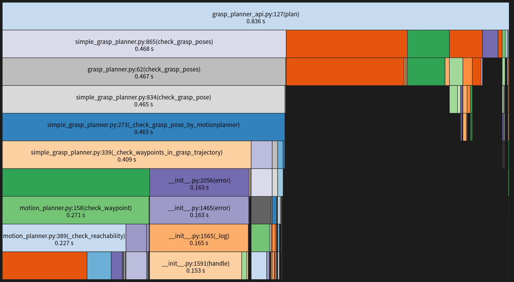


1. planner 轨迹规划检查等 55.91% -> 0.468s s  
   * _check_waypoints_in_grasp_trajectory 
     
     * check_reachability 27.19% -> 0.227s
       
       * _format_eef_joint -> 0.105s (只需要计算一次)
       * _apply_robot_base -> 0.0436s (可能随着 robot_configs.robot_base 更改)
     * check_collision 4.55% -> 0.038s
       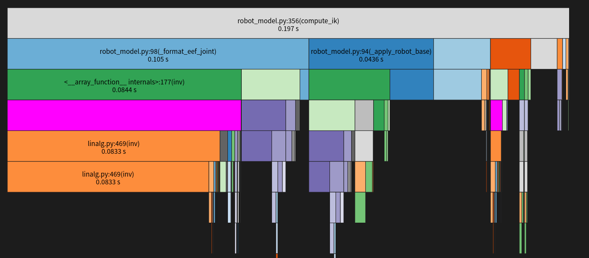
     
     * check_singularity 0.53% -> 0.004
2. core 夹爪与框/工件碰撞检测等 23.74% -> 0.199 s

   * collision_check_pc2pc_ -> 0.192s
3. update_scene 8.24% -> 0.0689s (非首次)
4. 上报抓取点信息 6.47% -> 0.0541s
5. 其他 


## P020 耗时分析

```json
{
    "grasp_eval_failed_samples": [],
    "grasp_eval_result": "PASSED",
    "maximum_allowable_percentage": 50.0,
    "planner_avg_runtime_baseline": 0.7760000228881836,
    "planner_avg_runtime_test_result": "FAILED",
    "planner_regression_result": "FAILED",
    "workflow_dataset_nums": 1,
    "workflow_planner_processor_avg_runtime": [
        [
            "roboeye/P020/station001/2025-01-14-12-09-20",
            1.431125521659851
        ]
    ]
}

```

### 耗时分布

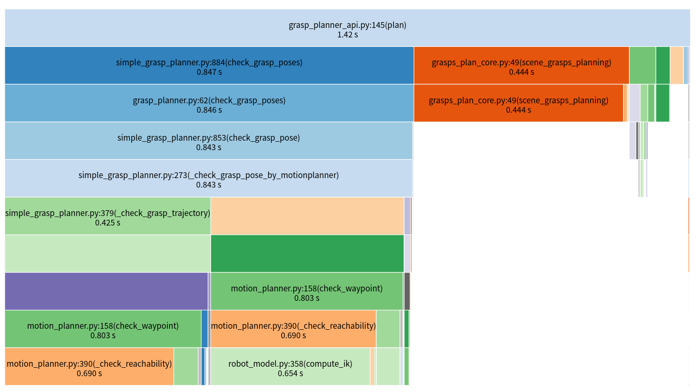

1. 轨迹检查 0.843 s -> 59.31%
   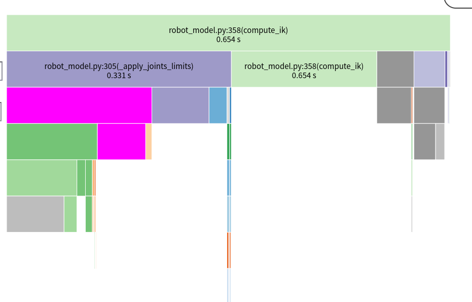
   * 扩展解 0.331 s -> 23.28 %
2. core 0.44 s -> 31.25%

注：

1. 协作机器人 ik 计算也慢 compute_ik_analytical


### 扩展解优化

协作机器人关节限位 $[-2\pi, 2\pi]$，导致扩展后解的数量比工业机器多得多
目前扩展上下界，一个解就会扩展 $3^6 = 729$ 个解，而实际上协作机器人并不能移动至超过限位 $\pm \pi$ 
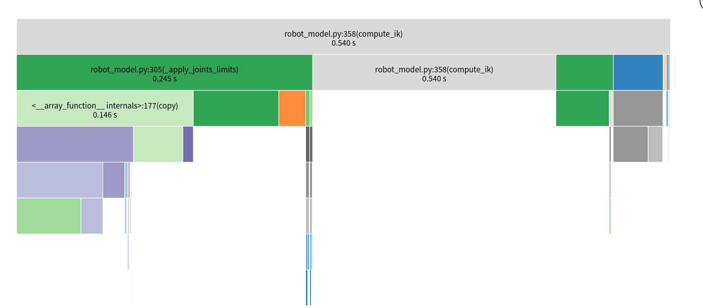
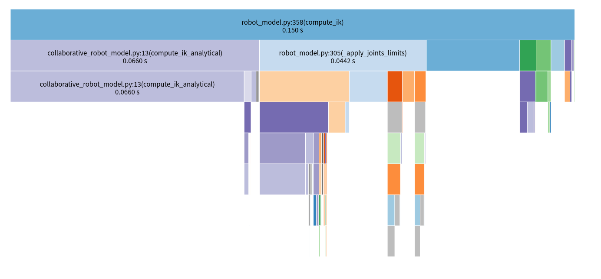

1. ~~优化逆解的拷贝~~


### 轨迹检查性能花销

check_waypoint
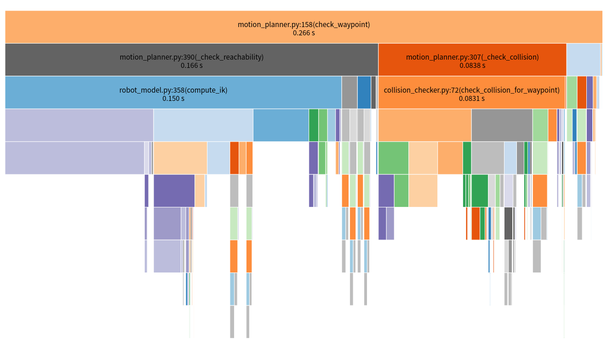


* check_reachability -> compute_ik
  
  * compute_ik_analytical -> 必要的逆解计算
    可优化方向 -> 寻找速度更快的解法
  * apply_joints_limits -> 扩展解，仅涉及部分 joint 的关节替换，主要耗时在于每个多组解的复制
  * 其他 -> 
* check_collision
  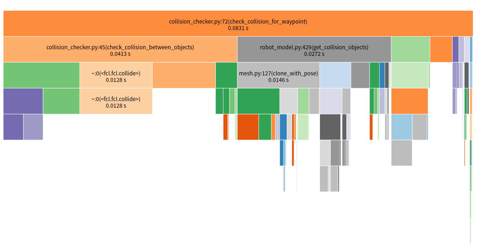
  * collision_objects collide check -> 必要的碰撞检测
  * get_colliison_object -> 获取碰撞对象，更新碰撞对象位姿，由 矩阵转换为四元数
  * template_collision_check 
* check_singularity
  * get_jacobian -> 获取雅可比矩阵，基本运算


## core collision optimize :star:

### 性能分析工具

#### gperf

```cpp
cc_binary(
    name = "grasp_core_py.so",
    srcs = [
        "grasp_core_py.cpp",
    ],
    copts = [
        "-fexceptions",
        "-fvisibility=hidden",
        "-I/usr/include/gperftools",
    ],
    data = [
        "@gperftools//:libtcmalloc.so",
    ],
    linkopts = [
        "-Wl,-Bsymbolic",
        "-L/usr/local/lib",
        "-lprofiler",
        ],
    linkshared = True,
    deps = [
        "//roboeye/core/core/src/grasp",
        "@com_github_google_glog//:glog",
        "@pybind11//:pybind11_py39",
    ],
)
```

```cpp
#include<gperftools/profiler.h>
ProfilerStart("/tmp/planner_regression/grasp_core_py.prof");
auto result = self.sceneGraspsPlanning(grasps);
ProfilerStop();
```

```bash 
pprof --web 
```


#### vtune

[vtune profiler](https://www.intel.com/content/www/us/en/developer/tools/oneapi/vtune-profiler-download.html?operatingsystem=linux&linux-install-type=apt)
==注：== 安装完之后，还需要运行初始化脚本

```bash 
source /opt/intel/oneapi/setvars.sh
```

运行 vtune gui 界面

```bash 
vtune-gui
```

summary 解释
[summary explanation](https://www.intel.com/content/www/us/en/docs/vtune-profiler/user-guide/2023-0/window-summary-hotspots-by-cpu-usage.html)

### eva4

展厅数据

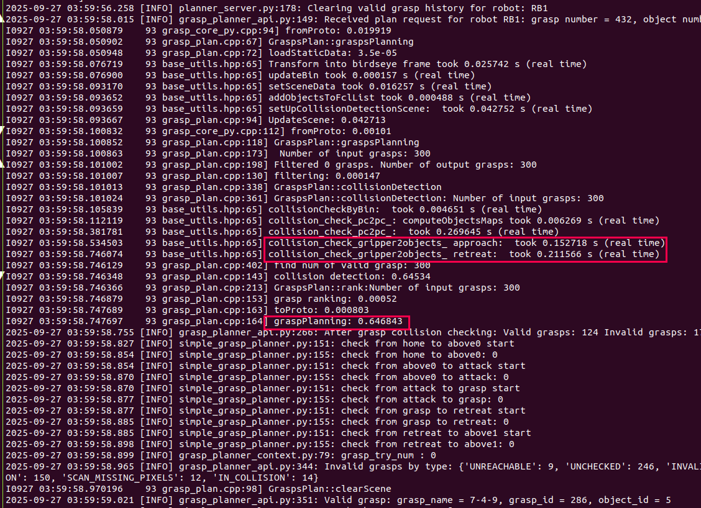

1. gripper2object approach & retreat $\approx 0.4$ s

### zhuan_pc 数据

```bash
pprof --web xxx.out
```


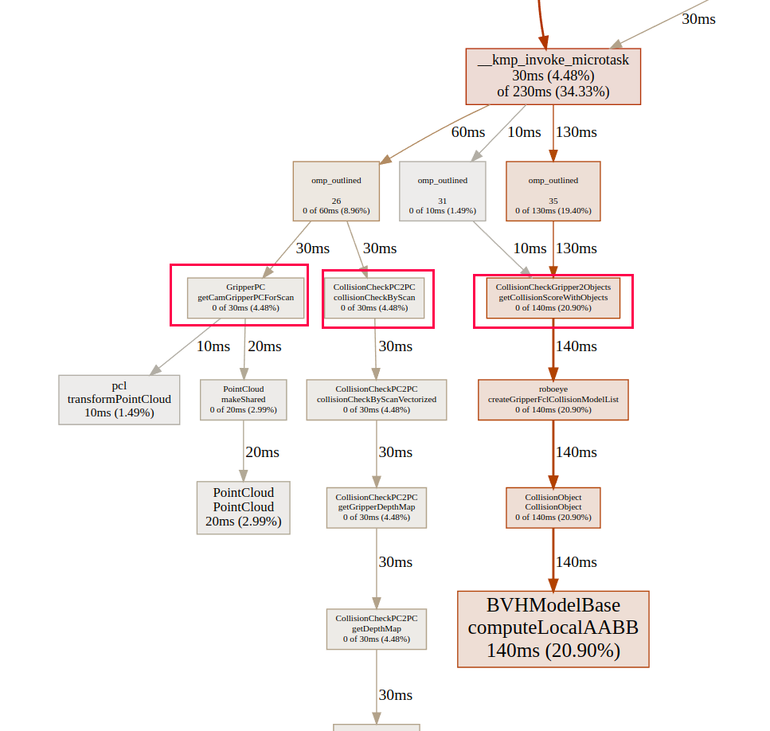


```bash 
vtune-gui
```

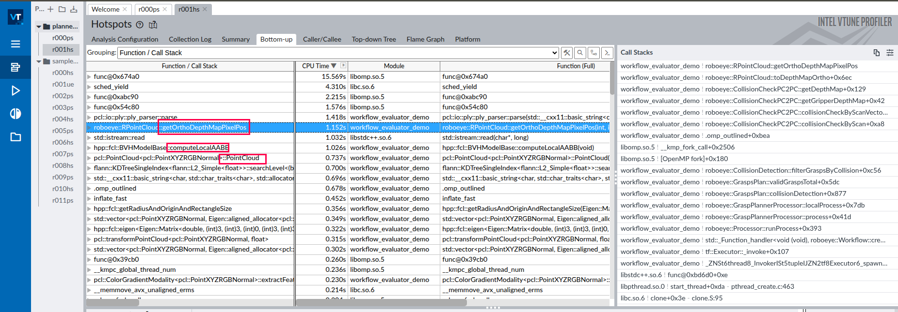

1. CollisionCheckGripper2Objects -> attack/retreat 夹爪与工件碰撞检测
2. CollisionCheckPC2PC -> 抓取位姿夹爪与工件碰撞检测
3. getCamGripperPCForScan -> 抓取位姿夹爪与工件碰撞检测

| 列名   | 含义                                                         |
| ------ | ------------------------------------------------------------ |
| flat   | 该函数**自身**（不包括它调用的其他函数）消耗的 CPU 时间。单位毫秒。 |
| flat%  | 该函数自身消耗时间占总 CPU 时间的百分比。                    |
| sum%   | 到当前行为止，所有列出函数的 flat 时间累计百分比。           |
| cum    | 该函数**及其调用的所有子函数**累计消耗的 CPU 时间（即累积时间）。 |
| cum%   | 累积时间占总时间的百分比。                                   |
| 函数名 | 消耗 CPU 的函数名称，通常是 C/C++ 底层函数，也有少量 Python 相关的。 |

```bash 
File: python3.9
Type: cpu
Showing nodes accounting for 670ms, 100% of 670ms total
      flat  flat%   sum%        cum   cum%
     430ms 64.18% 64.18%      470ms 70.15%  __kmpc_threadprivate_register_vec
     140ms 20.90% 85.07%      140ms 20.90%  hpp::fcl::BVHModelBase::computeLocalAABB
      30ms  4.48% 89.55%      230ms 34.33%  __kmp_invoke_microtask
      20ms  2.99% 92.54%       20ms  2.99%  pcl::PointCloud::PointCloud
      20ms  2.99% 95.52%       30ms  4.48%  roboeye::RPointCloud::getOrthoDepthMapPixelPos
      10ms  1.49% 97.01%       10ms  1.49%  __nss_passwd_lookup
      10ms  1.49% 98.51%       10ms  1.49%  __sched_yield
      10ms  1.49%   100%       10ms  1.49%  pcl::transformPointCloud

```


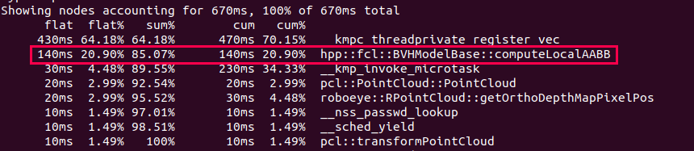

1. __kmpc_threadprivate_register_vec -> 与多线程/并行计算相关

2. ==hpp::fcl::BVHModelBase::computeLocalAABB -> fcl 计算轴对称包围盒== （运动）:heavy_check_mark:
   
   * attack/retreat 重新构造夹爪包围盒（与采样数量、vertices、triangles 有关）
     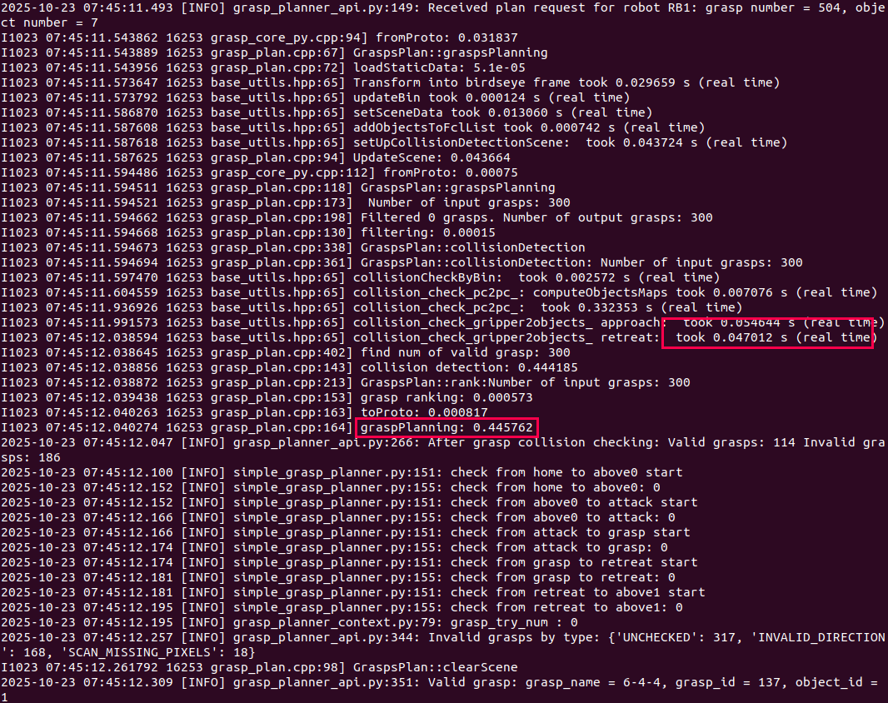
   
3. pcl::PointCloud::PointCloud -> 生成必要夹爪点云 
   * 重复构造点云对象 -> transformPointCloud -> gripper_pc_cam.makeShared()
     ~~降采样 -> 粗检测~~降采样会损失部分碰撞对象信息，并不是碰撞对象的冗余模型
   
4. roboeye::RPointCloud::getOrthoDepthMapPixelPos -> 生成夹爪深度图 （工件）
   计算点云中每个点在深度图的对应像素位置，填充深度图

   * ~~简化计算~~

   * 耗时与夹爪点云数量有关

     * 降低点云数量：降采样/使用简单模型

       ~~简化夹爪模型 -> 生成深度图 -> broad phase check~~

     * 自适应选取部分夹爪模型作碰撞检测
       ==由于碰撞检测并不需要完整的夹爪，可以选取框高度、工件高度、抓取角度等长度截断夹爪来作碰撞检测==


设置 fcl_transform & 不重新生成夹爪点云

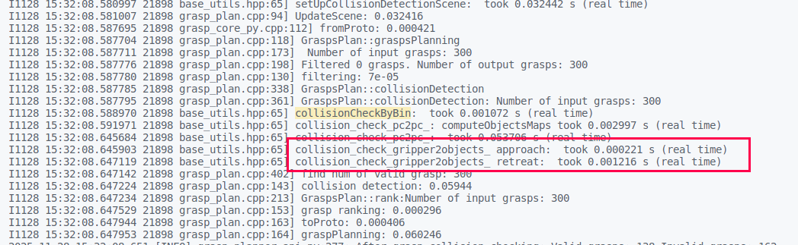
目前 pc2pc 点云碰撞检测主要耗时分布

1. get gripper depth map 必要计算
   * 遍历夹爪点云，根据点云是否有效填入高度值
2. collision check 必要计算-> 对比高度值

### 夹爪自适应选择:question:

夹爪与框、工件碰撞检测 gripper_id_gripper_pc_map_for_bin_ & gripper_id_gripper_pc_map_for_scan_

1. 确定工件高度（部分工件无法识别，仅有点云，可能有干扰导致点云高度异常）以及框高度(bin->outer_.dz) -> obstacle_height

2. 夹爪选择计算, 假设夹爪总长为 gripper_length，碰撞检测长度为 adaptive_length，
   抓取角度 grasp_angle（相对于世界 z 轴作为起始方向？）
   $\text{adaptive\_length} \times \cos(\text{grasp\_angle}) = \text{obstacle\_height}$
   
   * gripper_lenght -> 0 :question:
     考虑根据 mesh / point_cloud 获取
   * grasp_angle :heavy_check_mark:
     grasp->getEefDirection()
   * obstacle_length
     * bin :heavy_check_mark:
       bin->outer_.dz
       框外的点不再计算距离
     * template object 
       深度图最大有效值
   
3. 如何截取夹爪 point_cloud :question:

   * 定义一个高度平面
     * 经过工件最高处
     * 法向量如何选择
       * ~~tcp 方向~~
       * 框方向
   * 选用平面以下的点并重新生成点云

   ==注：== 在获取夹爪点云阶段就截取有效夹爪，根据最低抓取点和最高工件高度截取


### 当前耗时分析 :star:

1. core collision check
   * check_pc2pc  90 % 
     * ==点云转深度图 -> 考虑用 cv::mat==
2. trajectory check
3. update scene $\approx100$ ms
   * fromproto: 30 ms
   * Transform into birdseye frame: 30 ms
     * bin / point_cloud -> deep_copy
   * setSceneData: 10 ms
     * depth_map -> deep_copy
4. record to prometheus

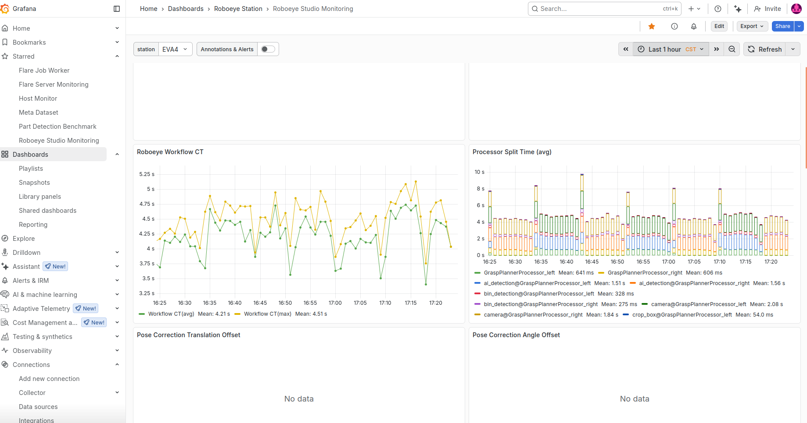

总体耗时在 600 ms 左右


# 混动通讯体验优化

## roboeye_2.0 应用 fanuc 适配 :heavy_check_mark:

robot: server -> client


## ~~等待状态更新问题 (控制权)~~

~~死循环等待 -> 设置等待超时时间~~

设置初始状态重新开始

cc  comm main

## fanuc send_request

系统等待超时时间会被占用，需要自定义实现

## ~~common client 不适配机器人品牌~~

选择了某个机器人品牌， common client 配置不适配


## kuka data 文件 :heavy_check_mark:

需要保留 dat 文件，不保留无法新建 ptp 移动指令 （BCO 移动确认）


## kuka tool frame :heavy_check_mark:

目前 tool frame 强制用了1

```
BAS (#TOOL,0 )
BAS (#BASE,0 )
```

==注：==base 是否也要指定


## kuka 取消选择程序 

解决库卡取消选择程序，通讯断连问题

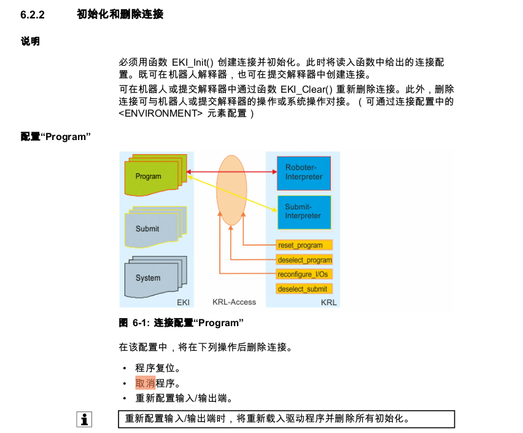

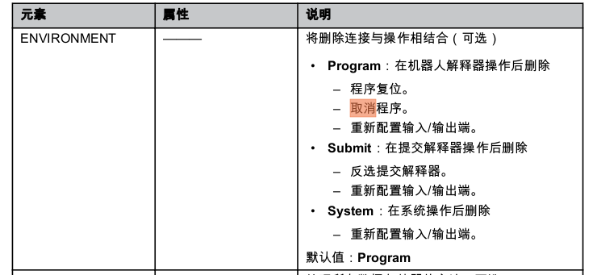

```xml
<INTERNAL>
    <!-- kuka robot ip -->
    <IP>192.168.0.75</IP>
    <!-- the listening port must be used 54600 - 54615 -->
    <PORT>54600</PORT>
    <ALIVE Set_Flag="1"/>
    <ENVIRONMENT> System </ENVIRONMENT>
</INTERNAL>
```

增加 ENVIRONMENT 配置


## cc 控制 fanuc 移动 :heavy_check_mark:


1. ~~不写入形态信息~~

   * 不写入用的默认配置值

     ```
     NUT
     ```

2. 用当前位姿的形态

   * 获取当前机器人位姿并写入

3. 根据 cpose 计算形态

   * 用 cpose 算 ik 也需要拿 apose 

4. 配置

   ```bash
   $SCR_GRP[1]
   $CONFIG_MASK
   ```

   [change pose configuration](https://www.robot-forum.com/robotforum/thread/41296-position-configurations-and-how-to-change-them/)


# 放置点检查 :heavy_check_mark:

## 当前缺陷

检查放置点位姿，由于起始点为原点，导致解的选择可能会出乎意料


### 检测起始点

~~使用真实起始位姿作为检查的起始点 -> 抓取点/过渡点/home （起始点不固定）~~

~~选用 home 点作为检测起始位姿（实际移动并不需要从 home 开始）~~要求上传移动至放置点前的 apose，目的是为了确定机器人形态，再根据直线/关节运动（关节空间插补待完成）确定是否强制要求机器人形态一致

若期望起始点 -> 放置点可达，可使用 movej(cpose)


适配旧版 -> start_joint[0, 0……] -> rad

```python
"GetPlacePosecheck111X"
```


# 矫正位姿检查 :heavy_check_mark:

correction_3d & correction_2d


# 手眼标定 wp 检查 :heavy_check_mark:


# ~~robot_link mesh~~

降低 mesh 质量


# 抓取点分数

更新 studio-manager 配置到所有机器


# T024 fanuc问题 :heavy_check_mark:

1. 没有在展厅熟悉导入流程，去到现场之后漏掉部分步骤
2. 网口
3. ~~部分机器没有选装 User Socket Msg 软件( R648 )~~
4. 手动标定程序


# middleware 回归测试 :heavy_check_mark:

返回 INVALID_CONFIG

1. grasp_plan mock 缺少部分函数

   ```python 
   eef_pose_to_tcp
   ```

2. 测试数据缺少 template_place_robot_pose


